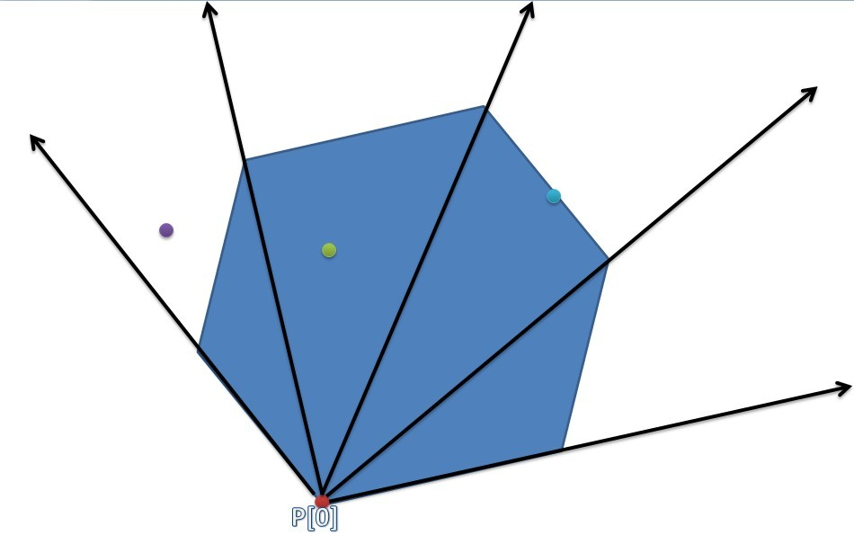
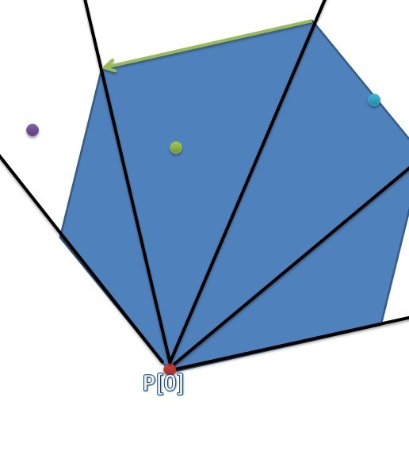
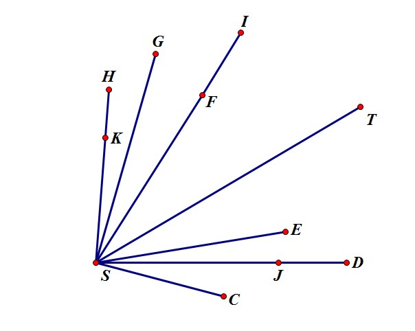

# 判断一个点是否在凸包（多边形）内

> 判断一个点是否在凸包内是比较常用的一个算法。

判断一个点是否在凸包（多边形）内是比较常用的一个算法，总结了一下出现的方法，主要找到了下面的几种。

## 方法一：外积计算法（只适用于凸多边形）

简单来说就是将点到凸多边形的顶点的各条向量，通过外积运算判断是否都往同一方向旋转，如果都是往同一方向旋转，则表示点在凸多边形的内部；如果中途出现反方向旋转，则说明点在凸多边形的外部；如果中途出现为零的情况，表示点在凸多边形上，而且就在对应的边上。

时间复杂度为O(N)


## 方法二：区域判别法

这种方法适用于快速判断多个点是否在一个凸多边形内。


首先，将一个凸多边形划分为 N 个三角形的区域。



对于某一个点，如果不在这些三角形区域内，则必不在凸包内。否则就能通过二分的方法得到点所在的三角形区间。

最后只需判断点与原凸包边的关系即可。



假设我们查询绿色的点是否在凸包内，我们首先二分得到了它所在的区间，然后判断它和绿色的向量的关系，蓝色和紫色的点类似，蓝色的点在边界上，紫色的点在边界右边。

由于应用了二分，时间复杂度为O(logN)。

问题链接：[SGU253 Theodore Roosevelt](http://blog.csdn.net/codeforces_sphinx/article/details/7200301)

*sgu253 这个问题需要使用极角序判断才能通过，而 cf116B 因为精度问题（把 eps 开到 1e-20 了都过不了）就需要使用叉乘判断，但是叉乘判断对于 sgu253 却不起作用。两题的方法不能通用，也不知道这是为什么？*

sgu253 代码：

```cpp
#include <iostream>
#include <cstring>
#include <algorithm>
#include <cmath>
#include <cstdio>

#define PI   3.14159265358979323846
#define PI_2 1.57079632679489661923
#define PI_4 0.78539816339744830962

#define eps 1e-6
#define DINF 1e200
using namespace std;
struct point
{
    double x,y;
    double ang;
    point(){}
    point(double _x,double _y){x=_x;y=_y;}
    void read()
    {
        scanf("%lf%lf",&x,&y);
    }
    void write()
    {
        printf("%lf %lf\n",x,y);
    }
};

bool dy(double x,double y)  {return x > y + eps;}          // x > y
bool xy(double x,double y)  {return x < y - eps;}          // x < y
bool dyd(double x,double y) {return x > y - eps;}          // x >= y
bool xyd(double x,double y) {return x < y + eps;}          // x <= y
bool dd(double x,double y)  {return fabs( x - y ) < eps;}  // x == y

double cross(point a,point b,point c)//向量 ac 在 ab 的方向
{
    return (c.x - a.x)*(b.y - a.y) - (b.x - a.x)*(c.y - a.y);
}

double dis(point a,point b)
{
    return(sqrt((a.x-b.x)*(a.x-b.x)+(a.y-b.y)*(a.y-b.y)));
}

int n,m,k;
point pt[100005];
point p[100005];
int cnt;
int pk;

int cmp(point a, point b)
{
    return(xy(a.ang,b.ang) || (dd(a.ang,b.ang) && dis(a,pt[0])<dis(b,pt[0])));
}
int panduan(point x)
{
    int l=1,r=n-1;
    int mid;
    int pos;
    if(xy(x.ang,pt[l].ang) || dy(x.ang,pt[r].ang)) return 0;
    while(l<r)
    {
        mid=(l+r)/2;
        if(pt[mid].ang<=x.ang)
        {
            l=mid+1;
            pos=l;
        }
        else
        {
            r=mid;
            pos=r;
        }

    }
    if(pos==n) pos--;
    if(dyd(cross(pt[pos],pt[pos-1],x),0)) return 1;
    return 0;
}

int main()
{
    scanf("%d%d%d",&n,&m,&k);
    cnt=0;
    pk=0;
    for(int i=0;i<n;i++)
    {
        pt[i].read();
        if(pt[pk].y>pt[i].y) pk=i;
        else if(pt[pk].y==pt[i].y && pt[pk].x>pt[i].x) pk=i;
    }
    swap(pt[pk],pt[0]);
    for(int i=0;i<n;i++)
    {
        pt[i].ang=atan2(pt[i].y-pt[0].y,pt[i].x-pt[0].x);
    }
    sort(pt+1,pt+n,cmp);

//    for(int i=0;i<n;i++) pt[i].write();
    pt[n]=pt[0];
    for(int i=0;i<m;i++)
    {
        p[i].read();
        p[i].ang=atan2(p[i].y-pt[0].y,p[i].x-pt[0].x);
    }
    for(int i=0;i<m;i++)
        if(panduan(p[i]))
        {
            cnt++;
            //cout<<i<<" ok"<<endl;
        }
    if(cnt>=k) puts("YES");
    else puts("NO");
    return 0;
}
```

CF116B 代码：（方法四提供了其它解法）

```cpp
#include <iostream>
#include <cstring>
#include <algorithm>
#include <cmath>
#include <cstdio>

#define PI   3.14159265358979323846
#define PI_2 1.57079632679489661923
#define PI_4 0.78539816339744830962

#define eps 1e-10
#define DINF 1e200
using namespace std;
struct point
{
    double x,y;
    point(){}
    point(double _x,double _y){x=_x;y=_y;}
    void read()
    {
        scanf("%lf%lf",&x,&y);
    }
    void write()
    {
        printf("%lf %lf\n",x,y);
    }
};

bool dy(double x,double y)  {return x > y + eps;}          // x > y
bool xy(double x,double y)  {return x < y - eps;}          // x < y
bool dyd(double x,double y) {return x > y - eps;}          // x >= y
bool xyd(double x,double y) {return x < y + eps;}          // x <= y
bool dd(double x,double y)  {return fabs( x - y ) < eps;}  // x == y

double cross(point a,point b,point c)//向量 ac 在 ab 的方向
{
    return (c.x - a.x)*(b.y - a.y) - (b.x - a.x)*(c.y - a.y);
}

double dis(point a,point b)
{
    return(sqrt((a.x-b.x)*(a.x-b.x)+(a.y-b.y)*(a.y-b.y)));
}

int n,m,k;
point pt[100005];
point p[100005];
int cnt;
int pk;

int cmp(point a, point b)
{
    double ans = cross(pt[0], a, b);
    if(ans < 0) return 1;
    if(ans == 0 && (dis(a, pt[0]) <= dis(b, pt[0]))) return 1;
    return 0;
}
int panduan(point x)
{
    int l=0,r=n-1;
    int mid;
    int pos;
    if(dd(cross(x,pt[0],pt[n-1]),0)) return 0;
    if(dd(cross(x,pt[1],pt[0]),0)) return 0;
    while(l<=r)
    {
        mid=(l+r)/2;
        if(dyd(cross(x,pt[mid],pt[0]),0))
        {
            pos=mid;
            l=mid+1;
        }
        else r=mid-1;
    }
    if(dyd(cross(x,pt[pos],pt[pos+1]),0)) return 0;
    return 1;
}

int main()
{
    scanf("%d",&n);
    cnt=0;
    pk=0;
    for(int i=0;i<n;i++)
    {
        pt[i].read();
        if(pt[pk].y>pt[i].y) pk=i;
        else if(pt[pk].y==pt[i].y && pt[pk].x>pt[i].x) pk=i;
    }
    swap(pt[pk],pt[0]);
    sort(pt+1,pt+n,cmp);

//    for(int i=0;i<n;i++) pt[i].write();
    pt[n]=pt[0];
    scanf("%d",&m);
    for(int i=0;i<m;i++)
    {
        p[i].read();
    }
    for(int i=0;i<m;i++)
        if(!panduan(p[i]))
        {
            puts("NO");
            return 0;
        }
    puts("YES");
    return 0;
}
```

## 方法三：射线相交法

从给定的点开始，往随便一个方向（习惯水平向右）引一条无限长的射线，看看穿过多少条边。如果穿过偶数条边，说明点在多边形外；穿过奇数条边，说明点在多边形内。

需要注意的是射线可能穿过定点或与边重合的情况。还有点也可能在多边形的边界上。

时间复杂度为O(N)


```cpp
struct Point {float x, y;} p[10];

// 无法正确判断点在多边形上的情况
bool point_in_polygon(Point& t)
{
    bool c = false;
    for (int i = 0, j = 10-1; i < 10; j = i++)
        if ((p[i].y > t.y) != (p[j].y > t.y) &&
            t.x < (p[j].x-p[i].x)*(t.y-p[i].y)/(p[j].y-p[i].y)+p[i].x)
            c = !c;
    return c;
}
```

补充两段代码：

代码一：

```cpp
inline int dblcmp(double x) //判断double的符号
{
    if(fabs(x) < eps)
        return 0;
    return x > 0 ? 1 : -1;
}
//判断点是否在多边形内
//思想：过点p做一条射线，判断交点数
bool point_inside(point p[],point& aa)
{
    int i, cnt = 0;
    double t;

    //确保p[n] = p[0]
    for(i=0;i<n;++i)
    {
        if((p[i].y<=aa.y && p[i+1].y>aa.y) ||
            (p[i+1].y<=aa.y && p[i].y>aa.y))
        {
            if(!dblcmp(p[i].y-p[i+1].y))
            {
                if(dblcmp(p[i].y-aa.y)==0)
                    cnt++;
                t=-DINF;
            }
            else
                t=p[i+1].x-(p[i+1].x-p[i].x)*(p[i+1].y-aa.y)/(p[i+1].y-p[i].y);

            if(dblcmp(t-aa.x)>=0)
                cnt++;
        }
    }
    return cnt%2;
}
```

代码二：

```cpp
bool isIntersected(point s1,point e1,point s2,point e2) //判断线段 s1-e1 与线段 s2-e2 是否相交
{
    return ( max(s1.x,e1.x)>=min(s2.x,e2.x) &&
            max(s1.y,e1.y)>=min(s2.y,e2.y) &&
            max(s2.x,e2.x)>=min(s1.x,e1.x) &&
            max(s2.y,e2.y)>=min(s1.y,e1.y) &&
            cross(s2,e1,s1)*cross(e1,e2,s1)>=0 &&
            cross(s1,e2,s2)*cross(e2,e1,s2)>=0 );
}
bool online(point p1,point p2,point p) //判断点 p 是否在线段 p1-p2 上
{
    if(fabs(cross(p1,p2,p))<eps && ((p.x-p1.x)*(p.x-p2.x)<eps && (p.y-p1.y)*(p.y-p2.y)<eps))
        return true;
    return false;
}
//判断点是否在多边形内
//思路：取一条无限长的线段，判断线段与线段相交
bool In_Polygon(point p[],point cen)
{
    int cnt=0;
    point PINF=point(20000.0,cen.y);
    for(int i=0;i<n;i++){
        if(online(p[i],p[i+1],cen)) return false;
        if(fabs(p[i].y-p[i+1].y)<eps) continue;
        if(online(cen,PINF,p[i])){
            if(p[i].y>p[i+1].y) cnt++;
        }
        else if(online(cen,PINF,p[i+1])){
            if(p[i+1].y>p[i].y) cnt++;
        }
        else if(isIntersected(cen,PINF,p[i],p[i+1]))
            cnt++;
    }
    return cnt&1;
}
```

## 方法四：面积比较法

我们知道计算面积有两种方法（具体可以参考【计算多边形的面积】），而两种方法的区别是关于有没有使用基点。

于是对于存在基点的方法，如果基点在多边形内，那么划分三角形得到的面积的符号都是相同的（逆时针计算的话都为正）。但是如果基点选在多边形外，就会出现相反符号的面积抵消的情况。这样来说，如果我们都按绝对值来计算每个划分三角形的面积，那么基点在多边形外的到的面积将会比真正的面积大。

我们可以通过积分方法和基点方法分别计算面积，然后通过比较两种方法的面积判断基点的位置。如果面积相等，则说明基点在多边形内；如果不相等，则说明基点在多边形外。

```cpp
struct node
{
    double x, y;
}p[105];

int n; //定点的数目
double getareap(node st)//多边形面积
{
    int i;
    double sum = 0;
    node p1, p2;
    p1 = p[n-1];
    for(i = 0; i < n; i ++)
    {
        p2 = p[i];
        sum += (p1.y+p2.y) * (p1.x - p2.x);
        p1 = p2;
    }
    return fabs(sum/2);
}
double areat(node p0, node p1, node p2)//三角形面积，面积取绝对值
{
    return fabs((p1.x-p0.x)*(p2.y-p0.y) - (p2.x-p0.x)*(p1.y-p0.y));
}
double getareat(node st)
{
    int i;
    double sum = 0;
    p[n] = p[0];
    for(i = 0; i < n; i ++)
    {
        sum += areat(st, p[i], p[i+1]);
    }
    return sum/2.0;
}
int inpolygon(node st)//点在多边形内判断，st 为基点
{
    double ans1, ans2;
    ans1 = getareap(st);
    ans2 = getareat(st);
    if(fabs(ans1-ans2) < ep) return 1;
    return 0;
}
```

## 方法五：共求凸包法

在codeforces的一道题目里看到的这种方法，适用于点比较多的情况。

大体思路是将凸包上的点与内部的点共同求凸包，如果最后求得的凸包中出现了原先没有出现的点，则证明有些点不严格在凸包内部。

题目链结：[Codeforces 166B Polygons](http://codeforces.com/problemset/problem/166/B)

这里大体讲解一下代码。题目要求的是严格在凸包内，那么就要求即使存在共线的点，也要出现在凸包上。

这里提供两组cf上的测试数据

```
Test: #16
4
-10 -10
-10 10
10 10
10 -10
3
-10 0
1 5
2 2

Test: #42
4
-10 -10
-10 10
10 10
10 -10
3
10 0
2 2
1 5
```

可以看出，这两组测试数据形式上差不多，关键在于共线点存在的位置。这里为了使共线点出现在最后的凸包上，我们把最左上角的点和最右下角的点的连线作为参考线。在参考线右边的可以考虑按距离近的先排序，在参考线左边的可以考虑按距离远的先排序，这样的目的是为了保证真正的极角排序是按照逆时针（或顺时针） 形成的。这就有了下面代码的 cmp 函数。



图片中点极角序是 S->C->J->D->E->T->I->F->G->H->K

如果先K再H，k点一定会被弹出，但是先H再K就不会。

我的渣代码：

```cpp
#include <iostream>
#include <cstring>
#include <algorithm>
#include <cstring>
#include <cstdio>
#include <vector>

using namespace std;
struct point
{
    long long x,y;
    int flag;
}tmp,pld,pru;
vector<point>VI;
vector<point>Q;
int n,m;
long long cross(point a,point b,point c) //求叉积
{
    return((a.x-c.x)*(b.y-c.y)-(a.y-c.y)*(b.x-c.x));
}
long long dis(point a,point b)
{
    return((a.x-b.x)*(a.x-b.x)+(a.y-b.y)*(a.y-b.y));
}
//int cmp(point a, point b)
//{
//    double ans = cross(a, b, tmp);
//    if(ans > 0) return 1;
//    if(ans == 0 && (dis(a, tmp) <= dis(b, tmp))) return 1;
//    return 0;
//}
int cmp(point a,point b) //当两点共线的时候，则根据与标准线的位置决定距离问题
{
    if(cross(a,b,pld)!=0)
    {
        return cross(a,b,pld)>0;
    }
    else
    {
        if(cross(pld,a,pru)>=0)
            return dis(a,pld)<dis(b,pld);
        else
            return dis(a,pld)>dis(b,pld);
    }
}
int ld; //记录最左下角点的位置
int ru; //记录最右上角点的位置
int main()
{
    VI.clear();
    ld=ru=0;
    //将凸包点加入点集合中
    cin>>n;
    for(int i=0;i<n;i++)
    {
        cin>>tmp.x>>tmp.y;
        tmp.flag=1;
        VI.push_back(tmp);

        if(VI[ld].x<VI[VI.size()-1].x) ld=VI.size()-1;
        else if(VI[ld].x==VI[VI.size()-1].x && VI[ld].y<VI[VI.size()-1].y) ld=VI.size()-1;

        if(VI[ru].x>VI[VI.size()-1].x) ru=VI.size()-1;
        else if(VI[ru].x==VI[VI.size()-1].x && VI[ru].y>VI[VI.size()-1].y) ru=VI.size()-1;

    }

    //将内部点加入点集合中
    cin>>m;
    for(int i=0;i<m;i++)
    {
        cin>>tmp.x>>tmp.y;
        tmp.flag=2;
        VI.push_back(tmp);

        if(VI[ld].x<VI[VI.size()-1].x) ld=VI.size()-1;
        else if(VI[ld].x==VI[VI.size()-1].x && VI[ld].y<VI[VI.size()-1].y) ld=VI.size()-1;

        if(VI[ru].x>VI[VI.size()-1].x) ru=VI.size()-1;
        else if(VI[ru].x==VI[VI.size()-1].x && VI[ru].y>VI[VI.size()-1].y) ru=VI.size()-1;

    }
    pld=VI[ld];
    pru=VI[ru];
    swap(VI[ld],VI[0]);
    sort(VI.begin()+1,VI.end(),cmp);
    VI.push_back(pld);

    Q.clear();
    Q.push_back(VI[0]);
    Q.push_back(VI[1]);
    for(int i=2;i<VI.size();i++)
    {
        while(cross(Q[Q.size()-2],VI[i],Q[Q.size()-1])>0) Q.pop_back();
        Q.push_back(VI[i]);
    }
    //cout<<Q.size()<<endl;
    int flag=1;
    for(int i=0;i<Q.size();i++)
    {
        if(Q[i].flag==2)
        {
            flag=0;
            break;
        }
    }
    if(flag) puts("YES");
    else puts("NO");
    return 0;
}
```

我还发现还有其它的一些代码是相同的思路，但是使用了不同的实现方法。将点按坐标排序之后，然后求一个正向凸包，再求一次逆向凸包。最后就出结果了？？？还在考虑这是为什么。

后来还是看了看，似乎明白了点。

上面也提到了，前部分和后部分对于相同极角序的距离判断是不同的。极角序小的时候距离小的在前边，而极角序大的时候，正好想法。

现在我们不考虑极角序对于距离的影响，统一进行相同的排序，那么在求凸包的时候正向凸包会把一些极角共线点包含进去，然后当反向求凸包的时候又会吧另一些极角共线点包含进去。由于正序和逆序对于严格的凸包上的点没有什么影响，不同的只是一些共线点的多少，通过两次求解凸包就会把所有的极角共线点包含进去，从而解决了分开排序的问题。

```cpp
//by mystery_boy
/*
TASK: Polygons
LANG: C++
*/
#include<stdio.h>
#include<stdlib.h>
#include<string.h>
#include<math.h>
#include<algorithm>
#include<map>
#include<set>
#include<list>
#include<queue>
#include<iostream>
using namespace std;
#define X first
#define Y second
int N,M,T;

typedef long long CoordType;

struct Point {
    CoordType x, y, z;

    bool operator <(const Point &p) const {
        return x < p.x || (x == p.x && y < p.y);
    }
}temp;

// 2D cross product.
// Return a positive value, if OAB makes a counter-clockwise turn,
// negative for clockwise turn, and zero if the points are collinear.
CoordType cross(const Point &O, const Point &A, const Point &B)
{
    return (A.x - O.x) * (B.y - O.y) - (A.y - O.y) * (B.x - O.x);
}

// Returns a list of points on the convex hull in counter-clockwise order.
// Note: the last point in the returned list is the same as the first one.
vector<Point> convexHull(vector<Point> P)
{
    int n = P.size(), k = 0;
    vector<Point> H(2*n);

    // Sort points lexicographically
    sort(P.begin(), P.end());

    // Build lower hull
    for (int i = 0; i < n; i++) {
        while (k >= 2 && cross(H[k-2], H[k-1], P[i]) < 0) k--;
        H[k++] = P[i];
    }

    // Build upper hull
    for (int i = n-2, t = k+1; i >= 0; i--) {
        while (k >= t && cross(H[k-2], H[k-1], P[i]) < 0) k--;
        H[k++] = P[i];
    }

    H.resize(k);
    return H;
}
vector<Point> v,ans;
int main()
{
    //freopen("xxx.in","r",stdin);
    //freopen("xxx.out","w",stdout);
    int i,j,k;
    scanf("%d",&N);
    for(i=1;i<=N;i++)
    {
        scanf("%I64d%I64d",&temp.x,&temp.y);
        temp.z=1;
        v.push_back(temp);
    }
    scanf("%d",&M);
    for(i=1;i<=M;i++)
    {
        scanf("%I64d%I64d",&temp.x,&temp.y);
        temp.z=2;
        v.push_back(temp);
    }
    ans=convexHull(v);
    bool ok=true;
    for(i=0;i<ans.size();i++)
    {
        if(ans[i].z==2) ok=false;
//        printf("%I64d %I64d [%I64d]\n",ans[i].x,ans[i].y,ans[i].z);
    }
    if(ok)  printf("YES\n");
    else    printf("NO\n");
    scanf(" ");
}
```

## 参考内容

+ [演算法筆記 - Polygon](http://www.csie.ntnu.edu.tw/~u91029/Polygon.html#3)
+ [URAL/1215 - NOCOW](http://www.nocow.cn/index.php/URAL/1215)
+ [【SGU 253】【Theodore Roosevelt】【快速判定点是否在凸包内】_AekdyCoin的空间](http://hi.baidu.com/aekdycoin/item/2d54f9c0fef55457ad00efd6)
+ [CodeForces 166B Polygons_银白之翼](http://hi.baidu.com/lycanlancelot/item/dd2f8bb4ee5a6a9f18469753)
+ [Codeforces 166B - Polygons - Join Hands](http://blog.csdn.net/wsniyufang/article/details/7494697)
