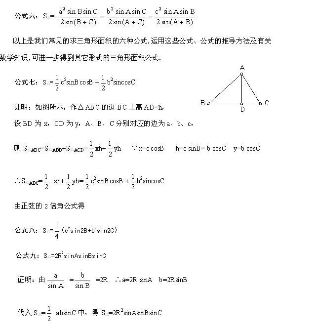
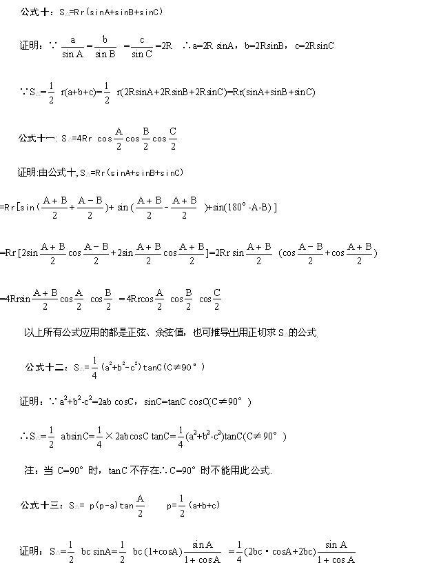

# 三角形面积的计算公式

> 给出一个三角形，这里有好几个公式来得到它的面积。

三角形面积没有什么特别的计算方法，只是对几个公式的理解。

这里借鉴了一篇文章的几个公式，希望对今后的解题有所帮助。






这里再将常用的几个写成代码形式：

```text
1. double s=a*h/2.0;
2. double s=a*b*sin(C)/2.0;
3. double p=(a+b+c)/2.0;
   double s=sqrt(p*(p-a)*(p-b)*(p-c));
4. double s=a*b*c/4.0/R;    //只适用于圆内接三角形，R为外接圆半径
5. double s=r*(a+b+c)/2.0;  //只适用于圆外切三角形，r为内切圆半径
6. double s=a*a*sin(B)*sin(C)/sin(B+C)/2.0;
```

三角形面积也就是在不同情形下的不同应用，还是需要对各种公式的熟练掌握。
