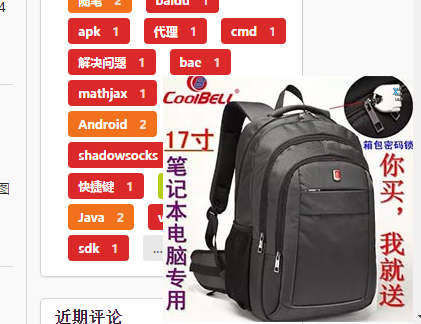

# 博客发现贴片广告(╯‵□′)╯︵┻━┻

晚上更新博客的时候突然发现页面的右下角出现了广告。

使用Chrome的控制台查看源代码可以发现一个奇怪的`#ppp_box`的div

博客引用的外部js有：`semantic-ui`框架、`duoshuo`评论、`cilcki`统计、`swiftype`搜索。
在使用`xxx+广告`搜索无果的情况下，决定以`ppp_box`为关键词搜索引用的js，终于发现了蛛丝马迹。

统计已换为google_analytics。
使用clicki是因为它的友好型和漂亮的扩展，可以显示来访用户详细的信息。

感觉非常难过。
