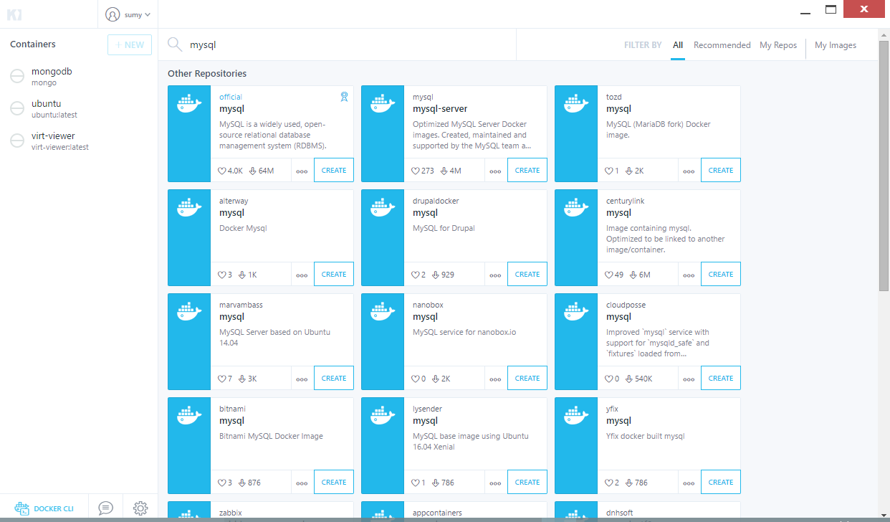
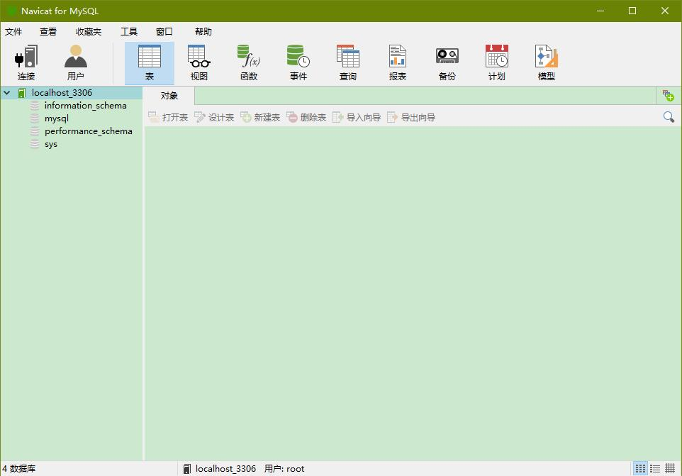

# 人人都懂的Docker简明教程

很早之前就听过 **Docker** ，前几天写一个程序的时候想要用 **mongo** ，于是就想不如从 Docker 里弄一个吧，于是就这样跌跌撞撞的走上了 _使用_ Docker之路。

本文不对Docker做深入的了解，只是根据实际使用中遇到的情况，所谓遇到什么问题解决什么问题。

另，本文为**Windows下使用Docker**，如果你使用其它操作系统请谷歌其它文章。

## 什么是Docker

一般一个事务，都要按照“是什么”、“为什么”、“怎么用”的角度来说明，但是至于 _Docker是什么这个问题_ ，我的理解Docker就是一个很大的软件仓库，可以从里面下载别人做好的软件来使用。

但是，Docker是一个生态，不可能几句话说清楚，而且Docker生态里大部分内容都是平常用不到的。

## 教练，我想用Docker

如何使用Docker？4步走。下载Docker安装，下载镜像，从镜像构建容器，关闭容器及再次运行容器。这里有两个名词 **镜像** 和 **容器**，这里先不做解释。根据顺序先从下载Docker开始。

### 下载Docker

打开Docker的官网TODO，这是我们遇到的第一个难题，应该如何下载Docker软件？

由于Docker的运行需要借助Linux的内核，所以Windows不得不通过虚拟机来虚拟Linux的内核。根据虚拟机来分有两个派别 **Hyper-V派** 和 **VirtualBox派**。下面这个表格帮助你选择需要安装的Docker版本。

|#|Hyper-V|Virtualbox|
|---|:---|:---|
|Docker代表软件|Docker for Windows|Docker Toolbox|
|试用版本|Windows8以上，Hyper-V支持|Virtualbox软件支持|
|其它软件|VS Android Emulator|Genymotion|

鱼和熊掌不能兼得，在Windows中不能同时使用Hyper-V和Virtualbox，强行使用会出现“绿屏”错误。如果不能割舍基于Virtualbox的模拟器（如Genymotion Android模拟器），可以通过启动菜单切换是否在系统中启用Hyper-V虚拟化功能。

### 下载镜像

选定好了Docker的版本，就需要使用Docker了。先从Docker最基本的**镜像**开始。

**镜像** 是Docker里“软件”传播的一种媒介，通过镜像可以将构建的环境封装起来然后在另一台电脑上部署。

Docker有一个专门的镜像应用市场叫[Docker Hub](https://hub.docker.com/)，在其中可以浏览Docker查找其它人构建的镜像，并将其下载下来使用。Docker下载镜像有几种方式：

#### docker pull

`docker pull` 是docker的一个子命令，只需向命令提供组织名/镜像名，docker就会自动将镜像下载到本地。如，下载mysql的镜像。

首先从Docker Hub上查找[mysql镜像](https://hub.docker.com/_/mysql/)的名称，然后执行docker pull命令，等待一段时候后mysql镜像就会下载到docker的环境中，等待的时间取决于你的网速。

```
PS C:\Users\Sumy> docker pull mysql
Using default tag: latest
latest: Pulling from library/mysql
693502eb7dfb: Pull complete
08d0e9d74b1b: Pull complete
e700ebfbe6bc: Pull complete
f718f1976629: Pull complete
575a0830e278: Pull complete
8461dfcf361d: Pull complete
349434898dfb: Pull complete
78d351522443: Pull complete
21897ab46952: Pull complete
ca6ffbbedc10: Pull complete
ba8ff064032b: Pull complete
Digest: sha256:6d4b33d189d62afe590ee4b35f92aae31f
Status: Downloaded newer image for mysql:latest
```

通过 `docker image` 可以查看当前已经下载过的镜像。

```
PS C:\Users\Sumy> docker images
REPOSITORY          TAG                 IMAGE ID            CREATED             SIZE
jess/virt-viewer    latest              68be3910bf7f        11 days ago         528 MB
mysql               latest              22be5748ecbe        13 days ago         406 MB
wordpress           latest              109633df95f5        6 weeks ago         400 MB
mysql               <none>              7666f75adb6b        6 weeks ago         406 MB
ubuntu              latest              f49eec89601e        7 weeks ago         129 MB
redis               latest              45c3ea2cecac        7 weeks ago         183 MB
mongo               latest              0dffc7177b06        7 weeks ago         402 MB
```

#### docker镜像管理 GUI

照顾一些不会使用命令行的人士，docker也有一些GUI管理工具，官方提供的是 **Kitematic**。



使用Kitematic需要注册一个Docker Hub账号，由此可以浏览Docker Hub上的镜像，下载并运行这些镜像。

#### 镜像到容器

**容器**是由镜像构建而成的运行环境。如果把镜像比作光盘，容器就是光盘里媒体运行的一系列环境。接下来，要运行我们的第一个容器。从镜像执行容器需要的命令参数可以从Docker Hub相应镜像的页面说明里查到，这里以mysql为例：

```
docker run --name mysql -v d:/DockerData/mysql:/var/lib/mysql -e MYSQL_ROOT_PASSWORD=123456 -p 3306:3306 -d mysql
```

这个命令表示通过mysql镜像生成一个Docker容器。`-d` 表示以守护进程的方式执行； `--name` 指定该容器的名字，供下次继续使用，如果没有指定名字，docker会自动生成一个； `-p` 表示映射端口，将容器内的3306映射到宿主机的3306端口上；`-v` 表示硬盘存储映射，将容器内的_/var/lib/mysql_目录映射到_d:/DockerData/mysql_； `-e` 主要为容器的运行提供一些环境变量。

运行中的容器可以使用 `docker ps` 查看，`docker ps -a` 可以查看所有创建过的容器。
```
PS C:\Users\Sumy> docker ps
CONTAINER ID        IMAGE               COMMAND                  CREATED             STATUS              PORTS                    NAMES
63545fbf4af6        mysql               "docker-entrypoint..."   3 minutes ago       Up 3 minutes        0.0.0.0:3306->3306/tcp   mysql

PS C:\Users\Sumy> docker ps -a
CONTAINER ID        IMAGE                     COMMAND                  CREATED             STATUS                     PORTS                    NAMES
63545fbf4af6        mysql                     "docker-entrypoint..."   4 minutes ago       Up 4 minutes               0.0.0.0:3306->3306/tcp   mysql
249e5a83f21e        jess/virt-viewer:latest   "virt-viewer -c qe..."   9 days ago          Exited (1) 9 days ago                               virt-vi
dfdd287e0590        ubuntu:latest             "/bin/bash"              2 weeks ago         Exited (255) 2 weeks ago                            ubuntu
bdb4df466deb        mongo                     "/entrypoint.sh mo..."   5 weeks ago         Exited (0) 4 weeks ago                              mongodb
```

如此，就创建了一个运行了mysql的容器，并且可以通过本机的3306连接到这个容器。



这里使用了 `docker run` 的命令，不同的镜像有不同的启动方式，可以使用 `docker help` 或 Docker官方文档 来了解 docker run 详细的使用说明。

### 再次运行容器

每次执行 `docker run` 都会生成一个新容器，新生成的容器与原本运行的容器完全独立。如果需要之前运行的某个容器，通过容器的NAMES可以操作容器的启动和关闭。这里用到的两个命令是 `docker start` 和 `docker stop` 。

要操作容器需要知道被操作容器的名字，这个名字在创建容器的时候通过 `--name` 参数指定，如果忘记了也可以通过 `docker ps -a` 查看所有容器，从中找出要操作的容器。

比如要启动和关闭上面创建的mysql容器，只需要执行 `docker start mysql` 和 `docker stop mysql` 即可。

## 其它一些废话

Docker在镜像仓库的协助下变得非常简单易用，通过下载其他人制作的镜像，可以快速创建和使用我们需要的容器。镜像仓库中的镜像有的时候可能不满足我们的需求，这时候可以通过自定义方式来创建容器，然后将其编译成镜像供他人使用。

推荐一本书《第一本Docker书》，看过前面部分的感受就是通过例子讲解Docker的一些部分。如果将Docker的一些概念理清楚了，那么Docker就算是入门了。
