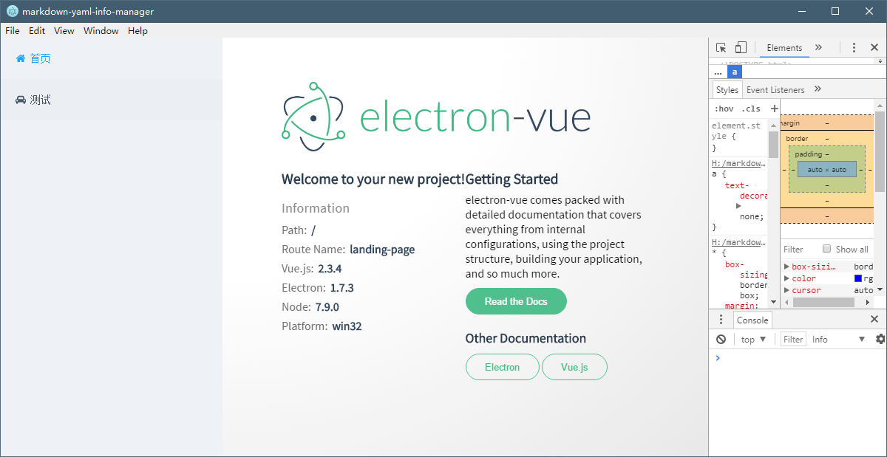

# 从零开始捣鼓一个Electron应用——界面组件

上一篇捣鼓了一个Electron-vue的脚手架，把Vue的全家桶搭建了一下，也很给面子的跑了起来。接下来就是如何一步一步完成我心中的那个“她”了。

首先先巴拉巴拉自己的技能：

1. Vue用过，了解Vue的MVVM思想，但是Vue2及其全家桶确实第一次用
1. 能写原生JavaScript程序，但是不明白什么是ES5或是ES6，反正就是看心情写了
1. React了解一点，但是没有写过，所以Vue2中类似于React的思想也是。。。:joy:
1. 总之，不要放弃治疗，从0开始异世界之旅吧。。。

每一篇文章都把自己的思（x）考（度）过程尽量表述出来，在文章开始的时候也会将本篇用到的东西稍微列举一下的。

## 本篇技术栈和主要技能

本篇先把以下内容整合到一起，然后做一个简单的欢迎页面，之后需要什么再继续补充。

+ :outbox_tray:Vue全家桶：vue2 + vuex + vue-router + webpack
+ :rabbit2:网络请求：axios（脚手架里自带，感觉上不会用到网络请求的）
+ :balloon:页面UI：Element-UI（本篇重点就是把它招募进来）、vue-awesome（这不是文章汇总）

## 组件安装

### 引用Element-UI

Element-UI的安装文档可以参考[这里](http://element.eleme.io/#/zh-CN/component/installation)

通过npm安装

```bash
npm install element-ui -S
```

然后想要完整引入Element，在main.js加入以下几行

```javascript
import ElementUI from 'element-ui'
import 'element-ui/lib/theme-default/index.css'

Vue.use(ElementUI)
```

随便测试一下应该就能用了。

### 引入vue-awesome

[vue-awesom](https://github.com/justineo/vue-awesome) 是对 [Font Awesome](http://fontawesome.io/) 的一个封装，首先还是通过npm安装

```bash
npm install vue-awesome
```

然后还是在main.js内全局引入

```javascript
import 'vue-awesome/icons'
import Icon from 'vue-awesome/components/Icon'

Vue.component('icon', Icon)
```

测试一下肯定也能用。

## 创建布局

下面开始实现一些功能，首先想在左面加入一个导航栏，用来选取功能，右面显示具体的功能，整个页面大概是这个样子的。


左边导航栏固定宽度，右边浮动。布局页面 `PageFrame.vue` 定义导航栏和显示内容的位置

```html
<template>
  <div>
    <div class="sidebar">
      <el-menu default-active="1">
        <router-link v-bind:to="'/home'">
          <el-menu-item index="1">
            <icon name="home"></icon>&nbsp;&nbsp;首页
          </el-menu-item>
        </router-link>
        <router-link v-bind:to="'/sysinfo'">
          <el-menu-item index="2">
            <icon name="car"></icon>&nbsp;&nbsp;测试
          </el-menu-item>
        </router-link>
      </el-menu>
    </div>
    <div class="content">
      <router-view></router-view>
    </div>
  </div>
</template>

<script>
export default {
  name: 'page-frame'
}
</script>

<style>
a {
  text-decoration: none;
}

.sidebar {
  position: fixed;
  width: 300px;
  left: 0;
  top: 0;
  bottom: 0;
  background-color: #eef1f6;
}

.content {
  margin-left: 300px;
  position: relative;
  width: calc(100% - 300px);
  min-height: 100vh;
  background: radial-gradient( ellipse at top left,
  rgba(255, 255, 255, 1) 40%,
  rgba(229, 229, 229, .9) 100%);
}
</style>

```

原入口 `App.vue` 改为只渲染页面布局，即上面提到的内容。

```html
<template>
  <div id="app">
    <page-frame></page-frame>
  </div>
</template>

<script>
import PageFrame from './components/PageFrame'

export default {
  name: 'markdown-yaml-info-manager',
  components: { PageFrame }
}
</script>

<style>
.fa-icon {
  height: 1em;
  width: 1em;
  bottom: -0.125em;
  position: relative;
}
</style>
```

别忘了定义一下vue-route，在 `route/index.js` 下，至于什么是vue-route，照着写就可以了。大体意思是，`/home` 载入原先的欢迎页，`/sysinfo` 输出一下系统信息，如果是其它的就跳转到 `/home`。这些配置信息可以配合 `<router-link>` 标签使用，用来转换 `<route-view>` 标签位置显示的内容。

```javascript
import Vue from 'vue'
import Router from 'vue-router'

Vue.use(Router)

export default new Router({
  routes: [
    {
      path: '/home',
      name: 'landing-page',
      component: require('@/components/LandingPage')
    },
    {
      path: '/sysinfo',
      name: 'system-information',
      component: require('@/components/LandingPage/SystemInformation')
    },
    {
      path: '*',
      redirect: '/home'
    }
  ]
})
```

其它的页面css和布局稍微调整一下，整个布局就ok了。最后效果页。



## 问题说明

### 图标与字体对其问题

调整一下图标大小，微调一下位置，[参考](https://github.com/aleen42/PersonalWiki/blob/master/translation/align_svg/align_svg.md)

```css
.fa-icon {
  height: 1em;
  width: 1em;
  bottom: -0.125em;
  position: relative;
}
```

### eslint问题

eslint会检查代码格式，所以平时要注意把格式化弄的跟eslint一样，不然每次格式化都会出错。

这里举个例子，通过配置 `.eslintrc.js` 可以控制检测的选项，比如下面的选项禁用了函数空格的检查，因为一直调不好

```json
  'rules': {
    "space-before-function-paren": ["error", {
        "anonymous": "never",
        "named": "never",
        "asyncArrow": "never"
    }]
  }
```

### template只能有一个根元素

vue的模板的根元素只能有一个根元素

> Component template should contain exactly one root element

所以只能写

```html
<template>
  <div>abcde....
    <div></div>
  </div>
</template>
```

而不能写成

```html
<template>
  <div>abcde....</div>
  <div></div>
</template>
```

## 打包编译

打包编译可以运行命令

```bash
yarn run build
```

只发现可以编译成exe文件，无法生成mac上的文件，后来发现在 electron-builder 的文档里发现了，编译只能生成本身平台的文件[Multi Platform Build](https://github.com/electron-userland/electron-builder/wiki/Multi-Platform-Build)

> Don't expect that you can build app for all platforms on one platform.

算了，其它平台到时候借个电脑编译一下吧。

## 稍微总结一下

了解了主要的项目结构，初步使用了vue-router相关内容，对于vue组件的编写也有了一定的了解。

不太了解的地方是store的内容，这部分还没有接触到。

然后代码可以上传了。:new_moon:

## 参考内容

+ [vue子组件template不能再写子组件了吗 - KingMario的回答 - SegmentFault](https://segmentfault.com/q/1010000008361637/a-1020000008456118)
