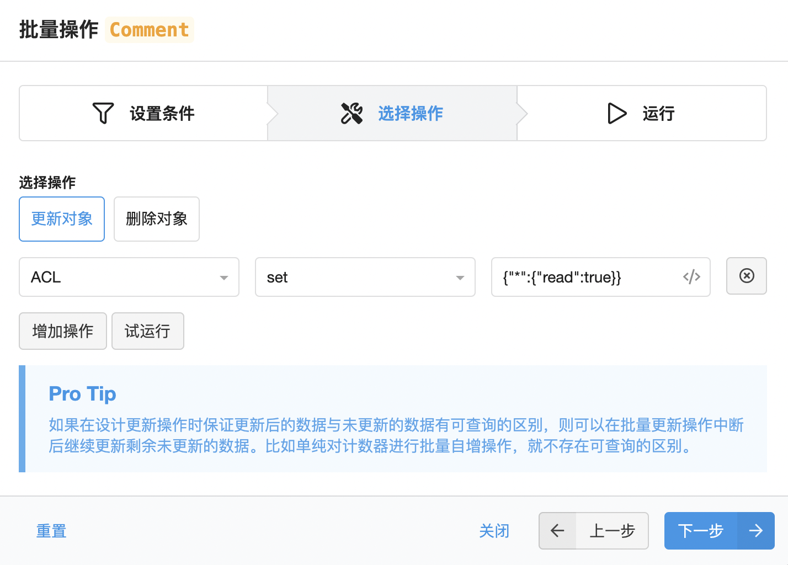

# 博客评论系统迁移到Valine

原来博客的评论系统使用的disqus，个人还是比较喜欢disqus评论的，无奈被“限制”的太厉害，常年加载不出来。无奈只好寻求其它的解决方案。

参考几个评论系统，有几款基于Github Issues的评论系统，有专门的评论系统（来必力等）。基于Github Issues的在存储上不成问题，但是考虑到评论导入的问题，就不太好操作了，切换到这类评论系统需要舍弃以前的评论信息。第三方的评论系统就要考虑随时被墙的问题，而且打开速度也有影响。

最后选择了Valine，主要看中了其没有后端，可以操作数据库，“伪造”评论 :sweat_smile:。

## 添加评论系统

首先需要获取评论系统使用的appId和appKey，这个就不多介绍了，可以参考[valine](https://valine.js.org/)文档中的快速开始部分进行获取。

本博客使用了 maupassant 主题，没有配置对应的评论模块，需要自己手动添加。

先在博客配置文件 _config.yml 中增加关于valine主题的配置。

```yaml
valine:
  enable: true #valine全局开关
  app_id: #获取的appId
  app_key: #获取的appKey
  visitor: true #是否启用访问统计
```

添加好配置后，找到评论渲染的位置 _partial/comments.pug 文件，引入公共js并渲染评论控件。

```pug
if theme.valine.enable
  script(src="//unpkg.com/valine/dist/Valine.min.js") 
  #vcomments
    script.
      new Valine({
          el: '#vcomments',
          appId: '#{theme.valine.app_id}',
          appKey: '#{theme.valine.app_key}',
          path: '#{page.path}',
          visitor: #{theme.valine.visitor}
      })
```

可以用valine的访问统计替换掉busuanzi的访问统计，找到 post.pug 文件中的访问统计位置，增加以下模板：

```pug
if theme.valine.enable && theme.valine.visitor
  span#valine_container_page_pv= ' | '
    span(id=page.path class='leancloud_visitors')
      span.leancloud-visitors-count
        i.fa.fa-spinner.fa-spin
      span= ' ' + __('Hits')
```

这样基本上就能使用了。

## 迁移评论数据

接下来需要将评论数据从disqus迁移到valine中。从disqus导出评论数据。在disqus后台，Export可以导出所有的评论数据。导出后从邮件里就会获取一个所有评论的xml文件。

下载完数据后，找到一个disqus导入valine数据的网站，[https://taosky.github.io/disqus-to-valine/](https://taosky.github.io/disqus-to-valine/)可以将disqus评论数据转换成valine并直接导入到数据库中。

导入完成之后，还需要调整下数据权限，防止客户端随便删除评论。

LeanCloud上有个批量操作数据的功能，将所有数据的ALC更新成 `{"*":{"read":true}}` 即可。



这样数据迁移就完成了。

## 其它

现在评论已经切换到valine中，还有一些功能，比如 **最近评论列表** 和需要展示的 **评论数量** 看怎么能实现，目前这两个功能暂时先空缺了。

## 参考内容

+ [评论系统从Disqus迁移到Valine](https://jayshao.com/disqus-to-valine/)
+ [valine](https://valine.js.org/)
