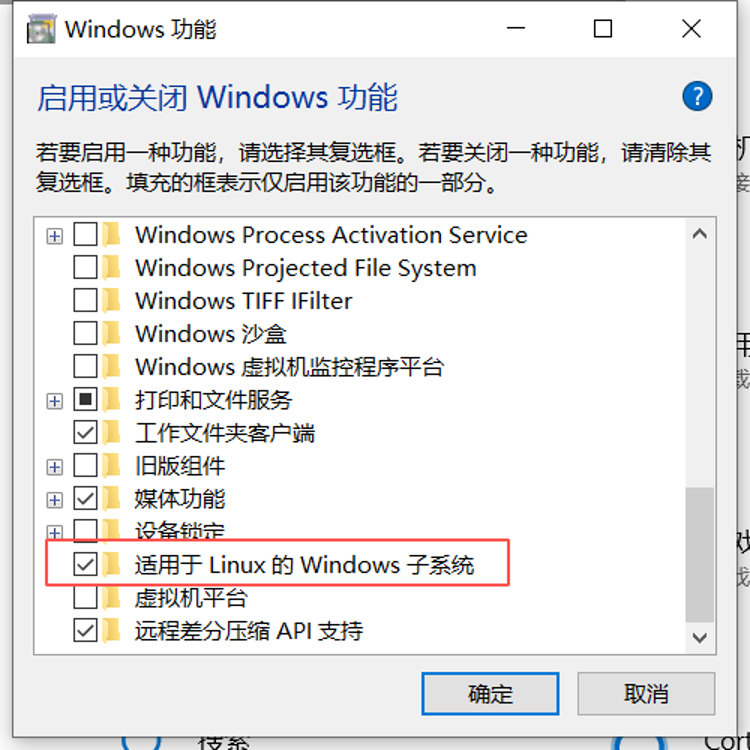
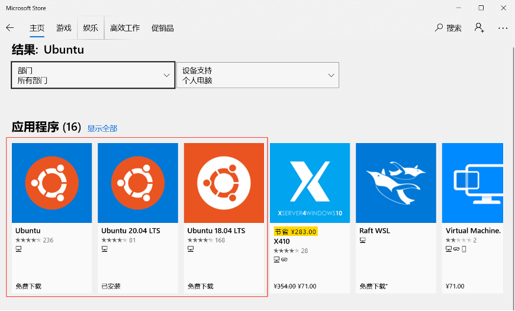
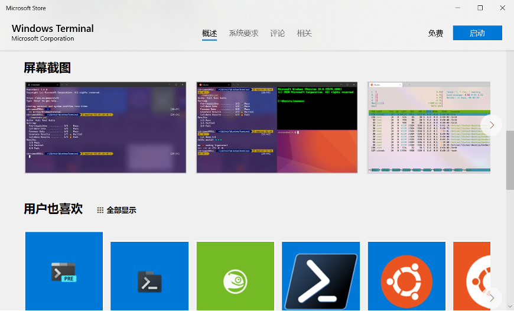
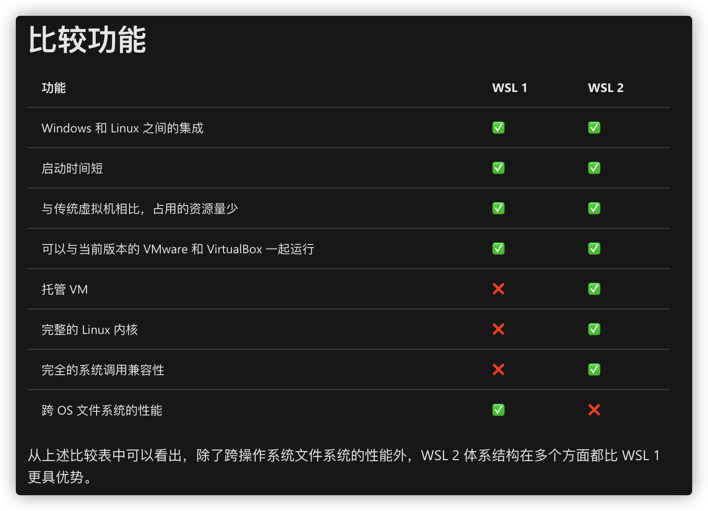

# 基于WSL2搭建Win10开发环境

距离微软发布 Windows Subsystem for Linux (WSL) 有好一段时间了，也一直没想到什么场景下能够用到这个子系统。最近给新电脑 Win10 系统搭建开发环境的时候，感觉好多开发软件不是特别顺手。猛然间想起了还有子系统，随即尝试了一下。作为开发环境没有什么问题的，下面把基本过程记录一下。

<!-- more -->

> 适用于 Linux 的 Windows 子系统可让开发人员按原样运行 GNU/Linux 环境 - 包括大多数命令行工具、实用工具和应用程序 - 且不会产生传统虚拟机或双启动设置开销。
> [什么是适用于 Linux 的 Windows 子系统 | Microsoft Docs](https://docs.microsoft.com/zh-cn/windows/wsl/about)

使用WSL有以下一些优点：

1. 外壳系统还是 Windows，但是可以运行 Linux 的一些命令
2. 可以使用 Linux 的包管理，使用 Linux 的软件和调试环境
3. 开发环境可以借助 VSCode 和 Intellij IDEA 访问 WSL 中的代码

## 安装WSL

官方提供了安装WSL的教程[在 Windows 10 上安装 WSL | Microsoft Docs](https://docs.microsoft.com/zh-cn/windows/wsl/install-win10)。重新总结一下安装步骤：

1. 更新 Win10 系统
2. 在Windows设置里搜索【启动或关闭Windows功能】


3. 找到其中的【适用于 Linux 的 Windows 子系统】选中，点【确定】，等待安装重启



1. 在Windows Store商店里安装Ubuntu发行版



商店里也有CentOS的发行版，但是需要~~花钱~~。。。

1. 在终端（命令提示符 或 PowerShell）中输入bash就可以启动WSL了。之后就可以像是用 Linux 一样用这个系统了。

## 更新到 WSL2

如果只是使用 WSL1 ，那么以上步骤就足够了。这里强烈建议更新到 WSL2 以获取更好的性能支持和更优秀的文件变更监控特性。

关于一代和二代的区别，可以参考这篇文章[比较 WSL 1 和 WSL 2 | Microsoft Docs](https://docs.microsoft.com/zh-cn/windows/wsl/compare-versions)



> 在开始更新之前，先要保证系统版本满足需要的最低版本，建议更新一下系统。除了通过系统版本号判断是否能够安装 WSL2 外，还可以通过命令简单的判断。
> 输入： `wsl --help`
> 根据命令反馈的帮助信息里有没有包含相应的选项（例如`--set-default-version`）来判断是否可以升级 WSL2。

以下步骤按照文章 在 [Windows 10 上安装 WSL | Microsoft Docs](https://docs.microsoft.com/zh-cn/windows/wsl/install-win10#manual-installation-steps) 进行操作。

1. 启动虚拟化功能，在Powershell的管理员模式（右键开始菜单按钮，选择【Windows PowerShell（管理员）】）下执行：

```powershell
dism.exe /online /enable-feature /featurename:VirtualMachinePlatform /all /norestart
```

2. 下载 Linux 内核更新包进行安装，[适用于 x64 计算机的 WSL2 Linux 内核更新包](https://wslstorestorage.blob.core.windows.net/wslblob/wsl_update_x64.msi)

3. 打开 PowerShell，输入以下命令将WSL默认版本切换到WSL2

```shell
wsl --set-default-version 2
```

4. 转换已经创建的 WSL 到 WSL2

```shell
# 查看当前已经存在的发行版
wsl --list --all
# 切换发行版版本，需要使用上个命令列出的发行版名称，如Ubuntu-20.04
wsl --set-version Ubuntu-20.04 2
```

## 安装Windows Terminal（可选）

Windows发布了一个命令行终端，可以尝试一下。

[GitHub - microsoft/terminal: The new Windows Terminal and the original Windows console host, all in the same place!](https://github.com/Microsoft/Terminal)

在 Github 的 [release](https://github.com/microsoft/terminal/releases) 页面或者 Windows 系统的 Microsoft Store 可以下载安装。



## 配置Node开发环境

直接上教程，按照说明操作一遍即可[在 WSL 2 上设置 NodeJS | Microsoft Docs](https://docs.microsoft.com/zh-cn/windows/dev-environment/javascript/nodejs-on-wsl)。

VSCode 需要安装 **Remote - WSL** 插件才能打开存储在 WSL 中的项目。IDEA 可以直接打开 WSL 中的项目。

## 参考内容

+ [WSL：搭建前端环境](https://www.yuque.com/raozhanping/rg2gql/mctpb4)
+ [搭建完美的Windows10开发环境](https://zhuanlan.zhihu.com/p/119299000)
