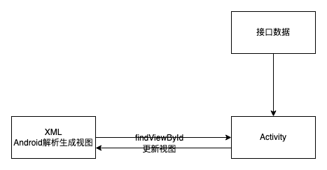
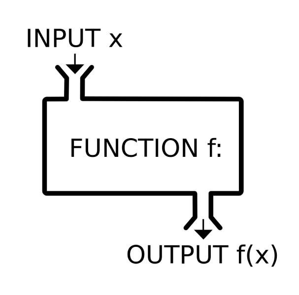

# Android Compose 对比 React hooks

## 前言

自2008年Android 1.0出现之后，Android开发的基本模式类似于一种MVC的命令式开发模式。



用XML编写界面，Activity中获取界面元素的引用，根据外部数据的状态来改变界面元素的属性。

纵观前端的发展历程，以上开发模式显然存在着一些弊端。后面前端也从MVC模式逐渐演变出现在的MVVM模式。
有句话说，MVVM模式是现在前端开发的终极模式。随着Java8函数式编程的引入，MVVM思想的流行和Kotlin对Android开发代码的简化和体验提升，
Google也在探索Android开发的新模式。

Jetpack Compose是Google在2019 I/O大会上公布的声明式UI框架。一经推出Google就鼓励更多的开发者去了解与使用它，
就在今年7月份，Compose发布了它的1.0版本，标志着推翻10年之久的UI开发模式的战役已经打响。


纵观Compose的设计理念和使用方式，你会发现它与React Hooks非常像。如函数组件、纯函数、副作用、声明式渲染、组件状态这些概念在Compose
与React Hooks都是保持一致的。本文通过介绍React Hooks的相关内容，来对Compose大体上做个了解。

## React Hooks

_Hook_ 是 React 16.8 的新增特性。它可以让你在不编写 class 的情况下使用 state 以及其他的 React 特性。

### 函数式组件

提到Hook不得不说的一个概念是函数式组件。React Hooks设计的初衷是为了 **Hook 使你在无需修改组件结构的情况下复用状态逻辑** 。
组件可以复用，函数可以复用，但是组件内的逻辑如何复用没有一个合理的方式。

一个函数，给定输入，就会有输出。函数式组件是，给定参数props输入，输出渲染组件的一个函数。如果一个函数，只要输入值相同，
输出值也一定相同，那么这个函数被称为 **纯函数** 。给函数式组件props相同的属性，展示应该一直保持一定。这就是 **幂等性** 的概念。



如果一个函数依赖了外部的数据（全局变量、接口等），那么就不能保证它是一个 **纯函数** 了。
当状态改变时，函数也可能跳出自身作用域去修改外部的一些数据（修改变量、请求接口），这里把这些都称为“副作用”（**Side Effect**）。

React通过 **useState** 为函数式组件引入状态，使用 **useEffect** 来管理状态产生的副作用。

### useState

**useState** 用于在React函数式组件上添加内部state。

```jsx
import React, { useState } from 'react';

function Example() {
    const [count, setCount] = useState(0);

    return (
        <div>
            <p>You clicked {count} times</p>
            <button onClick={() => setCount(count + 1)}>
                Click me
            </button>
        </div>
    );
}
```

- **第一行:** 引入 React 中的 `useState` Hook。它让我们在函数组件中存储内部 state。
- **第四行:** 在 `Example` 组件内部，我们通过调用 `useState` Hook 声明了一个新的 state 变量。它返回一对值给到我们命名的变量上。
我们把变量命名为 `count`，因为它存储的是点击次数。我们通过传 `0` 作为 `useState` 唯一的参数来将其初始化为 `0`。
第二个返回的值本身就是一个函数。它让我们可以更新 `count` 的值，所以我们叫它 `setCount`。
- **第九行:** 当用户点击按钮后，我们传递一个新的值给 `setCount`。React 会重新渲染 `Example` 组件，并把最新的 `count` 传给它。

### useEffect

**useEffect**用于在函数组件中执行副作用操作。

```jsx
import React, { useState, useEffect } from 'react';

function Example() {
  const [count, setCount] = useState(0);

  // Similar to componentDidMount and componentDidUpdate:  
  useEffect(() => {
      // Update the document title using the browser API
      document.title = `You clicked ${count} times`;
  }, [count]);

  return (
    <div>
      <p>You clicked {count} times</p>
      <button onClick={() => setCount(count + 1)}>
        Click me
      </button>
    </div>
  );
}
```

- **第七行：** 引入useEffect，在count发生变化的时候，修改页面title的值。

## Compose

上面介绍了React Hooks的两个函数useState和useEffect，下面用Compose实现对应的功能。

### 一个Activity页面

在Compose模式下，一个Activity页面如下

```kotlin
class MainActivity : ComponentActivity() {
    override fun onCreate(savedInstanceState: Bundle?) {
        super.onCreate(savedInstanceState)
        setContent {
            HelloComposeTheme {
                // A surface container using the 'background' color from the theme
                Surface(modifier = Modifier.fillMaxSize(), color = MaterialTheme.colorScheme.background) {
                    Greeting("Android")
                }
            }
        }
    }
}

@Composable
fun Greeting(name: String) {
    Text(text = "Hello $name!")
}

@Preview(showBackground = true)
@Composable
fun DefaultPreview() {
    HelloComposeTheme {
        Greeting("Android")
    }
}
```

- **第 5 - 12 行：** 为Compose控制的内容
- **第 16 行：** 用 `@Composable` 注解的函数就是一个函数组件
- **第 21 行：** 用 `@Preview` 注解表示可以进行本地UI预览

### 状态

```kotlin
@Composable
fun Example() {
    val (count, setCount) = remember { mutableStateOf(0) }

    Column {
        Text(text = "You clicked ${count} times")
        Button(onClick = { setCount(count + 1) }) {
            Text(text = "Click me")
        }
    }
}
```

- **第 3 行：** mutableStateOf创建一个状态，remember缓存状态
- **第 7 行：** 在Button被点击后触发onClick函数，通过 `setCount` 对state执行加1操作

### 副作用

```kotlin
@Composable
fun Example1() {
    val context = LocalContext.current
    val (count, setCount) = remember { mutableStateOf(0) }

    LaunchedEffect(count) {
        Toast.makeText(context, "You clicked ${count} times", Toast.LENGTH_SHORT).show()
    }

    Column {
        Text(text = "You clicked ${count} times")
        Button(onClick = { setCount(count + 1) }) {
            Text(text = "Click me")
        }
    }
}
```

- **第 7 - 8 行：** 在count变化后执行副作用，弹出一个toast

## 总结

通过上面的对比，Compose与React Hooks在函数式组件、状态管理和副作用函数方面还是很相似的，
声明式UI和数据驱动的思想也能在Android开发上得到运用。学会了React Hooks很容易入手Jetpack Compose。
大前端统一技术栈的进程又进了一步。
