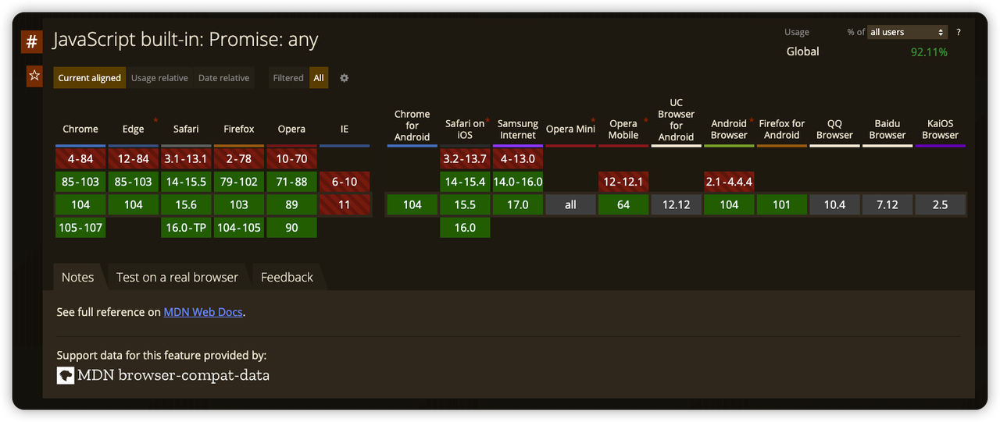

# 动态polyfill方案调研

## 什么是polyfill

简单来说，polyfill是为了**抹平不同浏览器的api之间的差异**。使我们在开发的过程中不需要过多关注浏览器版本之间的差异。


https://caniuse.com/mdn-javascript_builtins_promise_allsettled

一个语言需要不断发展，语言的不同阶段会产生差异。需要抹平不同浏览器的差异主要来自以下几个方面：

1. JavaScript语言层面的差异。JS也在不断发展，不同阶段提出了不同的API。为了在旧浏览器上能够使用新版的API，就需要进行polyfill。
2. 不同浏览器版本之间的差异。如IE和Chrome不同内核的差异，Chrome和Chrome不同版本的差异。DOM API、HTML5等特性的实现不同，就需要进行polyfill。

## 抹平不同浏览器的API差异

要使代码抹平不同浏览器的API差异、兼容低版本浏览器，主要从以下几方面入手：

1. 不同浏览器内核 => 判断+转换成统一方法。不同浏览器内核的API方法有些许不同，可以判断浏览器内核转化成统一的方法调用。


https://caniuse.com/addeventlistener

```js
// 添加事件
function addEvent(obj, type, fn) {
    if (obj.addEventListener) {
        obj.addEventListener(type, fn, false);
    } else if (obj.attachEvent) {
        obj.attachEvent('on' + type, fn);
    }
}

// 移除事件
function removeEvent(obj, type, fn) {
    if (obj.removeEventListener) {
        obj.removeEventListener(type, fn, false);
    } else if (obj.detachEvent) {
        obj.detachEvent('on' + type, fn);
    }
}
```

2. 新语法、语法糖 => 转换成兼容代码。新语法无法直接在旧版浏览器中执行，只能对其进行等义转换。

以运算符 `??` 为例：


https://caniuse.com/mdn-javascript_operators_nullish_coalescing

```js
// 原始代码
const a = 1
const b = 2
const x = a ?? b

// 转换后代码
const a = 1;
const b = 2;
const x = a !== null && a !== void 0 ? a : b;
```

https://www.typescriptlang.org/play?#code/MYewdgzgLgBAhjAvDAjAKFJWAjJMBMG40MAHnggPyUzZA

这类转换一般通过babel插件进行。
babel插件在打包的时候会根据package.json配置的环境范围对不兼容的语言进行转换。当然tsc也有对应的功能，它主要是读取tsconfig.json中配置的target确定需要转换语法的范围。

3. 新对象、新方法 => 补丁代码进行补充。后续浏览器更新会增加新方法，或者增加新对象。可以通过添加补丁代码的方式进行兼容。这类做法就是我们常说的polyfill。

以Promise.any为例



https://caniuse.com/mdn-javascript_builtins_promise_any

```js
/* global AggregateError, CreateMethodProperty, IterableToList, Promise, Type */
(function () {
        // Based on https://github.com/es-shims/Promise.any/blob/master/implementation.js

        var identity = function (x) {
                return x;
        }

        CreateMethodProperty(Promise, 'any', function any (iterable) {
                var C = this;
                if (Type(C) !== 'object') {
                        throw new TypeError('`this` value must be an object');
                }

                var arr;
                if (Array.isArray(iterable)) {
                        arr = iterable;
                } else {
                        try {
                                arr = IterableToList(iterable);
                        } catch (_error) {
                                return Promise.reject(new TypeError('Argument of Promise.any is not iterable'));
                        }
                }

                var thrower = function (value) {
                        return C.reject(value);
                };

                var promises = arr.map(function (promise) {
                        var itemPromise = C.resolve(promise);
                        try {
                                return itemPromise.then(thrower, identity);
                        } catch (e) {
                                return e;
                        }
                });

                return C.all(promises).then(function (errors) {
                        throw new AggregateError(errors, 'Every promise rejected')
                }, identity);
        });
}());
```

https://github.com/Financial-Times/polyfill-library/blob/master/polyfills/Promise/any/polyfill.js

## 使用polyfill

使用polyfill总的来说，有两种方式：手动和自动。

### 手动polyfill

以Object#assign为例，这类常用函数在IE11等旧浏览器上也会报错，但是有些库已经进行了实现，我们就能够借助这些库进行手动polyfill。

```js
Object.assign = require('object-assign')
// or

// Refer: https://developer.mozilla.org/en-US/docs/Web/JavaScript/Reference/Global_Objects/Object/assign
if (typeof Object.assign != 'function') {
  // Must be writable: true, enumerable: false, configurable: true
  Object.defineProperty(Object, "assign", {
    value: function assign(target, varArgs) { // .length of function is 2
      'use strict';
      if (target == null) { // TypeError if undefined or null
        throw new TypeError('Cannot convert undefined or null to object');
      }

      var to = Object(target);

      for (var index = 1; index < arguments.length; index++) {
        var nextSource = arguments[index];

        if (nextSource != null) { // Skip over if undefined or null
          for (var nextKey in nextSource) {
            // Avoid bugs when hasOwnProperty is shadowed
            if (Object.prototype.hasOwnProperty.call(nextSource, nextKey)) {
              to[nextKey] = nextSource[nextKey];
            }
          }
        }
      }
      return to;
    },
    writable: true,
    configurable: true
  });
}
```

优势是能够保证最先依赖引入。缺点是不便维护和管理，无法适应多端和复杂的浏览器环境。

### 自动polyfill

借助webpack的babel插件，可以实现根据代码自动polyfill。主要由以下插件和库可以实现该能力`@babel/preset-env`、 `@babel/plugin-transform-runtime`、 `core-js`、`@babel/polyfill`。

1. `@babel/preset-env` - 按需编译和按需打补丁

> `@babel/preset-env` is a smart preset that allows you to use the latest JavaScript without needing to micromanage 
> which syntax transforms (and optionally, browser polyfills) are needed by your target environment(s). This both makes 
> your life easier and JavaScript bundles smaller!

翻译过来就是 `@babel/preset-env` 会根据目标环境来进行编译和打补丁。具体来讲，是根据参数 `targets` 来确定目标环境，
默认情况下它编译为ES2015，可以根据项目需求进行配置：

```js
// ...
     presets: [
       [
         '@babel/preset-env',
         {
           // 支持chrome 58+ 及 IE 11+
           targets: {
             chrome: '58',
             ie: '11',
           }
         },
       ],
     ]
// ...
```

具体 targets 参数可参见 [browserlist](https://github.com/browserslist/browserslist)。

2. `core-js` JavaScript 标准库

[core-js](https://github.com/zloirock/core-js) 是实现 JavaScript 标准运行库之一，它提供了从ES3～ES7+ 以及还处在提案阶段的 JavaScript 的实现。

3. `@babel/plugin-transform-runtime` - 重利用 Babel helper 方法的babel插件

> A plugin that enables the re-use of Babel's injected helper code to save on codesize.

[@babel/plugin-transform-runtime](https://babeljs.io/docs/en/babel-plugin-transform-runtime) 是对 Babel 编译过程中产生的 helper 方法进行重新利用(聚合)，以达到减少打包体积的目的。
此外还有个作用是为了避免全局补丁污染，对打包过的 bundler 提供"沙箱"式的补丁。

4. `@babel/polyfill` - core-js 和 regenerator-runtime 补丁的实现库

> Babel includes a [polyfill](https://en.wikipedia.org/wiki/Polyfill_(programming)) that includes a custom 
> [regenerator runtime](https://github.com/facebook/regenerator/blob/master/packages/regenerator-runtime/runtime.js) 
> and https://github.com/zloirock/core-js.  
> This will emulate a full ES2015+ environment (no < Stage 4 proposals) and is intended to be used in an application 
> rather than a library/tool. (this polyfill is automatically loaded when using babel-node)

`@babel/polyfill` 通过定制 `polyfill` 和 `regenerator`，提供了一个ES2015+ 环境 polyfill的库。因为它是由其他两个库实现的，
直接引入其他两个库即可，所以已被废弃。

```js
  // 实现 @babel/polyfill 等同效果
  import 'core-js/stable'
  import 'regenerator-runtime/runtime' 
```

通过插件的方式，能够分析代码中使用的函数，根据浏览器覆盖率动态的生成polyfill进行加载，使得polyfill的体积和功能达到了一个平衡。

## 动态polyfill

以上的polyfill方案，无法避免的问题就是冗余。如果用户的浏览器环境本身就支持，就无需加载某个/些polyfill方法。

[Polyfill.io](https://polyfill.io/) 就是实现这个方案的服务，它会根据浏览器的UA不同，返回不一样的补丁。如想要 `Promise` 补丁，在页面引入：

```html
<script src="https://polyfill.io/v3/polyfill.js?features=Promise"></script>
```

如在高版本的浏览器(Chrome 75)上，打开链接会返回空页面：

```js
/* Polyfill service v3.111.0
 * For detailed credits and licence information see https://github.com/financial-times/polyfill-service.
 * 
 * Features requested: Promise
 *  */


/* No polyfills needed for current settings and browser */
```

如果将浏览器的UA改为IE 11，将会返回相应的 `polyfill`:


还可以附加查询参数来定制Polyfill，具体可参照[官方文档](https://polyfill.io/v3/url-builder/)。

此外，如果对 http://polyfill.io 的稳定性和安全性有要求，可以根据开源的 [polyfill service](https://github.com/Financial-Times/polyfill-service) 搭建自己的服务，然后部署到 CDN 上。

## 动态polyfill优化

动态polyfill听起来很美好，但是也存在一些问题。

1. 为了提供动态的特性，一个远端服务的支持。远端服务需要根据请求ua动态生成js文件。动态生成存在计算的过程，对服务的稳定性要求比较高。
2. 作为一个JS基础库，另一个考虑的因素就是访问和加载速度。免不了需要CDN的支持，但是ua的组合多种多样，使用CDN缓存会有庞大的成本问题。

如果平台所处的环境相对固定，就可以对polyfill进一步优化。借助埋点提供的浏览器环境数据，按照webview版本将polyfill拆分成固定的几个版本，在不同的版本阶段加载不同的polyfill。

### 基于线上版本分布的polyfill优化

从 sentry 上查看浏览器的版本分布


可以看到出现频率最常见的两个版本是 `66.0.3369` 和 `56.0.2924` ，这里准备了这两个环境的UA字符串：

```text
Mozilla/5.0 (Linux; Android 6.0.1; MiTV4A Build/MHC19J; wv) AppleWebKit/537.36 (KHTML, like Gecko) Version/4.0 Chrome/66.0.3359.158 Mobile Safari/537.36 MITV/94

Mozilla/5.0 (Linux; Android 6.0; MiTV4-MTSM0 Build/MRA58K; wv) AppleWebKit/537.36 (KHTML, like Gecko) Version/4.0 Chrome/56.0.2924.87 Mobile Safari/537.36 MITV/94
```

以将特性polyfill到es2015为例，https://polyfill.io/v3/polyfill.js?features=es2015 ，我们只需要准备三个版本的polyfill文件即可。


高于66的只polyfill Array.prototype.sort函数，在56-66之间的使用Array.prototype.sort和Array.prototype.values，其余的引用全量的polyfill。

相比全量和动态的polyfill，该方案能有效降低polyfill存储和传输的成本。

### 基于固定版本的polyfill优化

我们的服务如果可以定制化或者自带webview控件，就可以将WebView的版本进行锁定到固定版本。由此进一步缩小浏览器之间的内核和版本差异，达到版本分布可控的状态。

在版本可控的情况下，可以将当前WebView版本专有的polyfill文件缓存到系统本地，通过本地文件加载的方式进一步优化传输速度。

## 总结

polyfill是为了解决浏览器版本差异而出现的一种补丁措施。随着对性能和体验要求的提升，动态polyfill剔除了没必要的补丁，
使更多函数能够调用浏览器原生的函数实现。在变量中寻找不变量，对非必要变量进行剪枝，是动态polyfill优化的一个方向。
