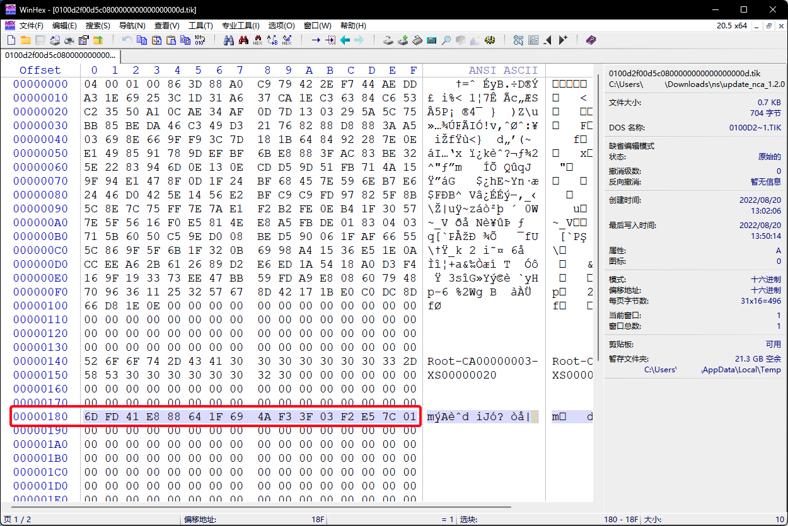
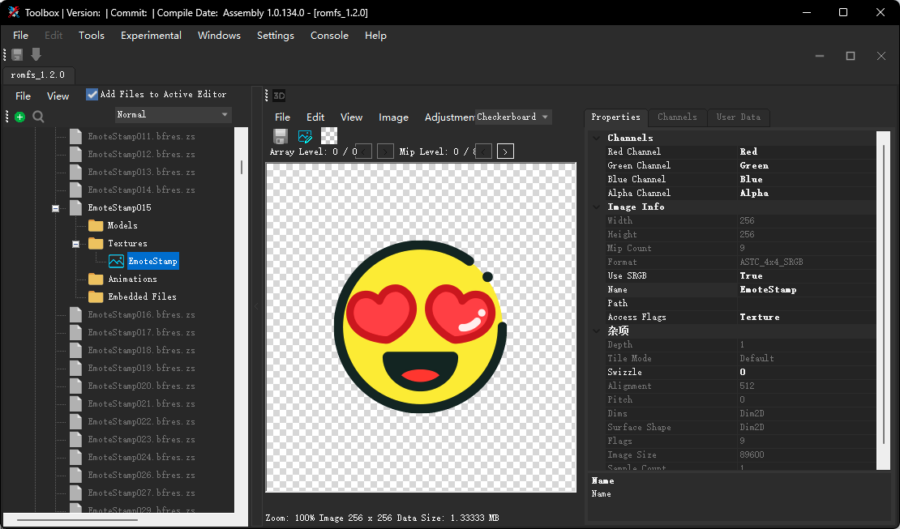

# 从《Nintendo Switch Sports》导出表情贴纸

最近一直奋战的Sports的保龄球里，虽说一直3局滚粗游戏体验不好吧，但是为了每周的装扮也是可以忍忍的。:smile:

游戏里的贴纸可以说非常的可爱，为了“永久的”获得这些有些贴纸，就考虑能不能从游戏数据里获取到原始的贴纸图片文件。

贴纸不是运行时从网络下载的，那就应该是封装在游戏数据里。只能解包游戏数据了。第一次解包ns的游戏数据，好多概念不太懂，不过好在工具比较“齐全”，操作起来还是比较容易的吧。。。

## 准备工作

要解包游戏，需要准备一下工具软件：

+ Windows系统 —— 大部分工具都是windows系统的，在windows系统下操作比较方便。
+ 游戏ROM文件 —— 包括xci本体和nsp升级文件，可以网盘见。
+ hactool —— 解包ROM工具。[GITHUB](https://github.com/SciresM/hactool/releases)
+ prod.key —— 配合hactool使用的解包密钥，与系统版本有关系，旧的密钥无法解包新的游戏，注意游戏版本。密钥不宜传播，还是自行搜索。
+ NSCB —— 游戏包数据修改工具，功能很多，这里只用到nsz格式转nsp的功能。[GITHUB](https://github.com/zdm65477730/NSC_BUILDER/releases)
+ Switch Toolbox —— 用来浏览解包后的数据。[GITHUB](https://github.com/KillzXGaming/Switch-Toolbox/releases)
+ WinHex —— 十六进制文本编辑工具。

## 解包游戏本体xci

这里准备了《Nintendo Switch Sports》的本体文件` Sports [0100d2f00d5c0000][v0].xci` 。

1. 解压 hactool，并把prod.keys和它放在同一目录下
2. 打开命令行，输入以下命令从本体中提取nca文件
```powershell
./hactool.exe -t xci --outdir="nca" ".\Sports [0100d2f00d5c0000][v0].xci"
```
3. 所有的文件被解压到nca文件夹中，如何找到主要的nca文件，就是看文件大小最大的那个
4. 接着执行以下命令，提取主要nac中的文件资源
```powershell
./hactool.exe -x -k .\prod.keys --romfsdir="romfs" --exefsdir="exefs" .\nca\secure\fff189342ce634d6f5ee09f88a625204.nca
```
5. ROM资源文件被提取到了romfs文件夹中，可以使用switch tool工具查看大部分的游戏文件。

## 解包游戏升级版本nsp

本体文件中的内容可能不是最新的，没有包含你想要的那部分资源。比如本体中的Sports只有最初的四款贴纸。这时候就要将升级文件当做补丁与本体结合产生最新的游戏ROM。这里准备了v1.2.0的更新包 `Nintendo Switch Sports [0100D2F00D5C0800][v131072].nsz` 。

如果更新包的格式是nsp，则可以跳过转换这一步，这里准备的是nsz，需要先转换成nsp文件。

1. 打开准备的NSCB工具，第一次使用要将准备的prod.keys更名为keys.txt放置在ztools目录下
2. 打开NSCB.bat会出现一个蓝色的界面，这里要解压，选择功能8

3. 将准备的nsz文件拖动到窗口里，回车添加到处理列表。之后选择1开始处理。

4. 稍等一段时间，等处理完成后在NSCB_output文件夹里就能找到处理后的文件。

处理好解压文件后，继续合并解压ROM文件：

1. 打开命令行，输入以下命令，从升级文件中提取nca文件
```powershell
./hactool.exe -t pfs0 --pfs0dir=update_nca_1.2.0 ".\Nintendo Switch Sports [0100D2F00D5C0800][v131072].nsp"
```
2. 文件被解压到update_nca_1.2.0文件夹中。在开始解压资源资源，还需要一个titlekey的数据，这个数据在update_nca_1.2.0文件夹中的一个tik后缀的文件中。用WinHex打开，从180位置处开始的32个字符就是titlekey。

4. 接下来就是将升级文件的nca与本体的nca合并，解压出最终的ROM资源。同理这里升级文件nca也是找最大的那个。
```powershell
./hactool.exe -x -k .\prod.keys --titlekey=6DFD41E888641F694AF33F03F2E57C01 --romfsdir="romfs_1.2.0" --exefsdir="exefs_1.2.0"  --basenca=".\nca\secure\fff189342ce634d6f5ee09f88a625204.nca".\update_nca_1.2.0\76a0c69e7fe78971ddcf8629dfca7609.nca
```
这里的basenca参数就是之前解压的本体的nca路径。

## 查看资源文件

将romfs_1.2.0文件夹加载到Toolbox中，就可以查看解压出的大部分文件了。我在Model文件夹找到了需要的贴纸文件。

右键导出成png文件，就可以了。完美~

## 参考内容

+ [如何解包switch游戏（动森为例） - 知乎 (zhihu.com)](https://zhuanlan.zhihu.com/p/349681765?ivk_sa=1024320u)
+ [【图片】【教程】XCI和NSP提取资源简单流程【符文工房吧】_百度贴吧 (baidu.com)](https://tieba.baidu.com/p/7409095483)
+ [【教程】Switch 如何使用NSCB 转换XCI NSP NSZ教程详解【1.01版本含13.01key秘钥】-游戏年轮 (bibgame.com)](https://www.bibgame.com/nsaita/pojie/106125.html)
