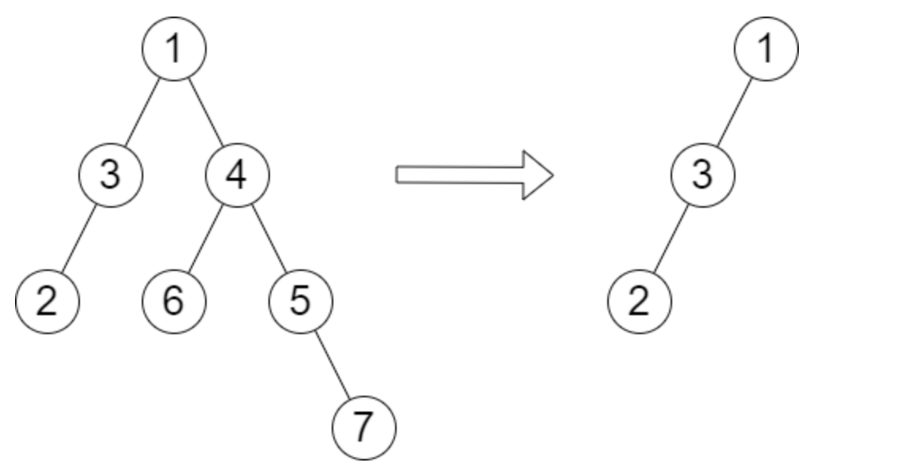

# 2022小米编程大赛题解

> 小米编程大赛是每年1024的固定活动，依托于力扣的周赛和双周赛，进行内部排名。

## 第一场-[第 90 场双周赛](https://leetcode.cn/contest/biweekly-contest-90/)

### [2451. 差值数组不同的字符串](https://leetcode.cn/problems/odd-string-difference/)

#### 题目

给你一个字符串数组 `words` ，每一个字符串长度都相同，令所有字符串的长度都为 `n` 。

每个字符串 `words[i]` 可以被转化为一个长度为 `n - 1` 的 **差值整数数组** `difference[i]` ，
其中对于 `0 <= j <= n - 2` 有 `difference[i][j] = words[i][j+1] - words[i][j]` 。
注意两个字母的差值定义为它们在字母表中 **位置** 之差，也就是说 `'a'` 的位置是 `0` ，`'b'` 的位置是 `1` ，`'z'` 的位置是 `25` 。

- 比方说，字符串 `"acb"` 的差值整数数组是 `[2 - 0, 1 - 2] = [2, -1]` 。

`words` 中所有字符串 **除了一个字符串以外** ，其他字符串的差值整数数组都相同。你需要找到那个不同的字符串。

请你返回`words`中 **差值整数数组** 不同的字符串。

**示例 1：**

```text
输入：words = ["adc","wzy","abc"]
输出："abc"
解释：
- "adc" 的差值整数数组是 [3 - 0, 2 - 3] = [3, -1] 。
- "wzy" 的差值整数数组是 [25 - 22, 24 - 25]= [3, -1] 。
- "abc" 的差值整数数组是 [1 - 0, 2 - 1] = [1, 1] 。
不同的数组是 [1, 1]，所以返回对应的字符串，"abc"。
```

**示例 2：**

```text
输入：words = ["aaa","bob","ccc","ddd"]
输出："bob"
解释：除了 "bob" 的差值整数数组是 [13, -13] 以外，其他字符串的差值整数数组都是 [0, 0] 。
```

**提示：**

- `3 <= words.length <= 100`
- `n == words[i].length`
- `2 <= n <= 20`
- `words[i]` 只含有小写英文字母。

#### 思路

这个题目方法有很多，比如按照题目要求进行处理，将处理后的数组转换成字符串，通过HashMap判断。

我的思路是，找到字符串中最小的字符，将所有字符的值向下平移，使最小字符的值为a。这样的字符串就是满足题目要求的字符串。
统计这样字符串的数量，找到数量为1的字符串对应的原始字符串。

> 足足写了7分钟😭老年人手速

#### 代码

```kotlin
class Solution {
    fun oddString(words: Array<String>): String {
        fun simply(str: String): String {
            val sb = StringBuilder(str)
            val minChar = sb.min()!!
            for (i in sb.indices) {
                sb[i] = ((sb[i] - minChar).toInt() + 'a'.toInt()).toChar()
            }
            return sb.toString()
        }

        var ans = ""
        val strMap = HashMap<String, Int>()
        for (str in words) {
            val sStr = simply(str)
            strMap[sStr] = strMap.getOrDefault(sStr, 0) + 1
        }
        for (str in words) {
            val sStr = simply(str)
            if (strMap[sStr] == 1) {
                ans = str
                break
            }
        }
        return ans
    }
}
```

### [2452. 距离字典两次编辑以内的单词](https://leetcode.cn/problems/words-within-two-edits-of-dictionary/)

#### 题目

给你两个字符串数组 `queries` 和 `dictionary` 。数组中所有单词都只包含小写英文字母，且长度都相同。

一次 **编辑** 中，你可以从 `queries` 中选择一个单词，将任意一个字母修改成任何其他字母。
从 `queries` 中找到所有满足以下条件的字符串：**不超过** 两次编辑内，字符串与 `dictionary` 中某个字符串相同。

请你返回 `queries` 中的单词列表，这些单词距离 `dictionary` 中的单词 **编辑次数** 不超过 **两次** 。
单词返回的顺序需要与 `queries` 中原本顺序相同。

**示例 1：**

```text
输入：queries = ["word","note","ants","wood"], dictionary = ["wood","joke","moat"]
输出：["word","note","wood"]
解释：
- 将 "word" 中的 'r' 换成 'o' ，得到 dictionary 中的单词 "wood" 。
- 将 "note" 中的 'n' 换成 'j' 且将 't' 换成 'k' ，得到 "joke" 。
- "ants" 需要超过 2 次编辑才能得到 dictionary 中的单词。
- "wood" 不需要修改（0 次编辑），就得到 dictionary 中相同的单词。
所以我们返回 ["word","note","wood"] 。
```

**示例 2：**

```text
输入：queries = ["yes"], dictionary = ["not"]
输出：[]
解释：
"yes" 需要超过 2 次编辑才能得到 "not" 。
所以我们返回空数组。
```

**提示：**

- `1 <= queries.length, dictionary.length <= 100`
- `n == queries[i].length == dictionary[j].length`
- `1 <= n <= 100`
- 所有 `queries[i]` 和 `dictionary[j]` 都只包含小写英文字母。

#### 思路

两层for循环的模拟，对于queries的每个单词，遍历dict中的单词，计算两个单词的距离是否小于等于2即可。

#### 代码

```kotlin
class Solution {
    fun twoEditWords(queries: Array<String>, dictionary: Array<String>): List<String> {
        fun diff(a: String, b: String): Int {
            var cnt = 0
            for (i in a.indices) {
                if (a[i] != b[i]) {
                    cnt++
                }
            }
            return cnt
        }

        val ans = ArrayList<String>()
        for (qur in queries) {
            for (dict in dictionary) {
                if (diff(qur, dict) <= 2) {
                    ans.add(qur)
                    break
                }
            }
        }
        return ans
    }
}
```

### [2453. 摧毁一系列目标](https://leetcode.cn/problems/destroy-sequential-targets/)

#### 题目

给你一个下标从 **0** 开始的数组 `nums` ，它包含若干正整数，表示数轴上你需要摧毁的目标所在的位置。同时给你一个整数 `space` 。

你有一台机器可以摧毁目标。给机器 **输入** `nums[i]` ，这台机器会摧毁所有位置在 `nums[i] + c * space` 的目标，
其中 `c` 是任意非负整数。你想摧毁 `nums` 中 **尽可能多** 的目标。

请你返回在摧毁数目最多的前提下，`nums[i]` 的 **最小值** 。

**示例 1：**

```text
输入：nums = [3,7,8,1,1,5], space = 2
输出：1
解释：如果我们输入 nums[3] ，我们可以摧毁位于 1,3,5,7,9,... 这些位置的目标。
这种情况下， 我们总共可以摧毁 5 个目标（除了 nums[2]）。
没有办法摧毁多于 5 个目标，所以我们返回 nums[3] 。
```

**示例 2：**

```text
输入：nums = [1,3,5,2,4,6], space = 2
输出：1
解释：输入 nums[0] 或者 nums[3] 都会摧毁 3 个目标。
没有办法摧毁多于 3 个目标。
由于 nums[0] 是最小的可以摧毁 3 个目标的整数，所以我们返回 1 。
```

**示例 3：**

```text
输入：nums = [6,2,5], space = 100
输出：2
解释：无论我们输入哪个数字，都只能摧毁 1 个目标。输入的最小整数是 nums[1] 。
```

**提示：**

- `1 <= nums.length <= 10^5`
- `1 <= nums[i] <= 10^9`
- `1 <= space <= 10^9`

#### 思路

数学化简对于一个数字x，(x + space * n) % n = x % n，于是题目就转化成判断 x % n 的值的次数最大的值的最小那个。

> 错了一次，最开始的思路对题目理解有点问题，以为需要连续，于是就做了一个链，数组从小到大。
> 对于当前元素x，判断x-space是否存在，存在就将x-space的总次数+1。

#### 代码

```kotlin
class Solution {
    fun destroyTargets(nums: IntArray, space: Int): Int {
        val destroyCntMap = HashMap<Long, Long>()
        val destroyHead = HashMap<Long, Long>()
        var minNum = -1L
        var maxDestroyCnt = 0L
        nums.sort()
        for (x in nums) {
            val cur = x.toLong() % space
            if (destroyCntMap[cur] != null) {
                destroyCntMap[cur] = destroyCntMap.getOrDefault(cur, 0) + 1
            } else {
                destroyCntMap[cur] = 1L
                destroyHead[cur] = x.toLong()
            }
            val curDestroyCnt = destroyCntMap[cur]!!
            if (curDestroyCnt > maxDestroyCnt) {
                minNum = destroyHead[cur]!!
                maxDestroyCnt = curDestroyCnt
            } else if (curDestroyCnt == maxDestroyCnt) {
                minNum = Math.min(minNum, destroyHead[cur]!!)
            }
        }

        return minNum.toInt()
    }
}
```

### [2454. 下一个更大元素 IV](https://leetcode.cn/problems/next-greater-element-iv/)

#### 题目

给你一个下标从 **0** 开始的非负整数数组 `nums` 。对于 `nums` 中每一个整数，你必须找到对应元素的 **第二大** 整数。

如果 `nums[j]` 满足以下条件，那么我们称它为 `nums[i]` 的 **第二大** 整数：

- `j > i`
- `nums[j] > nums[i]`
- 恰好存在 **一个** `k` 满足 `i < k < j` 且 `nums[k] > nums[i]` 。

如果不存在 `nums[j]` ，那么第二大整数为 `-1` 。

- 比方说，数组 `[1, 2, 4, 3]` 中，`1` 的第二大整数是 `4` ，`2` 的第二大整数是 `3` ，`3` 和 `4` 的第二大整数是 `-1` 。

请你返回一个整数数组`answer` ，其中`answer[i]`是`nums[i]` 的第二大整数。

**示例 1：**

```text
输入：nums = [2,4,0,9,6]
输出：[9,6,6,-1,-1]
解释：
下标为 0 处：2 的右边，4 是大于 2 的第一个整数，9 是第二个大于 2 的整数。
下标为 1 处：4 的右边，9 是大于 4 的第一个整数，6 是第二个大于 4 的整数。
下标为 2 处：0 的右边，9 是大于 0 的第一个整数，6 是第二个大于 0 的整数。
下标为 3 处：右边不存在大于 9 的整数，所以第二大整数为 -1 。
下标为 4 处：右边不存在大于 6 的整数，所以第二大整数为 -1 。
所以我们返回 [9,6,6,-1,-1] 。
```

**示例 2：**

```text
输入：nums = [3,3]
输出：[-1,-1]
解释：
由于每个数右边都没有更大的数，所以我们返回 [-1,-1] 。
```

**提示：**
- `1 <= nums.length <= 10^5`
- `0 <= nums[i] <= 10^9`

#### 思路

参考下一个更大的元素的思路，可以维护一个单调栈来解决。下下一个更大的元素，理论上需要两个单调栈。第一个单调栈出来的元素，
说明已经找到第一个比它大的元素。放在第二个单调栈里等待找到第二个比它大的元素。

> 两个栈的版本没有调试好该怎么做，错了两次之后，改成TreeMap的模式，自动排序。使用TreeMap的时候注意处理重复元素。

#### 代码

```kotlin
class Solution {
    fun secondGreaterElement(nums: IntArray): IntArray {
        val n = nums.size
        val ans = IntArray(n) {
            -1
        }
        val stack1 = LinkedList<Int>()
        val stack2 = TreeMap<Int, ArrayList<Int>>()
        for (i in 0 until n) {
            while (stack2.isNotEmpty() && stack2.firstKey() < nums[i]) {
                val firstEntry = stack2.firstEntry()
                for (j in firstEntry.value) {
                    ans[j] = nums[i]
                }
                stack2.remove(firstEntry.key)
            }
            while (stack1.isNotEmpty() && nums[stack1.peekLast()] < nums[i]) {
                val removed = stack1.removeLast()
                stack2.getOrPut(nums[removed]) { ArrayList<Int>() }.add(removed)
            }
            stack1.addLast(i)
        }

        return ans
    }
}
```

## 第二场-[第 317 场周赛](https://leetcode.cn/contest/weekly-contest-317/)

### [2455. 可被三整除的偶数的平均值](https://leetcode.cn/problems/average-value-of-even-numbers-that-are-divisible-by-three/)

#### 题目

给你一个由正整数组成的整数数组 `nums` ，返回其中可被 `3` 整除的所有偶数的平均值。

注意：`n` 个元素的平均值等于 `n` 个元素 **求和** 再除以 `n` ，结果 **向下取整** 到最接近的整数。

**示例1：**

```text
输入：nums = [1,3,6,10,12,15]
输出：9
解释：6 和 12 是可以被 3 整除的偶数。(6 + 12) / 2 = 9 。
```

**示例2：**

```text
输入：nums = [1,2,4,7,10]
输出：0
解释：不存在满足题目要求的整数，所以返回 0 。
```

**提示：**

- `1 <= nums.length <= 1000`
- `1 <= nums[i] <= 1000`

#### 思路

模拟，过滤出满足要求（被3整除、被2整除）的整数，求和求平均值即可。

> 这个题被坑了一次，主要没看到 **偶数** 这个关键词，其它的没什么难点。

#### 代码

```kotlin
class Solution {
    fun averageValue(nums: IntArray): Int {
        return nums.filter { it % 3 == 0 && it % 2 == 0 }.average().toInt()
    }
}
```

### [2456\. 最流行的视频创作者](https://leetcode.cn/problems/most-popular-video-creator/)

#### 题目

给你两个字符串数组 `creators` 和 `ids` ，和一个整数数组 `views` ，所有数组的长度都是 `n` 。
平台上第 `i` 个视频者是 `creator[i]` ，视频分配的 id 是 `ids[i]` ，且播放量为 `views[i]` 。

视频创作者的 **流行度** 是该创作者的 **所有** 视频的播放量的 **总和** 。
请找出流行度 **最高** 创作者以及该创作者播放量 **最大** 的视频的 id 。

- 如果存在多个创作者流行度都最高，则需要找出所有符合条件的创作者。
- 如果某个创作者存在多个播放量最高的视频，则只需要找出字典序最小的 `id` 。

返回一个二维字符串数组`answer`，其中`answer[i] = [creator_i, id_i]`表示`creator_i` 的流行度 **最高** 且其最流行的视频 id 是`id_i`，可以按任何顺序返回该结果。

**示例1：**

```text
输入：creators = ["alice","bob","alice","chris"], ids = ["one","two","three","four"], views = [5,10,5,4]
输出：[["alice","one"],["bob","two"]]
解释：
alice 的流行度是 5 + 5 = 10 。
bob 的流行度是 10 。
chris 的流行度是 4 。
alice 和 bob 是流行度最高的创作者。
bob 播放量最高的视频 id 为 "two" 。
alice 播放量最高的视频 id 是 "one" 和 "three" 。由于 "one" 的字典序比 "three" 更小，所以结果中返回的 id 是 "one" 。
```

**示例2：**

```text
输入：creators = ["alice","alice","alice"], ids = ["a","b","c"], views = [1,2,2]
输出：[["alice","b"]]
解释：
id 为 "b" 和 "c" 的视频都满足播放量最高的条件。
由于 "b" 的字典序比 "c" 更小，所以结果中返回的 id 是 "b" 。
```

**提示：**

- `n == creators.length == ids.length == views.length`
- `1 <= n <= 10^5`
- `1 <= creators[i].length, ids[i].length <= 5`
- `creators[i]` 和 `ids[i]` 仅由小写英文字母组成
- `0 <= views[i] <= 10^5`

#### 思路

模拟，这个题就是代码量大点，细心点没什么难点

#### 代码

```kotlin
class Solution {
    fun mostPopularCreator(creators: Array<String>, ids: Array<String>, views: IntArray): List<List<String>> {
        val creatorViewsMap = TreeMap<String, Long>()
        val creatorVideoMap = TreeMap<String, ArrayList<Pair<String, Int>>>()
        val n = creators.size
        for (i in 0 until n) {
            creatorViewsMap[creators[i]] = creatorViewsMap.getOrDefault(creators[i], 0L) + views[i]
            creatorVideoMap.getOrPut(creators[i]) { ArrayList() }.add(ids[i] to views[i])
        }
        val ans = ArrayList<List<String>>()
        var maxView = 0L
        val maxViews = ArrayList<Map.Entry<String, ArrayList<Pair<String, Int>>>>()
        for ((creator, view) in creatorViewsMap.entries) {
            if (maxView < view) {
                maxView = view
                maxViews.clear()
                maxViews.add(creatorVideoMap.ceilingEntry(creator))
            } else if (maxView == view) {
                maxViews.add(creatorVideoMap.ceilingEntry(creator))
            }
        }
        for (entry in maxViews) {
            ans.add(listOf(entry.key,
                entry.value.sortedWith(compareByDescending<Pair<String, Int>> { it.second }.thenBy { it.first })
                    .first().first
            )
            )
        }

        return ans
    }
}
```

### [2457. 美丽整数的最小增量](https://leetcode.cn/problems/minimum-addition-to-make-integer-beautiful/)

#### 题目

给你两个正整数 `n` 和 `target` 。

如果某个整数每一位上的数字相加小于或等于 `target` ，则认为这个整数是一个 **美丽整数** 。

找出并返回满足 `n + x` 是 **美丽整数** 的最小非负整数 `x` 。生成的输入保证总可以使 `n` 变成一个美丽整数。

**示例 1：**

```text
输入：n = 16, target = 6
输出：4
解释：最初，n 是 16 ，且其每一位数字的和是 1 + 6 = 7 。在加 4 之后，n 变为 20 且每一位数字的和变成 2 + 0 = 2 。可以证明无法加上一个小于 4 的非负整数使 n 变成一个美丽整数。
```

**示例 2：**

```text
输入：n = 467, target = 6
输出：33
解释：最初，n 是 467 ，且其每一位数字的和是 4 + 6 + 7 = 17 。在加 33 之后，n 变为 500 且每一位数字的和变成 5 + 0 + 0 = 5 。可以证明无法加上一个小于 33 的非负整数使 n 变成一个美丽整数。
```

**示例 3：**

```text
输入：n = 1, target = 1
输出：0
解释：最初，n 是 1 ，且其每一位数字的和是 1 ，已经小于等于 target 。
```

**提示：**

- `1 <= n <= 10^12`
- `1 <= target <= 150`
- 生成的输入保证总可以使 `n` 变成一个美丽整数。

#### 思路

贪心做法，由于数字只能增加，要减小所有数字的和，只能通过进位的方式让当前位变成0。

例如467，每位数字和为17，通过进位让数字变为467+3=470，每位数字和为就变为了11，成功降低了每位数字和。
通过补齐所有位数，最小可以降到1，467+533=1000。

思路就变成了，枚举进位位置，找到最低位能够满足要求的进位位置。注意特判一下不需要任何操作0的情况。

> 提交错了两次，问题出在想把0的情况融合在for循环中，最后还是特判了一下。

#### 代码

```kotlin
class Solution {
    fun makeIntegerBeautiful(n: Long, target: Int): Long {
        val nStr = n.toString()
        val numSum = nStr.map { it - '0' }.sum()
        if (numSum <= target) {
            return 0
        }
        var ans = Long.MAX_VALUE
        var sum = 1
        for (i in nStr.indices) {
            if (sum > target) {
                break
            }
            var x = 0L
            for (j in i until nStr.length) {
                x = x * 10 + (9 - (nStr[j] - '0'))
            }
            x++
            ans = Math.min(ans, x)
            sum += (nStr[i] - '0')
        }

        return ans
    }
}
```

### [2458. 移除子树后的二叉树高度](https://leetcode.cn/problems/height-of-binary-tree-after-subtree-removal-queries/)

#### 题目

给你一棵 **二叉树** 的根节点 `root` ，树中有 `n` 个节点。每个节点都可以被分配一个从 `1` 到 `n` 且互不相同的值。
另给你一个长度为 `m` 的数组 `queries` 。

你必须在树上执行 `m` 个 **独立** 的查询，其中第 `i` 个查询你需要执行以下操作：

- 从树中 **移除** 以 `queries[i]` 的值作为根节点的子树。题目所用测试用例保证 `queries[i]` **不** 等于根节点的值。

返回一个长度为 `m` 的数组`answer`，其中`answer[i]`是执行第 `i` 个查询后树的高度。

**注意：**

- 查询之间是独立的，所以在每个查询执行后，树会回到其 **初始** 状态。
- 树的高度是从根到树中某个节点的 **最长简单路径中的边数** 。

**示例 1：**



```text
输入：root = [1,3,4,2,null,6,5,null,null,null,null,null,7], queries = [4]
输出：[2]
解释：上图展示了从树中移除以 4 为根节点的子树。
树的高度是 2（路径为 1 -> 3 -> 2）。
```

**示例 2：**


```text
输入：root = [5,8,9,2,1,3,7,4,6], queries = [3,2,4,8]
输出：[3,2,3,2]
解释：执行下述查询：
- 移除以 3 为根节点的子树。树的高度变为 3（路径为 5 -> 8 -> 2 -> 4）。
- 移除以 2 为根节点的子树。树的高度变为 2（路径为 5 -> 8 -> 1）。
- 移除以 4 为根节点的子树。树的高度变为 3（路径为 5 -> 8 -> 2 -> 6）。
- 移除以 8 为根节点的子树。树的高度变为 2（路径为 5 -> 9 -> 3）。
```

提示：
- 树中节点的数目是 `n`
- `2 <= n <= 10^5`
- `1 <= Node.val <= n`
- 树中的所有值 **互不相同**
- `m == queries.length`
- `1 <= m <= min(n, 10^4)`
- `1 <= queries[i] <= n`
- `queries[i] != root.val`

#### 思路

首先树的总高度可以通过bfs或dfs得到，问题的关键点在于删除了某个节点后，树的高度是否受到影响。
如果每删除一个节点都通过bfs或dfs判断一下，时间复杂度O(mn)≈10^9，必然超时。

删除当前节点后，不受影响的是当前节点的兄弟节点。于是考虑能够通过兄弟节点获取高度，通过预处理的方式，
可以获取到每个节点的兄弟节点（层级）和每个节点产生的树的高度。删除节点后，从遍历所有的兄弟节点，获取到的最大高度就是树的高度。
特别考虑的是若删除节点没有兄弟节点，树的高度就是删除节点的父节点的层级。时间复杂度 $O(mlog_2n)$ 。

> 此题错了一次，在删除的节点没有兄弟节点的时候，获取的高度应该是删除节点的level-1，手误写成了level。

#### 代码

```kotlin
/**
 * Example:
 * var ti = TreeNode(5)
 * var v = ti.`val`
 * Definition for a binary tree node.
 * class TreeNode(var `val`: Int) {
 *     var left: TreeNode? = null
 *     var right: TreeNode? = null
 * }
 */
class Solution {
    fun treeQueries(root: TreeNode?, queries: IntArray): IntArray {
        if (root == null) {
            return intArrayOf()
        }

        class TreeNodeHolder(val value: Int, val level: Int) {
            var left: TreeNodeHolder? = null
            var right: TreeNodeHolder? = null
            var maxDepth = 0
        }

        val rootNode = TreeNodeHolder(root.`val`, 0)

        val valueToTreeNodeMap = HashMap<Int, TreeNodeHolder>()
        val levelToTreeNodeListMap = TreeMap<Int, ArrayList<TreeNodeHolder>>()
        fun buildTree(curNode: TreeNodeHolder, treeNode: TreeNode, level: Int): Int {
            valueToTreeNodeMap[curNode.value] = curNode
            levelToTreeNodeListMap.getOrPut(level) { ArrayList() }.add(curNode)
            var maxDepth = level
            if (treeNode.left != null) {
                curNode.left = TreeNodeHolder(treeNode.left!!.`val`, level + 1)
                maxDepth = Math.max(maxDepth, buildTree(curNode.left!!, treeNode.left!!, level + 1))
            }
            if (treeNode.right != null) {
                curNode.right = TreeNodeHolder(treeNode.right!!.`val`, level + 1)
                maxDepth = Math.max(maxDepth, buildTree(curNode.right!!, treeNode.right!!, level + 1))
            }
            curNode.maxDepth = maxDepth
            return maxDepth
        }

        val maxDepth = buildTree(rootNode, root, 0)
        rootNode.maxDepth = maxDepth

        val ans = IntArray(queries.size)
        for (i in queries.indices) {
            val removeTreeNode = valueToTreeNodeMap[queries[i]]!!
            var depth = removeTreeNode.level - 1
            for (node in levelToTreeNodeListMap[removeTreeNode.level]!!) {
                if (node.value == queries[i]) {
                    continue
                }
                depth = Math.max(depth, node.maxDepth)
            }

            ans[i] = depth
        }

        return ans
    }
}
```
