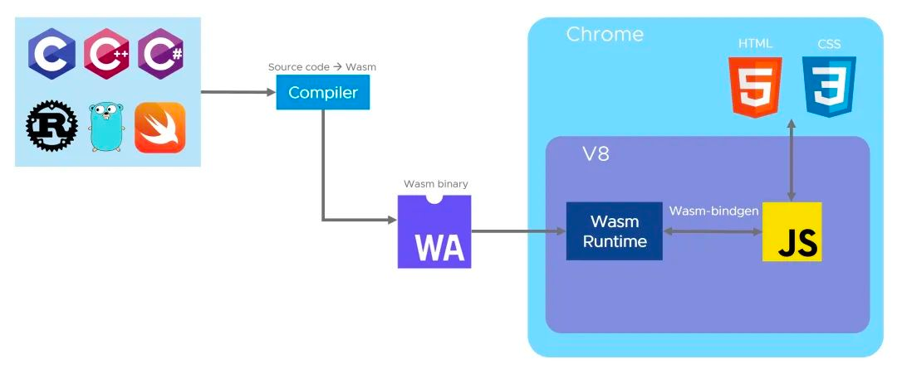
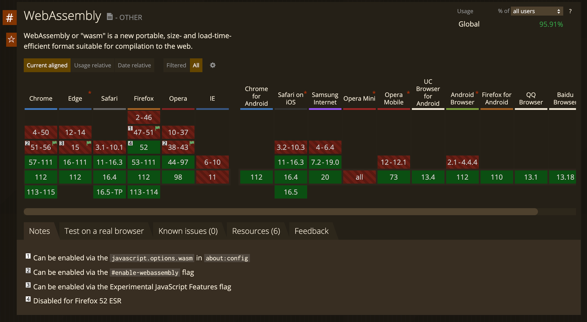
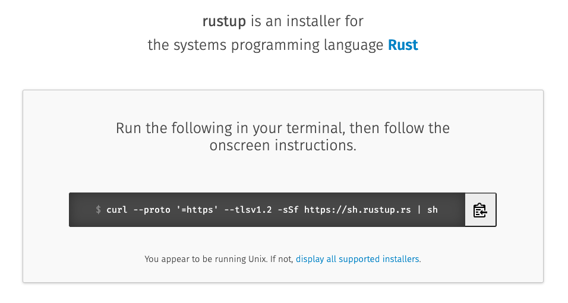
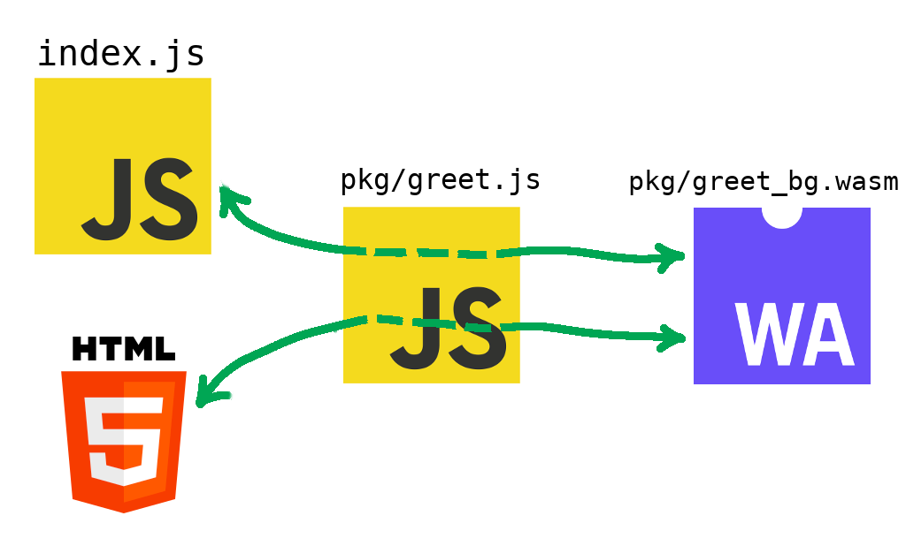
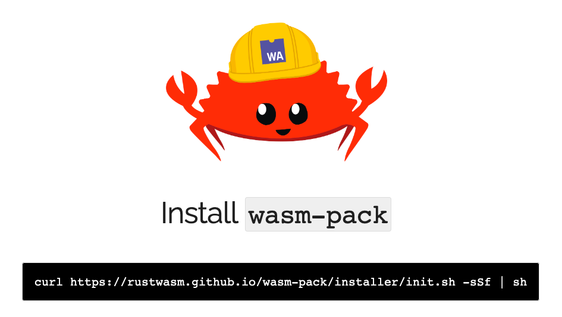

# 重放攻击与Rust与WebAssembly

> 本文主要介绍重放攻击的原理和防范措施。并尝试使用rust编译的wasm模块实现重放攻击中的请求签名算法。

## 什么是重放攻击？

重放攻击（Replay Attack）是一种网络攻击方式，攻击者通过录制合法用户的网络通信报文，再将其在未经授权的情况下重新发送给目标服务器，
以达到欺骗服务器的目的。

重放攻击的原理是攻击者在通信过程中拦截了合法用户与服务器之间的数据包，并将其保存下来。当攻击者想要对服务器进行攻击时，
他就将之前拦截到的数据包重新发送给服务器，从而欺骗服务器以为这是一个合法的请求。

例如，一个简单的重放攻击可以是攻击者在进行抽奖的时候，记录下该请求，然后将请其重放到服务器上，以假乱真地模拟用户进行抽奖的过程。
由于服务器并不能区别这些请求是否为重放攻击，因此攻击者可以通过这种方式获得更多的抽奖机会，从而提高自己中奖的概率。另一方面，
攻击者通过脚本可以在短时间内大量的发送重放请求，影响正常用户的使用。这种攻击方式往往会导致用户的合法权益受到损失，
因此对于网络安全来说，重放攻击是一种比较严重的威胁。

### 防范重放攻击的措施

目前防范重放攻击的措施可以包括以下几个方面：

- 加密通信数据：使用加密技术可以有效地防止重放攻击，因为攻击者即使拦截了通信数据，也不能破解加密后的数据内容。
- 时间戳（timestamp）：在通信数据中加入时间戳，在服务器端接收到请求后，检查时间戳的合法性，如果时间戳已经过期，则拒绝请求。
- 随机数（nonce）：在通信数据中加入随机数，服务器端接收到请求后，检查随机数的合法性，如果随机数已经被使用过，则拒绝请求。
- 消息摘要（sign）：使用消息摘要技术可以防止重放攻击。在通信数据中加入消息摘要，服务器端接收到请求后，计算消息摘要，如果计算结果与请求中的消息摘要不符，则拒绝请求。

总之，防范重放攻击的关键在于在通信过程中加入一些验证机制，以确保每个请求都是合法唯一的。

## 消息摘要的实现

### 普通js实现消息摘要

要实现消息摘要算法比较容易，下面以axios框架为例：

```typescript
import axios, {AxiosRequestConfig} from 'axios';
import HmacSHA1 from 'crypto-js/hmac-sha1';
import nanoid from 'nanoid';

const API_TOKEN = 'xxx';
const API_SECRET_KEY = 'xxx';

/**
 * 签名请求
 * @param config
 */
export function signAxiosRequest(config: AxiosRequestConfig): void {
  const timestamp = Date.now();
  const nonce = nanoid();
  config.params = {
    ...config.params,
    timestamp,
    nonce,
  };
  delete config.params['sign'];
  delete config.params['token'];
  const signUrl = (axios.getUri(config) + `&token=${API_TOKEN}`).replace(import.meta.env.VITE_APP_GAME_SERVICE_API_BASE_URL as string, '');
  config.params['sign'] = HmacSHA1(
      signUrl,
      API_SECRET_KEY
  ).toString();
}
```

将url请求地址和query拼接后形成需要签名的url，对url使用HmacSHA1进行签名。最后生成签名后的sign。这其中有几部分需要注意：

- 签名附带url，使得当前签名只针对该接口，防止将请求参数赋给其它url使用。
- timestamp，一般是请求的当前时间，用于后端校验签名的有效期，后端只会处理在有效期内的接口。
- nonce，是一个随机字符串，保证请求在一段时间内（一般与timestamp的有效期一致）只会使用一次。这个参数是防止重放攻击的关键。需要后端缓存记录已经使用过的nonce字符串。
- token和secretKey，是一对加密密钥，用于区分不同的后端系统，防止相同的url地址重放给不同的后端系统服务使用。

签名方法保障的是在有效期内，一次签名的请求只会被请求响应一次，而通过加密验签保障了客户端的请求参数不会被随意修改。

::: tip
但是随之而来的问题是，这个计算请求摘要的逻辑由于是js实现，通过浏览器的控制台很容易被逆向，知道了加密规则和密钥的签名很容易被伪造。于是如何更好的混淆代码，保障加密密钥的安全性，是下一步应该考虑的问题。
:::

## wasm与rust

要隐藏消息计算的计算逻辑，首先想到的是客户端采用更加难以理解的混淆代码的方式。正好在前端领域里，WebAssembly就是这样一种格式。

### 什么是wasm？

WebAssembly是一种二进制指令格式，简称为Wasm，它可以运行在适用于堆栈的虚拟机上。

WebAssembly存在的意义就是成为编程语言的可移植编译目标，让在Web上部署客户端和服务端应用成为可能。



由于wasm是一种二进制的文件格式，相对于解释型的js语言来说，就有更快的执行速度、更高的安全性等优势。



::: tip
在这里，wasm被用来混淆加密逻辑，并隐藏计算请求摘要的对称加密token。如何方便的编写wasm代码，是下一个需要解决的问题。
:::

### 为什么是Rust？

> Rust是一门系统编程语言，专注于安全，尤其是并发安全，支持函数式和命令式以及泛型等编程范式的多范式语言。Rust在语法上和C++类似，
> 但是设计者想要在保证性能的同时提供更好的内存安全。 Rust最初是由Mozilla研究院的Graydon Hoare设计创造，然后在Dave Herman、
> Brendan Eich以及很多其他人的贡献下逐步完善的。Rust的设计者们通过在研发Servo网站浏览器布局引擎过程中积累的经验优化了Rust语言和Rust编译器。

Rust在编写node工具链和WebAssembly等领域的贡献非常大，市面上大部分node工具都打算使用Rust进行重写，以提升安全性和性能。特别提到的是，
下一代webpack打包工具[Rspack](https://www.rspack.dev/)，就是使用Rust编写的，号称有10x以上的性能提升。

总之，使用Rust来编写wasm代码会非常简单。当然，我们也不是想用Rust来替代JavaScript的语言，而是与其形成互补，在需要更高性能的地方借助系统编程语言来提升效率。

### 从零开始的Rust

在开始使用Rust编写代码之前，先了解一些Rust系统的工具链概念。

#### [cargo](https://crates.io/)

cargo是rust的代码组织和包管理工具，你可以将它类比为node.js中的npm。


cargo 提供了一系列强大的功能，从项目的建立、构建到测试、运行直至部署，为rust项目的管理提供尽可能完整的手段。
同时，它也与rust语言及其编译器rustc本身的各种特性紧密结合。

#### [rustup](https://rustup.rs/)

rustup是Rust的安装和工具链管理工具，并且官网推荐使用rustup安装Rust。



rustup将rustc和cargo等工具安装在Cargo的bin目录，但这些工具只是Rust工具链中组件的代理，真正工作的是工具链中的组件。
通过 rustup 的命令可以指定使用不同版本的工具链。

#### [wasm-bindgen](https://rustwasm.github.io/docs/wasm-bindgen/)



wasm-bindgen提供了JS和Rust类型之间的桥梁，它允许JS使用字符串调用Rust API，或者使用Rust函数来捕获JS异常。

wasm-bindgen的核心是促进javascript和Rust之间使用wasm进行通信。它允许开发者直接使用Rust的结构体、javascript的类、字符串等类型，而不仅仅是wasm支持的整数或浮点数类型。

#### [wasm-pack](https://rustwasm.github.io/wasm-pack/)



wasm-pack 由 Rust / Wasm 工作组开发维护，是现在最为活跃的 WebAssembly 应用开发工具。

wasm-pack 支持将代码打包成 npm 模块，并且附带 Webpack 插件（wasm-pack-plugin），借助它，我们可以轻松的将 Rust 与已有的 JavaScript 应用结合。

#### wasm32-unknown-unknown

```shell
rustup target add wasm32-unknown-unknown
```

通过 rustup 的 target 命令可以指定编译的目标平台，也就是编译后的程序在哪种操作系统上运行。

wasm-pack 使用 wasm32-unknown-unknown 目标编译代码。

### 实现一个简单的wasm程序

下面实现一个简单的wasm-helloworld程序，通过调用浏览器的alert指令弹出消息提示。

#### 创建一个新的rust项目

```shell
cargo new --lib hello-wasm
```

将会创建 rust 库工程，并创建src/lib.rs。修改为以下内容：

```rust
extern crate wasm_bindgen;

use wasm_bindgen::prelude::*;

#[wasm_bindgen]
extern {
    pub fn alert(s: &str);
}

#[wasm_bindgen]
pub fn greet(name: &str) {
    alert(&format!("Hello, {}!", name));
}
```

这段代码的含义是：

- 第6行：从外部导入alert函数，使得rust可以调用js的alert语句。
- 第11行：导出一个greet函数，该函数接收一个name参数，并调用导入的alert指令输出hello {{name}}的语句。

接着在 Cargo.toml 文件中添加 wasm-bindgen 依赖，wasm-bindgen 来提供 JavaScript 和 Rust 类型之间的桥梁，
允许 JavaScript 使用字符串调用 Rust API，或调用 Rust 函数来捕获 JavaScript 异常。

```toml
[package]
name = "hello-wasm"
version = "0.1.0"

[lib]
crate-type = ["cdylib"]

[dependencies]
wasm-bindgen = "0.2"
```

#### 打包

下载 wasm-pack，用于将 rust 代码打包成 .wasm 文件

```shell
cargo install wasm-pack
```

执行构建命令

```shell
wasm-pack build
```

就会在pkg目录下生成打包好的js文件、wasm文件和ts类型文件。

```text
├─pkg
|  ├─.gitignore
|  ├─hello_wasm.d.ts
|  ├─hello_wasm.js
|  ├─hello_wasm_bg.js
|  ├─hello_wasm_bg.wasm
|  └─hello_wasm_bg.wasm.d.ts
```

借助 wasm-pack 可以非常轻松的将 rust 打包成 wasm，同时还提供了 js 相关支持。直接打包成 js 可导入的 npm 包，
而不是让用户导入 wasm 文件然后通过浏览器 WebAssembly 对象来加载 WebAssembly 代码，其他语言的 WebAssembly 开发也是如此。

#### 运行

本地运行的话可以将pkg拷贝到项目目录，然后添加以下代码进行引用：

```typescript
const js = import("./hello-wasm/hello_wasm.js");
js.then(js => {
  js.greet("WebAssembly");
});
```

## 使用Rust编写消息摘要计算逻辑

根据前面的逻辑，生成时间戳、随机数、拼接URL的逻辑都可以在JS端完成。确定这里rust需要实现的逻辑是，拿到url之后，在最后拼接token，然后对其进行hmac-sha1加密。

和从npm找需要的包一样，这里需要从 [crates.io](https://crates.io/) 中也可以找到你想要的库。这里用两个库ring（用于加密）和hex（用于生成转十六进制字符）。

```toml
[dependencies]
wasm-bindgen = "0.2.84"
ring = "0.16.20"
hex = "0.4.3"
```

下面是封装的签名代码，可以放在一个单独的模块文件里signer.rs

```rust
use ring::hmac;

pub fn sign(url: &str) -> String {
    let app_id = "aaa";
    let secret_key = "ccc";
    let mut url = url.to_string();
    if url.contains("?") == false {
        url.push_str("?");
    } else {
        url.push_str("&");
    }
    url.push_str("token=");
    url.push_str(app_id);

    let signed_key = hmac::Key::new(hmac::HMAC_SHA1_FOR_LEGACY_USE_ONLY, secret_key.as_bytes());
    let signature = hmac::sign(&signed_key, url.as_bytes());
    let result = hex::encode(&signature.as_ref());
    return result;
}
```

然后在开始的lib.rs文件引用这个模块，并导出一个签名函数：

```rust
mod signer;

#[wasm_bindgen]
pub fn sign(url: &str) -> String {
    return signer::sign(url).into();
}
```

此时通过 wasm-pack 将上述代码打包成 lib 库，在代码中调用sign函数实现的签名逻辑。至此就实现本标题的内容了。

### 更好的开发体验

每次开发调试都要打包构建、引入，然后重启服务。未免有点繁琐，其实借助 `@wasm-tool/wasm-pack-plugin` 的webpack插件，
就能实现rust代码的实时热更新功能。提升开发体验。

在rust模块项目下增加一个package.json，用于引入依赖库。

```json
{
  "name": "hello-wasm",
  "version": "1.0.0",
  "scripts": {
    "build": "NODE_ENV=production webpack",
    "serve": "NODE_ENV=development webpack-dev-server"
  },
  "devDependencies": {
    "@wasm-tool/wasm-pack-plugin": "1.7.0",
    "html-webpack-plugin": "^5.5.1",
    "text-encoding": "^0.7.0",
    "webpack": "^5.80.0",
    "webpack-cli": "^5.0.2",
    "webpack-dev-server": "^4.13.3"
  }
}
```

增加一个webpack.config.js的配置文件，用来启动devServer。

```javascript
const path = require('path');
const HtmlWebpackPlugin = require('html-webpack-plugin');
const webpack = require('webpack');
const WasmPackPlugin = require("@wasm-tool/wasm-pack-plugin");

module.exports = {
    entry: './index.js',
    output: {
        path: path.resolve(__dirname, 'dist'),
        filename: 'index.js',
    },
    experiments: {
        asyncWebAssembly: true,
    },
    module: {
        rules: [{
            test: /\.wasm$/,
            type: "webassembly/async"
        }]
    },
    plugins: [
        new HtmlWebpackPlugin(),
        new WasmPackPlugin({
            crateDirectory: path.resolve(__dirname, ".")
        }),
        // Have this example work in Edge which doesn't ship `TextEncoder` or
        // `TextDecoder` at this time.
        new webpack.ProvidePlugin({
            TextDecoder: ['text-encoding', 'TextDecoder'],
            TextEncoder: ['text-encoding', 'TextEncoder']
        })
    ],
    mode: process.env.NODE_ENV || 'production'
};
```

最后增加一个index.js的入口文件：

```javascript
import {sign} from "./pkg";

console.log(sign("/foo/bar/?nonce=123123&timestamp=123123"))
```

执行命令启动devServer，在浏览器的控制台里就能看到输出的签名结果。

```shell
yarn run serve
```

而且编辑rust代码，能实时触发热更新，可谓是非常的nice~

### 思考：如何提高签名模块的安全性和通用性

虽说使用wasm可以隐藏加密密钥，但是如果获取了wasm文件，还是能本地调用的。

思考一下这个问题，可以校验当前浏览器的域名，只有符合域名规则的浏览器才能使用本服务。当前这种方法也不是绝对的，因为本地也可以用反向代理、改/etc/hosts等方法将域名指向本地服务。

另一方面如何针对不同服务使用不同的加密密钥？

这里考虑了两个方案，一个是将密钥表硬编码到wasm中，根据传入的app_id来找到对应的加密密钥。

另一个可以考虑将app_id和密钥再通过非对称加密之后的字符串，作为参数传入到签名方法里，签名方法解密获取到app_id和密钥再执行消息摘要的逻辑。这就是典型的把钥匙锁在保险箱里的方法了。

## 总结

从最近几年的发展来看，Rust在大前端领域的势头锐不可当。为了不脱离大趋势，于是本文借助一个url验签的安全场景，
尝试使用rust解决代码中存在的安全问题。后续也会继续思考rust在前端其它方面的应用，以此提高代码的安全性和运行效率。

“没有绝对的安全，只有相对的安全”。就在这种攻防互搏的观念中，代码逻辑变得复杂起来了。

## 参考内容

- [web前端培训：使用 Rust 编写 React 组件](https://blog.csdn.net/weixin_45695430/article/details/123347532)
- [Rust实现MD5加密并打包成WebAssembly调用](https://cloud.tencent.com/developer/article/2205711)
