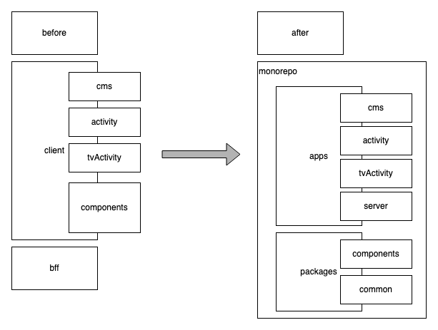
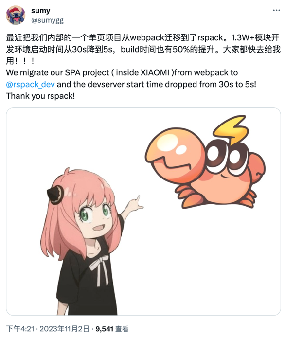
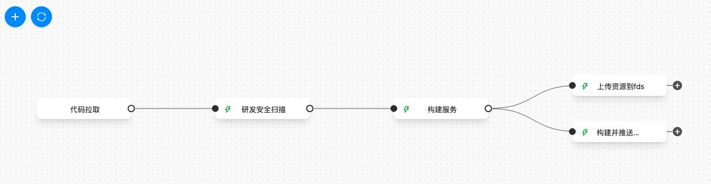

# 鲁班平台Monorepo+rspack构建优化实践

鲁班平台是我们内部的一个低代码搭建平台，承载着移动端、大屏端和RN的活动搭建。

鲁班平台采用了一个仓库管理代码，整个代码仓库结构如下：


随着业务发展，一些问题也随之显现出来：
1. 目录结构混乱，模块之间相互引用
2. 整个client由同一个 package.json 管理，依赖冗余
3. 构建时间长，在流水线上平均一次需要 8 min

项目基于 webpack4 进行构建，之前我们一直在寻找好的解决方案。首先 Monorepo 已经是一个成熟的理念，
也曾尝试迁移到 Monorepo。但是从最终收益来看只是改变了项目结构，构建成本未发生实质的变化。
而 Rspack 的出现，才使得这个方案变得更有价值。

## 什么是Monorepo？

一个产品会有多个项目，每个项目之间会存在版本同步的问题，如何在其中一个项目发布上线后，保证每个项目版本升级后的版本同步问题，
提出的解决方案就是 monorepo 策略。

monorepo 是一种将多个项目代码存储在一个仓库里的软件开发策略（mono 意为单一，repo 意为 仓库）。
与之相对的是另一种流行的代码管理方式 MultiRepo，即每个项目对应一个单独的仓库来分散管理。


## Rspack

[Rspack](https://www.rspack.dev/) 是一个基于 Rust 的高性能 Web 构建工具，具备与 webpack 生态系统的互操作性，
可以被 webpack 项目低成本集成，并提供更好的构建性能。

相较于 webpack，Rspack 的构建性能有明显提升，除了 Rust 带来的语言优势，这也来自于它的并行架构和增量编译等特性。
经过 benchmark 验证，Rspack 可以带来 5 ～ 10 倍编译性能的提升。


## 项目结构优化

之前的代码采用目录的方式进行隔离存放——client 和 server，而 client 的 src 又存放了三个关键模块——cms、activity 和 tvActivity。
于是整个项目结构拆分的方向就确定了。



整体看来整理前后的目录结构是一一对应的，apps 作为入口，packages 作为项目内部依赖。

当然这个目录也不是一开始就是确定这样拆分的，apps 的入口确定好了之后，packages 根据后面 rspack 的迁移不断的补充和完成形成的。

### 创建 Monorepo 工程

monorepo 有多种驱动方式，一般需要包管理工具的 workspace 功能的支持。这里采用 turborepo + yarn workspace 的模式。

自己写配置还是比较麻烦的，参考一个现有的使用 https://turbo.build/repo/docs/getting-started/from-example 创建一个示例的 Monorepo 工程

```bash
npx create-turbo -e with-docker
```

根据之前拆分的目录结构，创建对应的目录，并删除实例代码。

### 项目内的模块依赖

要在一个模块引入其它模块，不需要将包 push 到 artifactory 上，而是在对应模块的 package.json 引入。

```json
{
    "dependencies": {
        "luban-components": "*",
    }
}
```

后续在代码中，使用 `luban-components/xxx/xxx` 就能引用模块下的文件了。

### postcss.config.js

postcss 的配置无它，这里简单提一下。需要在所有需要处理的 css 文件的模块的根目录放置一个 postcss.config.js 文件，
否则 postcss 不会处理这个目录下的文件。

除了配置文件放置的位置之外，还需要注意版本升级后的新语法，除法需要加括号才会在预处理阶段进行计算。

### 构建 docker 镜像

之前 docker 镜像里会同时存在 nginx 服务和 node 服务。本次迁移也是采用这种模式。

前端页面只需要将 dist 目录下的成品转移到 nginx 服务目录下。而 node 服务就需要在容器里安装依赖并进行构建。
因此 dockerfile 编写也需要分成两部分进行。

#### 构建前端页面

在 package.json 中添加一条命令，`--filter` 表示只处理对应模块。

```shell
turbo run build --filter=luban-activity --filter=luban-tv-activity --filter=luban-cms
```

构建的时候执行该命令，通过 COPY 执行将 dist 目录下的成品复制到对应目录下

```dockerfile
COPY ./apps/luban-activity/dist /home/work/apps/luban-activity/dist
COPY ./apps/luban-tv-activity/dist /home/work/apps/luban-tv-activity/dist
COPY ./apps/luban-cms/dist /home/work/apps/luban-cms/dist
COPY ./nginx/$CI_COMMIT_BRANCH/default.conf /etc/nginx/http.d/
```

#### 构建 node 服务

在 monorepo 模式下，所有依赖都会被提取到根目录的 node_modules。而 node 执行需要依赖其中的某些包。直接拷贝 node 服务会缺少依赖，
而全部拷贝（包含外部的 node_modules）又会引入前端的一些依赖。

这个时候就需要使用 turbo 提供的一条指令了 https://turbo.build/repo/docs/reference/command-line-reference/prune

```shell
turbo prune --scope=luban-server --docker
```

这条指令会将 luban-server 模块下依赖的全部文件生成到 out 目录下，我们将 out 目录拷贝到 docker 中，然后执行安装命令。

```dockerfile
COPY ./out/full /home/work/
RUN cd /home/work/ &&  \
yarn install --registry=https://pkgs.d.xiaomi.net/artifactory/api/npm/mi-npm/ &&  \
yarn run build
RUN npm install pm2 -g --registry=https://pkgs.d.xiaomi.net/artifactory/api/npm/mi-npm/
```

## 迁移rspack

将项目目录进行分模块拆分之后，接下来将 webpack4 的配置迁移到 rspack。这里采用的是先创建一个vue2 的 rspack 空白项目，
然后将模块代码拷入，补充缺少的依赖和配置的方式进行。下面记录一下关键步骤、遇到的问题和解决方案。

### 迁移配置文件

根据报错信息，需要补充的配置内容有：

1. devServer.proxy 的本地预览服务器转发配置
2. builtins.define 中的变量替换
3. resolve.alias 的路径别名替换

这里直接展示完成后的 rspack.config.js

```javascript
const { VueLoaderPlugin } = require("vue-loader");
const path = require("path");
const { proxy } = require('luban-ci/devServer')
const { loadEnv } = require("luban-ci/load-dotenv");

process.env.PROJECT_NAME = 'cms'

const buildMode = process.env.LUBAN_BUILD_MODE || 'development'

const env = loadEnv(buildMode, '.')

/** @type {import('@rspack/cli').Configuration} */
const config = {
    context: __dirname,
    entry: {
       main: "./src/main.js"
    },
    output: {
       publicPath: '/'
    },
    devServer: {
       historyApiFallback: {
          index: '/index.html'
       },
       proxy: proxy
    },
    devtool: false,
    builtins: {
       html: [
          {
             template: "./index.html",
             favicon: "favicon.ico"
          }
       ],
       define: {
          "process.env": env || {}
       }
    },
    resolve: {
       extensions: [".vue", ".json", ".js"],
       alias: {
          "@": path.resolve(__dirname, "./src"),
          // 解决el-table在vue高版本渲染空白
          vue$: 'vue/dist/vue.esm.js',
          api: 'luban-common/lib/js/utils/request/api.js',
          "~": "luban-components",
          "js-lib": "luban-common/lib/js",
          "css-lib": "luban-common/lib/css",
          "project-conf": path.resolve(__dirname, "./src/project-conf"),
       }
    },
    plugins: [new VueLoaderPlugin()],
    module: {
       rules: [
          {
             test: /\.vue$/,
             use: ["vue-loader"]
          },
          {
             resourceQuery: /lang=ts/,
             type: "ts"
          },
          {
             test: /\.less$/,
             use: ["vue-style-loader", "css-loader", "postcss-loader", "less-loader"],
             type: "javascript/auto"
          },
          {
             test: /\.css$/,
             use: ["vue-style-loader", "css-loader", "postcss-loader"],
             type: "javascript/auto"
          },
          {
             test: /\.(png|jpe?g|gif|svg)(\?.*)?$/,
             type: 'asset',
          }
       ]
    }
};
module.exports = config;
```

### 多环境配置文件

目前很流行一套代码多环境部署，但是 webpack 和 rspack 都没有支持。

> 不过 webpack 已经计划支持了 https://github.com/webpack/webpack-cli/pull/3759 ，相信不久的将来 rspack 也会跟上。

老项目之前的方案是根据环境变量，将不同的 webpack 配置使用 webpack-merge 进行合并，由此达到多环境配置的目的。
这里参考 vite 的模式 https://cn.vitejs.dev/guide/env-and-mode.html ，根据环境变量加载不同的 dotenv 。

```javascript
const dotenv = require('dotenv')
const dotenvExpand = require('dotenv-expand')
const path = require('path')
const fs = require('fs')

// 处理默认环境变量
process.env.CI_COMMIT_SHORT_SHA = process.env.CI_COMMIT_SHORT_SHA || '0'

/**
 * 加载env文件
 * @param mode {string} 环境变量模式
 * @param envDir {string} env文件目录
 * @param prefixes {undefined | string[]} env变量前缀，只有该前缀的变量才会导出到客户端
 */
function loadEnv(mode, envDir, prefixes) {
  if (!prefixes) {
    prefixes = ["LB_"];
  }

  if (mode === "local") {
    throw new Error("local mode is not supported");
  }
  const env = {};
  const envFiles = [
    ".env",
    `.env.local`,
    `.env.${mode}`,
    `.env.${mode}.local`
  ];
  const parsed = Object.fromEntries(
    envFiles.flatMap((file) => {
      const filePath = path.join(envDir, file);
      const fileStat = fs.statSync(filePath, { throwIfNoEntry: false });
      if (fileStat && fileStat.isFile()) {
        return Object.entries(dotenv.parse(fs.readFileSync(filePath)));
      }
      return [];
    })
  );

  // 该指令除了处理env中的${}引用，还会将env中的变量注入到process.env中
  dotenvExpand.expand({ parsed });

  // 检查变量的前缀，只有LB_开头的变量才会导出到客户端
  for (const [key, value] of Object.entries(parsed)) {
    if (prefixes.some((prefix) => key.startsWith(prefix))) {
      env[key] = value;
    }
  }

  // 检查环境变量中是否还存在LB_开头的变量，如果存在，也导出到客户端
  for (const key in process.env) {
    if (prefixes.some((prefix) => key.startsWith(prefix))) {
      env[key] = process.env[key];
    }
  }

  return env;
}

module.exports = {
    loadEnv,
}
```

### webpack 插件无法兼容 rspack

项目中的 luban-cms 模块使用了 [svg-sprite-loader](https://github.com/JetBrains/svg-sprite-loader) 来处理 svg 图标。
这个插件使用的 API 在 rspack 中报错。由于没有找到其它代替的插件来解决 svg 图标构建的问题，这里继续使用 webpack 构建 svg 图标库，
将构建成品引入项目。

这里贴一个 webpack 的配置，其它项目通过 luban-icons/dist/icons.js 的方式引用生成的 svg 图标库。


```javascript
const path = require("path");
const { CleanWebpackPlugin } = require("clean-webpack-plugin");
const webpack = require("webpack");

module.exports = {
    mode: "production",
    entry: "./index.js",
    output: {
        path: path.resolve(__dirname, "dist"),
        filename: "icons.js",
    },
    module: {
        rules: [
            {
                test: /\.svg$/,
                use: [
                    {
                        loader: "svg-sprite-loader",
                        options: {
                            symbolId: "luban-icon-[name]",
                        },
                    },
                ],
            },
        ],
    },
    plugins: [new webpack.ProgressPlugin(), new CleanWebpackPlugin()],
};
```

## 成果

### 单模块构建

这里选择文件依赖数量最多的 luban-cms 模块，本地执行 `yarn run build` 执行进行构建。yarn 命令统计的耗时从 21s 提升到 5s。
基于 Rspack 构建成品的速度提升了大概 4 倍。


为此我还专门去推上吹了一波~

https://twitter.com/sumygg/status/1719993104592425311



### 流水线集成构建

将整个项目构建流迁移到新版流水线上，排除首次构建缓存的影响，已第二次构建的时间作为总体的构建时间。
计算从代码拉取到推送完 docker 的总时间。由于阶段之间的环节是并行执行的，总时间计算的是各阶段的耗时总和，
而每个阶段取其中最长时间的环节作为该阶段的耗时。

**迁移前**

19+20+133+134+175=481s


**迁移后**

8+20+58+117=203s




可以看到除了简化了 流水线 上配置的构建步骤外（6步 缩减为 3步），构建时长也从 481s 缩减到了 203s 。构建速度大概提升了 2 倍。

不过构建 docker 镜像的耗时也是一个大头，还有 miflow 平台的资源调度也存在一定的耗时，后续考虑如何优化这一部分构建。

## 其它 Monorepo 场景

除了鲁班项目迁移遇到的一些场景，下面再介绍几个常见的 Monorepo 的使用场景。

### 前端+组件库

这可能是最初的使用方式了吧，包括一些开源的项目都是使用的这种方式。通过命令执行将构建的成品推送到 artifactory 上。

当然也需要一些工具链的配置，比如自动修改版本号、自动构建、自动publish等。

在我编写的midway-mi组件库中，就尝试了turbo+changeset的模式，感兴趣的可以尝试一下。

https://turbo.build/repo/docs/handbook/publishing-packages/versioning-and-publishing

```json5
{
  "scripts": {
    // Include build, lint, test - all the things you need to run
    // before publishing
    "publish-packages": "turbo run build lint test && changeset version && changeset publish" 
  }
}
```

### 前端+node后端共享类型

Node 服务提供接口，返回给前端页面展示使用。由于都是使用的 js 语言的关系，可以共享前后端的类型。

假设这个共享类型的模块叫 shared-types。

前端可以在 package.json 文件里添加该依赖，然后在代码中引入对应的类型即可。打包工具会处理公共模块内的代码并引入。

后端服务没有打包工具，只是根据依赖文件的路径解析文件，并加载执行。所以一个模块要给后端使用，需要实时进行构建。

```json
{
  "name": "shared-types",
  "version": "1.0.0",
  "license": "MIT",
  "private": true,
  "main": "./dist/index.js",
  "types": "./dist/index.d.ts",
  "scripts": {
    "afterinstall": "npm run build",
    "build": "tsup src/index.ts --format cjs --dts",
    "dev": "npm run build -- --watch"
  },
  "dependencies": {
    "typescript": "latest"
  },
  "devDependencies": {
    "tsup": "^6.5.0"
  }
}
```

与以往不同的是 dev 命令添加了 `--watch` 参数，用于监听文件变化，并在文件修改后实时将文件构建成 cjs 格式的成品文件。

## 总结

使用 Monorepo 后一方面能够很好的组织隔离各模块的依赖，另一方面也使得代码结构变得清晰。

而 Rspack 对编译速度的提升非常明显。由于 Rspack 对 webpack API 兼容支持比较高，迁移 Rspack 没有遇到大的兼容性问题。
当然一些与 Rspack 不兼容的 webpack 插件，在迁移的过程中没有将中心放在改造插件上，采用了继续使用 webpack 构建成 js 成品再引入项目的方式来解决。
另外一些特性比如加载 dotenv 后续也期望 Rspack 能够尽快支持。

再后续也会考虑将 Rspack 应用到其它业务中，例如作为 taro 或 umijs 的底层。不过 Rspack 不支持 Module Federation 的特性的问题还是需要权衡一下的。

以上只是对项目迁移的一个粗略的介绍，很多细节没有详细进行说明。如果你有好的想法或其它想详细了解的内容，欢迎与我探讨。

## 参考内容

- [monorepo介绍与实践🥂 - 掘金](https://juejin.cn/post/7202441529150767162)
- [rspack](https://www.rspack.dev/)
