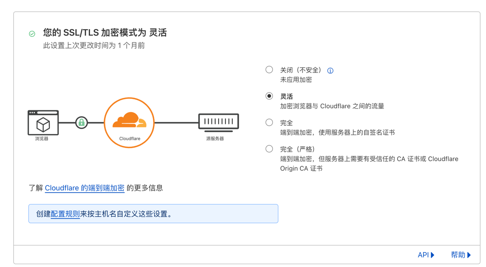
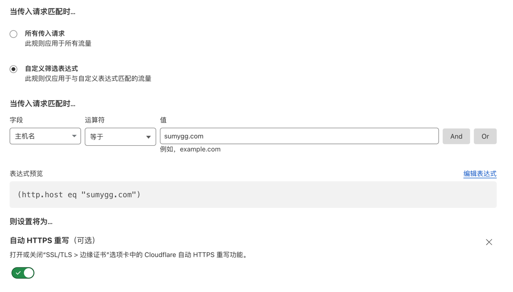

# 使用 Cloudflare 加速 Github Pages

之前很早注册过一个域名，一直闲置。后来看到 cloudflare 的免费域名托管服务，就用来做了邮箱。

尝到甜头后，就把博客的域名也迁移到 cloudflare 上面去。

## 将域名解析到 Cloudflare

首先在 cloudflare 上添加站点。这里使用的博客的域名 `sumygg.com`。

选择一个免费套餐，由于已经设定好了域名，这里没有截图。

选择好套餐后，cloudflare 会给出 nameserver 的地址，需要在域名注册商那里修改 nameserver。

我的域名在 namesilo 上注册的，在 namesilo 的控制台里修改 nameserver。

修改好 nameserver 后，cloudflare 会自动检测域名是否已经解析到 cloudflare，这个过程可能需要十几分钟。

## 配置 DNS

在 cloudflare 的 DNS 配置页面，添加 A 记录 和 AAAA 记录，将域名解析到 Github Pages 的 IP 地址。

这里直接查看我填写好的配置。或者参考 [Github Pages 的官方文档](https://docs.github.com/zh/pages/configuring-a-custom-domain-for-your-github-pages-site/managing-a-custom-domain-for-your-github-pages-site#configuring-an-apex-domain)。

别忘了还需要在仓库中添加 CNAME 文件，内容为域名。由于是迁移到 cloudflare，之前都已经做过了。

## 配置 HTTPS

cloudflare 提供了免费的 HTTPS 证书，可以直接开启。

这里选择灵活、完全、完全（严格）都是可以的。

:::warning
需要注意的是，如果选择灵活，那么 cloudflare 和 Github Pages 之间的通信是 HTTP，而 cloudflare 和用户之间的通信是 HTTPS。
如果你在 Github Pages 中开启了强制 HTTPS，就会出现无限重定向的问题。
:::

## 配置 Configuration Rules

因为使用了 灵活 的 HTTPS 方式，通过 规则 来强制使用 HTTPS。

其实与以上选择 完全 的效果是一样的。这样的目的，以后也在该域名代理其它网站，则以 HTTPS 方式回源只针对当前域名有效。

## 效果

到此配置完成了，在 cloudflare 的 概述 面板上，可以查看域名的访问情况，感觉还是挺不错的。

