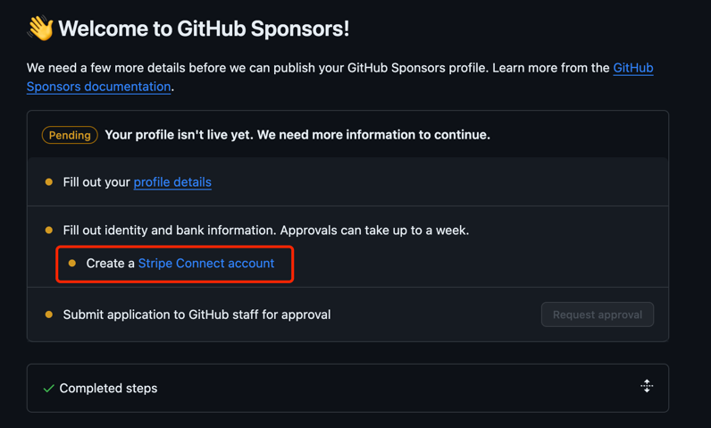

# 我的 GitHub Sponsors 已经开通了

自从听到 GitHub Sponsors 的消息之后，就一直在关注这个，就是幻想能被别人赞助“包养”的感觉。于是早早就提交了 waitlist，然后就一直等待着。 
因为提交的是大陆地区，所以一直没有开通的消息。

前两天去香港旅游（抱歉没留下任何游记，无非就是逛逛逛、买买买）， 看到了银行阴差阳错的进去申请了一下，然后就办下了港卡。
回来之后一直思考如何将港卡利用起来，然后就想到了 GitHub Sponsors。

## 修改 waitlist 信息

打开 [GitHub Sponsors](https://github.com/sponsors) 的页面，选择那个正在 Pending 的账号/组织。

将地址改成香港的地址，然后重新提交等待审核。

## 填写港卡信息

审核通过后，需要填写 Stripe 的账号信息，这里就需要填写港卡的信息了。



开通港卡的时候会给一个回执单，按照回执单上的信息填写即可。

需要补充居住地址（香港的一个地址），银行账户信息，还有账单地址。填写完成这些信息后，就可以提交 Github staff 了。

## 接收赞助

审核通过后，就可以接收赞助了。你需要做的是想一个好的“乞讨文案”（俺并没有想），给你的 github 项目添加一个 sponsor 按钮。

在项目的添加一个 `.github/FUNDING.yml` 文件，里面包含的是你的 Github ID。

```yaml
github:
  - sumy7
```

可以在这个项目里感受一下最后效果。[vite-plugin-generate-file](https://github.com/sumy7/vite-plugin-generate-file)

## 总结

GitHub Sponsors 是一个很好的平台，可以让你的项目得到更多的关注和支持。如果你有一些开源项目，不妨试试。

也真的希望能有人看中我写的一些“破烂”然后赞助一下。Orz

## 参考内容

- [我的 GitHub Sponsors 开通啦！ | Surmon.me](https://surmon.me/article/163)
