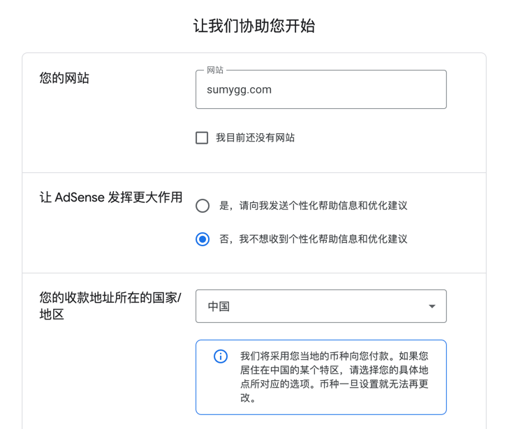
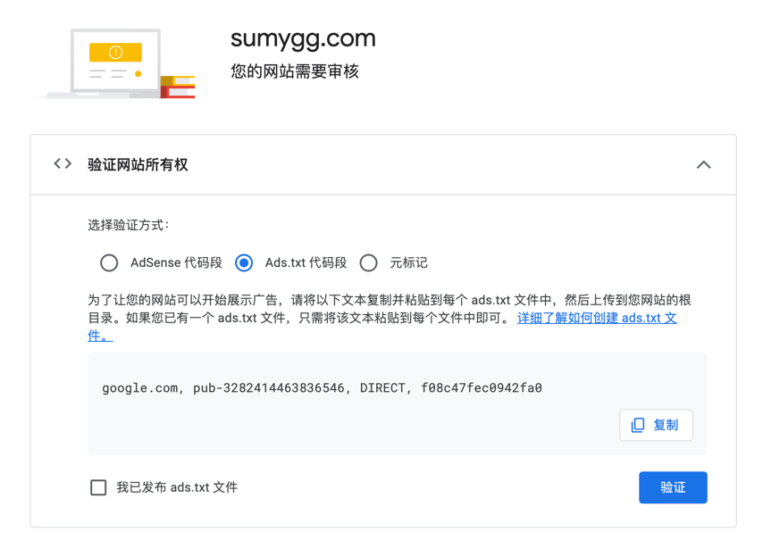
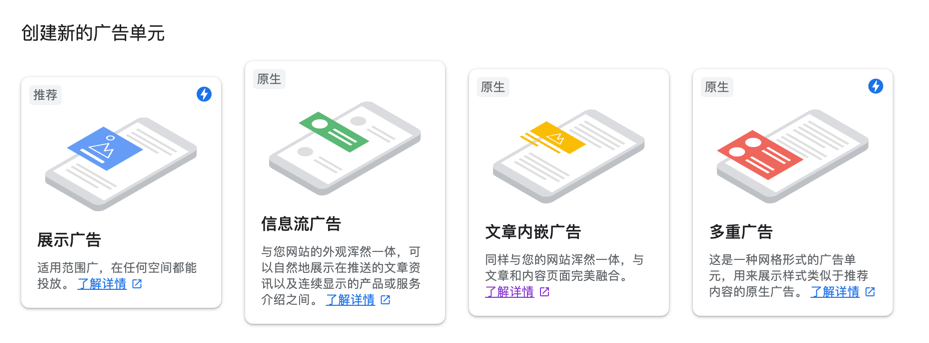
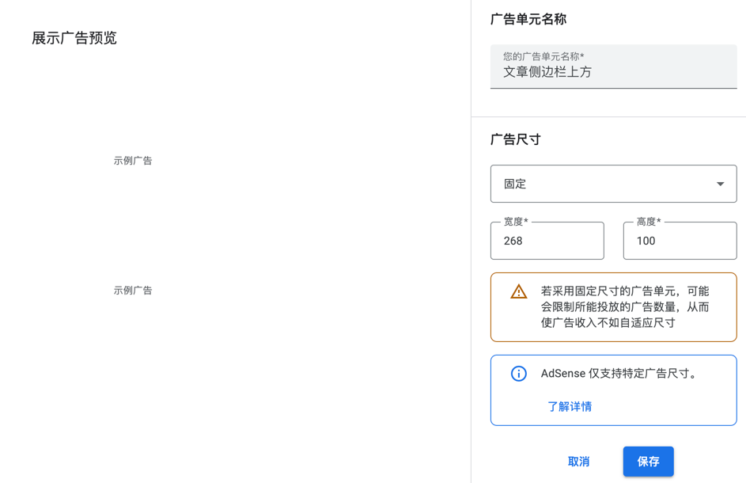
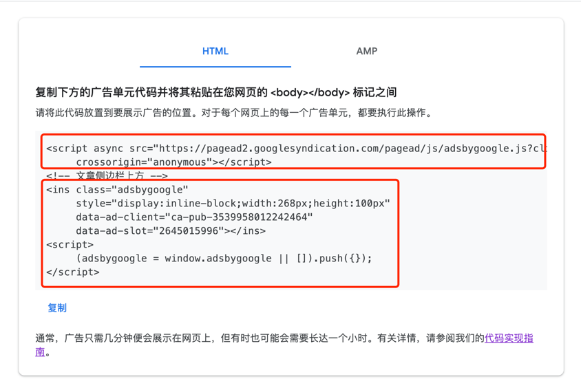

# 在博客中插入谷歌广告

最近看到博客每天也有点流量，就想着能不能广告薅点羊毛（事实证明并不是那么容易）。
最近博客的引擎切换到了 rspress，本篇就基于此简单介绍一下如何在博客中插入谷歌广告。

## 注册谷歌广告账号

打开 [Google AdSense](https://www.google.com/adsense) 的官网，选择右上角的 “登录” 按钮，选择一个 Google 账号登录。

第一次登录后，会填写网站的基本信息。包括网址、电子邮箱和订阅信息等。



需要注意的是地区这里选择“中国”。

::: tip
地区这里不建议选择“香港”，虽然有港卡会比较方便点，但是后续地址验证和 **手机号验证** 都需要香港的才可以。

如果之前因为地区选择错误继续注册了，只能通过删除账号的方式才能更换地区。
:::

这样账号注册完成，接下来按照网站的提示，还需要进行三步操作：


## 提供个人信息

个人客户信息影响后续收款，所以需要根据具体情况进行填写。


【姓名和地址】涉及到后续谷歌会向这个地址递送一个Pin码，一定要填写准确。

这样第一步就算完成了。

## 验证网站

接下来是第三步。为了能够正常展示广告，需要验证网站所有权。（让我们开始吧）



谷歌这里提供了三种方式验证网站所有权：

- AdSense代码段：在head里插入一段script代码
- Ads.txt代码段：在public目录下放置一个txt文件，通过(域名)/ads.txt的路径能够访问到
- 元标记：也是在head里插入一段meta标签代码

可以选一种方式进行验证，我这里选择了Ads.txt代码段。放置好之后发布一下博客，然后点击验证。

验证通过后，需要提交网站审核，谷歌会检查你的网站是否符合广告展示的要求。

## 插入广告代码

在验证的过程中，别忘了可以创建广告单元，向网站中插入广告。

adsense 提供了两种模式展示广告，一种是自动广告，一种是手动广告。

自动广告是添加一段代码后，谷歌自己判断展示广告的位置，不过这种模式的广告展示位置不太好控制。就怕最后页面所有位置都是广告。


这里不要选择这种模式，选择手动广告，即创建广告单元。



选择【展示广告】，填写广告位的名称和大小等配置。



创建之后，会生成一个广告代码，将这段代码插入到博客要展示广告的位置。



其中的script标签，在全局引用一次即可。用rspress来说，可以在 `rspress.config.ts` 中配置注入。

```typescript
{
    // ...
    builderConfig: {
        html: {
            tags: [
                // Configure Google Ads
                {
                    tag: 'script',
                    attrs: {
                        async: true,
                        src: `https://pagead2.googlesyndication.com/pagead/js/adsbygoogle.js`,
                        crossorigin: 'anonymous',
                    },
                },
            ]
        }
    }
    // ...
}
```

然后在需要展示的位置插入广告组件，比如在文章的中间插入一个广告。

```tsx
export default function MyComponent() {
    useEffect(()=> {
        (window.adsbygoogle = window.adsbygoogle || []).push({});
    }, [])
    
    return (
        <ins className="adsbygoogle"
             style="display:inline-block;width:268px;height:100px"
             data-ad-client="ca-pub-3539958012242464"
             data-ad-slot="2645015996"></ins>
    );
}
```

每次都写一个广告位组件还是比较麻烦的，后续可以考虑抽离成一个广告组件。目前已经简单实现了一下[plugin-google-ads](https://github.com/sumy7/SumyBlog-rspress/tree/main/packages/plugin-google-ads)

## 接下来

广告账号的注册和广告投放已经告一段落了，后续就是优化广告的展示效果，增加博客里广告位。不过还是想继续保持博客简约的风格，就不打算放太多广告了。

接下来还有谷歌Pin码验证，这个等到收到了再说吧，任重而道远。（听说广告收入需要达到10美元的时候，目前0.1美元）

## 参考内容

- [VuePress网站接入Google AdSense广告位 | 千古壹号的博客](https://www.qianguyihao.com/post/2021-06-30-Google-adSense/)
