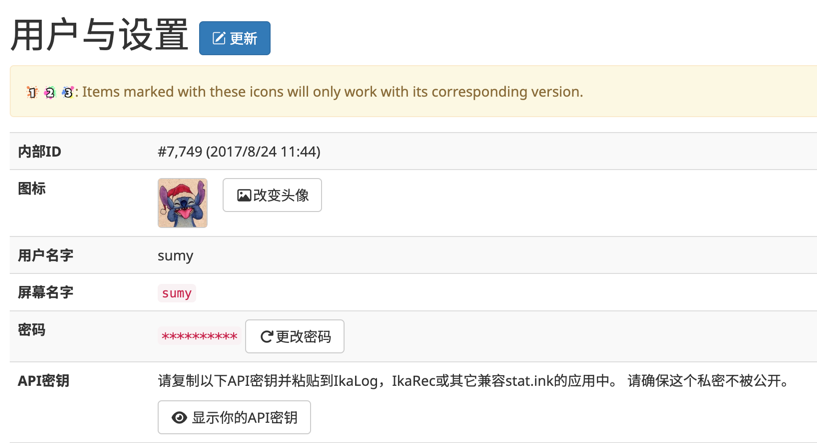
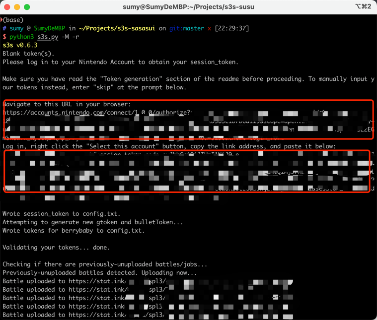
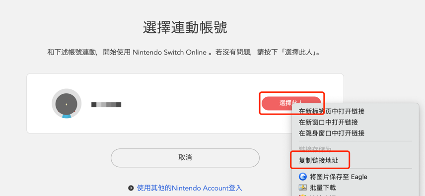

# 上传splatoon3对战记录到stat.ink

[stat.ink](https://stat.ink/)是一个splatoon系列游戏的对战记录网站，可以上传对战记录，查看自己的对战记录，以及查看其他玩家的对战记录。

虽然三代的NSO相比二代好用了不少，但是对战记录依然只能保留50条，对于一些喜欢查看自己对战记录的玩家来说，总归不是很方便。

本文介绍如何上传splatoon3的对战记录到stat.ink。

## 注册stat.ink账号

这里不再赘述，打开网站注册一个账号。在个人中心可以找到自己的API key。记录下来，后面需要使用。



## 安装s3s

[s3s](https://github.com/frozenpandaman/s3s)是一个对战记录上传器，它能够访问NSO的对战记录，然后上传到stat.ink。

为了能够使用s3s，需要git和python3工具。如果你是开发人员，这些工具应该已经安装了。如果没有安装，可以自行搜索安装方法。

```shell
# 克隆s3s仓库
git clone https://github.com/frozenpandaman/s3s.git
# 进入目录
cd s3s
# 安装依赖
pip3 install -r requirements.txt
```

## 配置s3s

执行s3s命令进行启动，这个命令的意思是上传打工记录，并每隔5分钟检查一次。

```shell
python3 s3s.py -M -r
```



1. 提示输入API key，输入stat.ink的API key。我这里提前输入过了，就没有提示出来。
2. 给出一个链接，用浏览器打开这个链接，登录自己的NSO账号

在【选择此人】上面右键，选择【复制链接地址】，将地址粘贴到命令行中
3. 等待s3s校验登录信息，然后就自动上传对战记录了

## 查看对战结果

上传大概10s一条记录，直接访问命令行里给出的对战记录链接就可以看到自己的对战记录了。

我的打工记录：[https://stat.ink/@sumy/salmon3](https://stat.ink/@sumy/salmon3)，感兴趣的可以一起来玩。

## docker容器部署

每次手动执行命令很麻烦，而且对战上传服务不稳定，经常上传一段时间后出现SSL认证错误的情况。

所以考虑用docker容器部署s3s服务，并设置每一个小时定时启动上传一次。

我自己有个群晖NAS，所以docker是部署到NAS上的。这里说明一下主要的配置属性。

```text
Name: isseim-s3s1
Image: isseim/s3s:latest
Command: -r
Volumes: /opt/s3s/config.txt -> /volume1/docker/s3s/config.txt
```

config.txt是本地s3s生成的配置文件，因为容器无法使用交互式输入登录信息，需要直接使用配置文件。

群晖有计划任务功能，可以设置定时任务，这里设置每小时执行一次。执行的命令行为

```shell
docker restart isseim-s3s1
```

这样就可以实现每小时上传一次对战记录了。

::: warning
如果账号密码或者地区有变动，会存在登录信息失效的问题。  
出现这种情况，需要在本地重新走一遍登录流程，生成config.txt并更新到容器里。
:::

## 总结

通过s3s可以方便的将对战记录上传到stat.ink，而使用docker又能够实现定时上传对战记录的功能。
