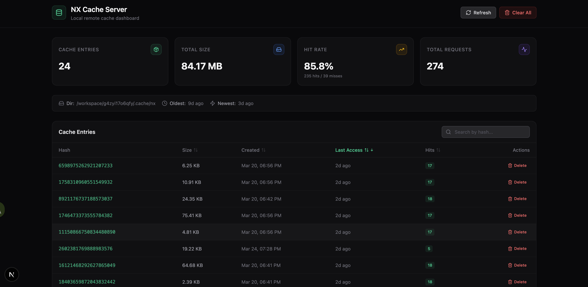

# 使用 Nx 搭建自建远程缓存服务

Nx 的计算缓存是 monorepo 提升构建效率的关键能力。默认情况下缓存仅存储在本地，而 Nx Cloud 虽然提供了远程缓存，但是对于我们这种“穷人”就考虑怎么省钱怎么来了。

本文介绍如何使用 Nx 的自定义远程缓存（Custom Remote Cache）功能，搭建一套完全受控的缓存服务。

## 为什么需要远程缓存

默认创建配置完成项目后，Nx 已经启用了本地缓存。每次构建的时候，Nx 会将构建产物和输入的哈希值存储在本地 `.nx/cache` 目录下，这时候再次构建的产物会有一个 `[local cache]` 的提示，说明命中了本地缓存。

但是上线过程中使用 jenkins 的流水线构建，构建环境是完全隔离的，每次构建都是全新的环境，所以本地缓存无法复用。

## Nx 远程缓存的工作原理

Nx 在执行任务时会根据输入（源码、配置、依赖等）生成哈希值。如果哈希命中缓存，则直接使用缓存产物，跳过实际执行。

远程缓存的流程：

1. 任务执行前，先查询远程缓存是否存在对应哈希
2. 命中则下载缓存产物并还原到本地
3. 未命中则正常执行任务，完成后将产物上传到远程缓存

## 使用 Vibe Coding 搭建自建远程缓存服务

Nx 的构建缓存经历了几个阶段：官方提供远程缓存+允许自建，不允许自建，又允许自建的几个阶段。目前基于最新的 Nx v21 版本。

访问 [Nx 官方文档](https://nx.dev/docs/guides/tasks--caching/self-hosted-caching#open-api-specification) 里关于自建远程缓存的章节。这里可以获取到一个 OpenAPI 规范的接口定义，我们需要实现这个接口来搭建自己的远程缓存服务。

打开一个 vibe coding 平台，搭建一个 next.js 项目，然后给它这个接口定义，告诉它要实现这个接口。别忘了还需要美化一下界面，增加管理功能，比如查看缓存列表、命中等统计数据，以及删除缓存等功能。缓存可以保存在容器内部。

最终搭建了一个这样的平台：



## 配置项目使用缓存

使用环境变量可以配置 Nx 使用远程缓存：

```bash
export NX_SELF_HOSTED_CACHE_SERVER=http://<your-cache-server>:3000/
```

另外通过 cross-env 在 package.json 的启动命令里配置：

```json
"scripts": {
  "build:packages": "cross-env NX_SELF_HOSTED_CACHE_SERVER=http://<your-cache-server>:3000/ NX_DAEMON=false nx run-many -t build --projects=packages/*"
}
```

在 CI/CD 流水线构建的时候，如果出现 `[remote cache]` 的提示，说明命中了远程缓存。

## 总结

使用 Nx 的自定义远程缓存功能，可以搭建一套完全受控的缓存服务，提升构建效率，节省构建时间和资源。虽然需要一些额外的工作来实现接口和管理缓存，但对于大型 monorepo 项目来说是非常值得的。

## 参考内容

- [Nx 官方文档 - Remote Caching](https://nx.dev/docs/guides/tasks--caching/self-hosted-caching)
