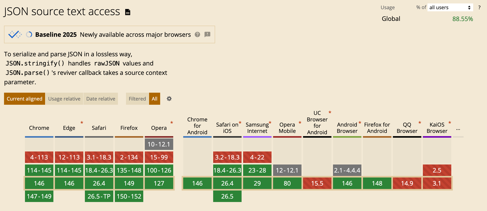

# 在 JS 环境下解析大整数的三种方式

在前端开发中，处理 JSON 数据时经常会遇到大整数（Big Number）的问题。由于 JavaScript 的 Number 类型采用 IEEE 754 双精度浮点数，安全整数范围为 $-(2^{53}-1)$ 到 $2^{53}-1$，超出范围的整数会丢失精度。

本文介绍三种在 JS 环境下解析大整数的方案，并对比其优缺点，帮助你选择最合适的实现方式。

## 为什么需要特殊处理大整数

常见场景如后端返回的订单号、ID、区块链数据等，往往超出 JS 的安全整数范围。直接用 `JSON.parse` 解析会导致精度丢失：

```js
JSON.parse('{"big":9007199254740993123}') // { big: 9007199254740993000 }
```

## 方案一：使用 json-bigint 库

[json-bigint](https://github.com/sidorares/json-bigint) 是社区常用的解决方案，支持将大整数解析为 BigInt 或字符串。

**用法示例：**

```js
import JSONbig from 'json-bigint';
const obj = JSONbig({ storeAsString: true }).parse('{"big":9007199254740993123}');
console.log(obj.big); // '9007199254740993123'
```

**优点：**
- 兼容性好，支持所有主流浏览器
- API 与原生 JSON.parse 类似，上手简单

**缺点：**
- 体积较大（约20KB+）
- 性能略低于原生 JSON.parse

## 方案二：原生 JSON.parse + reviver

在新版浏览器（如 Chrome 114+）中，`JSON.parse` 支持 `context.source`，可以结合 reviver 实现大整数精准解析：

**用法示例：**

```js
const json = '{"big":9007199254740993123}';
const obj = JSON.parse(json, (key, value, context) => {
    if (Number.isInteger(value) && !Number.isSafeInteger(value)) {
        if(context && context.source) {
            return context.source;
        }
    }
    return value;
});
console.log(obj.big); // "9007199254740993123"
```

**优点：**
- 性能极高，几乎与原生一致
- 无需引入第三方库

**缺点：**
- 仅支持部分新版浏览器（如 Chrome 114+）
- 兼容性有限

## 方案三：Rust + WASM 实现自定义解析

对于极致性能和灵活性需求，可以用 Rust 编写 JSON 解析逻辑并通过 WASM 暴露给 JS 调用。

**实现思路：**
1. Rust 使用 [serde_json](https://docs.rs/serde_json/) 解析字符串，遇到大整数时转为字符串或 BigInt
2. 编译为 WASM，JS 侧通过 wasm-bindgen 调用

**伪代码示例：**

```rust
// Rust 侧
#[wasm_bindgen]
pub fn parse_json_bigint(input: &str) -> JsValue {
		// 递归遍历 JSON，将大整数转为字符串
}
```

```js
// JS 侧
import init, { parse_json_bigint } from './your_wasm_bg.wasm';
await init();
const obj = parse_json_bigint('{"big":9007199254740993123}');
console.log(obj.big); // '9007199254740993123'
```

**优点：**
- 性能极高，适合大数据量场景
- 可灵活扩展更多自定义需求

**缺点：**
- 实现复杂，需要 WASM 构建链
- 体积较大，加载慢于 JS 方案

## 三种方案对比

| 方案         | 兼容性         | 性能       | 体积     | 易用性   | 耗时 |
|--------------|----------------|------------|----------|----------|----|
| json-bigint  | 所有主流浏览器 | 较好       | 较大     | 简单     | 53ms |
| JSON.parse+reviver | 新版浏览器   | 极高       | 最小     | 简单     | 44ms|
| Rust+WASM    | 需 WASM 支持   | 极高       | 较大     | 复杂     | 88ms |

在耗时方面，方案二（原生 JSON.parse + reviver）表现最佳，方案一（json-bigint）次之，方案三（Rust + WASM）由于跨语言调用和加载开销，耗时较高。

## 推荐实践

由于 JSON.parse reviver context 不是所有浏览器都支持：



综合考虑兼容性与性能，可以使用以下函数检测环境支持：

```javascript
// 检测是否支持 JSON.parse reviver context
function isSupportJSONParseReviver() {
    let isSupport = false;
    try {
        JSON.parse('{"test":1}', (key, value, context) => {
            if(context && context.source) {
                isSupport = true;
            }
            return value;
        });
        return isSupport;
    } catch (e) {
        return false;
    }
}
```

如果支持方案二，优先使用；否则退回方案一。

## 总结

在 JS 环境下解析大整数有多种方案，需根据实际兼容性和性能需求选择。随着浏览器原生能力增强，未来方案二将成为主流。

## 参考内容

- [json-bigint](https://github.com/sidorares/json-bigint)
- [Chrome JSON.parse reviver context](https://developer.chrome.com/blog/json-parse-source/)
- [Rust serde_json](https://docs.rs/serde_json/)
- [Caniuse-context.source](https://caniuse.com/?search=context.source)
