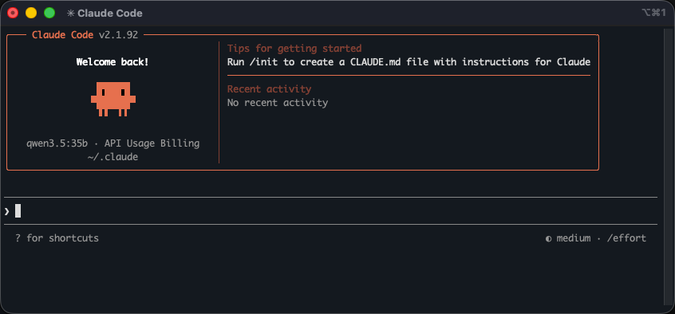
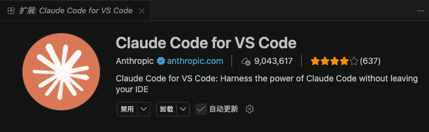
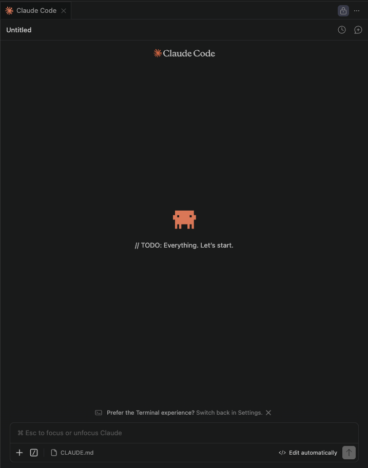

# 免费使用 Claude Code VSCode 扩展：用 Ollama 本地模型免订阅方案

[Claude Code](https://github.com/anthropics/claude-code) 是 Anthropic 推出的官方 CLI 工具，但官方服务需要付费订阅。在 VSCode 安装 Claude Code for VS Code 扩展之后，会出现一个登录订阅的默认界面，如果没有订阅就无法使用。通过配置 Ollama 本地部署的模型，我们可以免费使用类似 Claude Code 的功能，以下是详细的设置指南。

## 1. 安装 Ollama

前往 [Ollama 官网](https://ollama.com/) 下载安装程序。安装后验证：

```bash
ollama --version
```

推荐使用轻量级但性能不错的模型：

```bash
# 下载 qwen3.5:35b（推荐，代码理解能力强）
ollama pull qwen3.5:35b

# 或其他模型选项
ollama pull llama3.2      # 轻量，适合低配置机器
ollama pull mistral       # 平衡性能和体积
```

## 2. Claude Code CLI 配置

选择合适的方式安装 Claude Code CLI，在 mac 环境下推荐以下三种安装方式：

```bash
# 命令行安装
curl -fsSL https://claude.ai/install.sh | bash

# 使用 npm
npm install -g @anthropic/claude-code

# brew（macOS）
brew install --cask claude-code
```

安装完成后，执行命令可以看到 Claude Code CLI 的默认界面：

```bash
claude
```



Ollama 准备了一键配置模型的启动命令

```bash
ollama launch claude --model qwen3.5:35b
```

启动后，在 Claude Code 吉祥物标志下显示当前的模型，如果是指定的 `qwen3.5:35b` 就说明配置成功了。

## 3. VSCode 扩展配置

在 VSCode 扩展市场搜索 "Claude Code" 并安装。



之前如果运行过 `claude` 命令，会在本地生成一个配置文件，路径通常是 `~/.claude/settings.json`。在里面增加 Ollama 的配置：

```json
{
  "env": {
    "ANTHROPIC_AUTH_TOKEN": "ollama",
    "ANTHROPIC_BASE_URL": "http://localhost:11434"
  },
  "primaryApiKey": "foxcode",
  "model": "qwen3.5:35b"
}
```

重启 VSCode 后，打开 Claude Code 扩展，应该就能看到默认进入对话窗口了。



后面就可以愉快的和模型对话了。

---

## 参考资源

- [Ollama 官方文档](https://ollama.com/docs)
- [How to Run Qwen3.5 Locally With Claude Code (No API Bills, Full Agentic Coding) - Medium](https://medium.com/coding-nexus/how-to-run-qwen3-5-locally-with-claude-code-no-api-bills-full-agentic-coding-3350606f866d)
