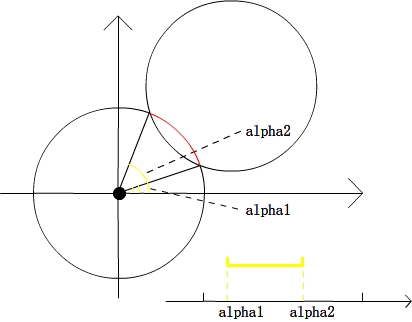

# 给定半径圆覆盖点

> 给定一个圆，使其能覆盖平面上最多的点。

## 题目模型

给平面上N个点的坐标 ( Xi,Yi )，给出圆半径 R ，求 R 能覆盖的最多的点数。

## 题目分析

> 最初的分析就是移动，保证点在圆周上，然后圆以这一点为轴转动360度，检查有多少个点能被圆覆盖。操作时，对于基点 i ，如果 dist(i, j)&lt;D 那么就以i点为轴转动圆周到 j 在圆周上。但是这么做的正确性没有仔细想过，但是实现起来就相当麻烦了。时间复杂度上是 O(N^2) 肯定是可以接受的。这种想法还有待于更深入的讨论。
> 
> 后来在网上发现一种做法，就是以每个点为圆心，以半径R画圆，然后统计每个区域重叠的次数，记录最大。
> 
> 但是，如果要表示一个区域，是几乎不可能的事情。区域是不规则的，最初我想将区域栅格化，但是时间复杂度和正确性上都是不能保证的。最后还是看了报告……
> 仔细观察上图，虽然红色区域不能被表示，但是围成区域的边界却是能表示的。由于边界是圆弧，所以可以用这段弧对于x轴的极角表示，
> 
> 区域问题转化成了线段覆盖次数的问题了。然后就是把alpha1，alpha2映射到一个[0, 4pi]的区间，这里映射到[0, 4pi]而不是[0, 2pi]是由于alpha的范围是[-pi/2, 5pi/2]，而非[0, 2pi]，对于不在[0,4pi]范围内的点，直接加2pi不会影响结果。

这里再说明一下这种方法：

首先将重叠的弧的开始点和结束点标示出来（如开始点为 1 ，结束点为 0），那么将弧按极角排序之后，遇到开始点的时候计数器加 1 ，遇到结束点计数器减 1。统计这个期间计数器的最大值就是圆重叠的最大数。具体原理可以参考一下上面的图片。

## 例题

### hoj2704 Phone Cell

直接套用算法就可以解决。

题目连接：[http://acm.hit.edu.cn/hoj/problem/view?id=2704](http://acm.hit.edu.cn/hoj/problem/view?id=2704)

```cpp
    #include <iostream>
    #include <cmath>
    using namespace std;
    const double pi = acos(-1);
    const int MAXN = 2048;
    struct point
    {
        double x, y;
    };
    point list[MAXN];
    struct interval
    {
        double arg;
        bool flag;
        bool operator<(const interval &T) const
        {
            return arg < T.arg;
        }
    };
    interval event[4 * MAXN];
    double dis(point a, point b)
    {
        return sqrt((a.x - b.x)*(a.x - b.x) + (a.y - b.y)*(a.y - b.y));
    }

    int main()
    {
        int n;
        int num, res, ans;
        double r;
        double dist, a1, a2, delta, cta;
        while(scanf("%d%lf", &n, &r) && n)
        {
            r += 0.01;
            ans = -1;
            for(int i = 0; i < n; i++) scanf("%lf%lf", &list[i].x, &list[i].y);

            for(int i = 0; i < n; i++)
            {
                num = 0;
                for(int j = 0; j < n; j++)
                {
                    if(i == j) continue;
                    dist = dis(list[i], list[j]);
                    if(dist <= 2.0 * r)
                    {
                        cta = atan2(list[j].y - list[i].y, list[j].x - list[i].x);
                        if(cta < 0) cta += 2 * pi;
                        delta = acos(dist / 2.0 / r);
                        a1 = cta - delta, a2 = cta + delta;
                        if(a1 < 0)
                        {
                            event[num].arg = a1 + 2 * pi, event[num++].flag = true;
                            event[num].arg = a2 + 2 * pi, event[num++].flag = false;
                        }
                        else
                        {
                            event[num].arg = a1, event[num++].flag = true;
                            event[num].arg = a2, event[num++].flag = false;
                            event[num].arg = a1 + 2 * pi, event[num++].flag = true;
                            event[num].arg = a2 + 2 * pi, event[num++].flag = false;
                        }
                    }
                }
                if(num < ans) continue;
                sort(event, event + num);
                res = 0;
                for(int j = 0; j < num; j++)
                {
                    if(event[j].flag) res++;
                    else res--;
                    if(ans < res) ans = res;
                }
            }
            if(ans != -1) printf("It is possible to cover %d points.\n", ans + 1);
            else printf("It is possible to cover 1 points.\n");
        }
        return 0;
    }
```

### hoj1799 Circle and Points

这个问题与上一个问题类似，只不过半径固定为 1.0 。其它的没什么特殊的地方。

题目链接：[http://acm.hit.edu.cn/hoj/problem/view?id=1799](http://acm.hit.edu.cn/hoj/problem/view?id=1799)

### hoj2940 Pit Lord

这个问题每个点都有一个权值，可以考虑“进入”的时候增加的是点的权值，而“离开”的时候减去点的权值。

题目链接：[http://acm.hit.edu.cn/hoj/problem/view?id=2940](http://acm.hit.edu.cn/hoj/problem/view?id=2940)

```cpp
    #include <iostream>
    #include <cstdio>
    #include <cstring>
    #include <cmath>
    #include <algorithm>
    #include <vector>
    using namespace std;
    struct point
    {
        double x,y;
        double val;
        void read()
        {
            cin>>x>>y>>val;
        }
    }p[1005];
    struct node
    {
        double dius;
        int flag;
        double val;
    };
    int n;
    double r;
    double ans;
    vector<node>lists;
    double dis(point a,point b)
    {
        return(sqrt((a.x-b.x)*(a.x-b.x)+(a.y-b.y)*(a.y-b.y)));
    }
    int cmp(node a,node b)
    {
        return(a.dius<b.dius);
    }
    int main()
    {
        while(cin>>n>>r)
        {
            r+=0.001;
            for(int i=0;i<n;i++)
            {
                p[i].read();
            }
            ans=0.0;
            for(int i=0;i<n;i++)
            {
                lists.clear();
                for(int j=0;j<n;j++)
                {
                    if(i==j) continue;
                    double dist=dis(p[i],p[j]);
                    if(dist<=2.0*r)
                    {
                        double cta=atan2(p[j].y-p[i].y,p[j].x-p[i].x);
                        if(cta<0) cta+=2.0*M_PI;
                        double delta=acos(dist/2.0/r);
                        double a1=cta-delta,a2=cta+delta;
                        node tmp;
                        if(a1<0)
                        {
                            tmp.dius=a1+2.0*M_PI;tmp.flag=1;tmp.val=p[j].val;
                            lists.push_back(tmp);
                            tmp.dius=a2+2.0*M_PI;tmp.flag=0;tmp.val=p[j].val;
                            lists.push_back(tmp);
                        }
                        else
                        {
                            tmp.dius=a1;tmp.flag=1;tmp.val=p[j].val;
                            lists.push_back(tmp);
                            tmp.dius=a2;tmp.flag=0;tmp.val=p[j].val;
                            lists.push_back(tmp);
                            tmp.dius=a1+2.0*M_PI;tmp.flag=1;tmp.val=p[j].val;
                            lists.push_back(tmp);
                            tmp.dius=a2+2.0*M_PI;tmp.flag=0;tmp.val=p[j].val;
                            lists.push_back(tmp);
                        }
                    }
                }
                sort(lists.begin(),lists.end(),cmp);
                double res=0;
                for(int k=0;k<lists.size();k++)
                {
                    if(lists[k].flag)
                    {
                        res+=lists[k].val;
                    }
                    else
                    {
                        res-=lists[k].val;
                    }
                    if(res+p[i].val>ans) ans=res+p[i].val;
                }
            }
            printf("%.2lf\n",ans);
        }
        return 0;
    }
```

### ural1332 Genie Bomber

这个问题的特殊之处就在于每个点也有自己的半径，也就是用大圆 R 来覆盖若干小圆 r 。这里的处理方法是将 R-r 作为覆盖圆来使用。注意 R-r 为负值的时候要输出 0 。

题目链接：[http://acm.timus.ru/problem.aspx?space=1&num=1332](http://acm.timus.ru/problem.aspx?space=1&num=1332)

```cpp
    #include <iostream>
    #include <cstring>
    #include <algorithm>
    #include <cmath>
    #include <cstdio>
    #include <vector>

    using namespace std;
    struct point
    {
        double x,y;
        void read()
        {
            cin>>x>>y;
        }
    }p[305];
    struct node
    {
        double dius;
        int flag;
    };
    vector<node>lists;
    double dis(point a,point b)
    {
        return(sqrt((a.x-b.x)*(a.x-b.x)+(a.y-b.y)*(a.y-b.y)));
    }
    int cmp(node a,node b)
    {
        return a.dius<b.dius;
    }
    int ans=0;
    double R,r;
    int main()
    {
        int n;
        cin>>n;
        for(int i=0;i<n;i++)
        {
            p[i].read();
        }
        cin>>R>>r;
        R-=r;
        if(R<0)
        {
            cout<<"0"<<endl;
            return 0;
        }
        ans=0;
        for(int i=0;i<n;i++)
        {
            lists.clear();
            for(int j=0;j<n;j++)
            {
                if(i==j) continue;
                double dist=dis(p[i],p[j]);
                if(dist<=2.0*R)
                {
                    double cta=atan2(p[j].y-p[i].y,p[j].x-p[i].x);
                    if(cta<0) cta+=2.0*M_PI;
                    double delta=acos(dist/2.0/R);
                    double a1=cta-delta,a2=cta+delta;
                    node tmp;
                    if(a1<0)
                    {
                        tmp.dius=a1+2.0*M_PI;tmp.flag=1;
                        lists.push_back(tmp);
                        tmp.dius=a2+2.0*M_PI;tmp.flag=0;
                        lists.push_back(tmp);
                    }
                    else
                    {
                        tmp.dius=a1;tmp.flag=1;
                        lists.push_back(tmp);
                        tmp.dius=a2;tmp.flag=0;
                        lists.push_back(tmp);
                        tmp.dius=a1+2.0*M_PI;tmp.flag=1;
                        lists.push_back(tmp);
                        tmp.dius=a2+2.0*M_PI;tmp.flag=0;
                        lists.push_back(tmp);
                    }
                }
            }
            sort(lists.begin(),lists.end(),cmp);
            int cnt=0;
            for(int k=0;k<lists.size();k++)
            {
                if(lists[k].flag) cnt++;
                else cnt--;
                if(cnt>ans) ans=cnt;
            }
        }
        cout<<ans+1<<endl;
        return 0;
    }
```

## 参考内容

+ [【转】HOJ2704 Phone Cell 计算几何_AekdyCoin的空间](http://hi.baidu.com/aekdycoin/item/4c864089e5011759840fabd6)
+ [单位圆覆盖平面上点 - wujiawei@HIT](http://www.cppblog.com/wujiawei/archive/2010/08/21/124180.html)
+ [北京邮电大学-北邮人论坛-北邮人的温馨家园 -- [模板]二维几何模板](http://bbs.byr.cn/wForum/disparticle.php?boardName=ACM_ICPC&ID=63442&start=0&listType=1)
