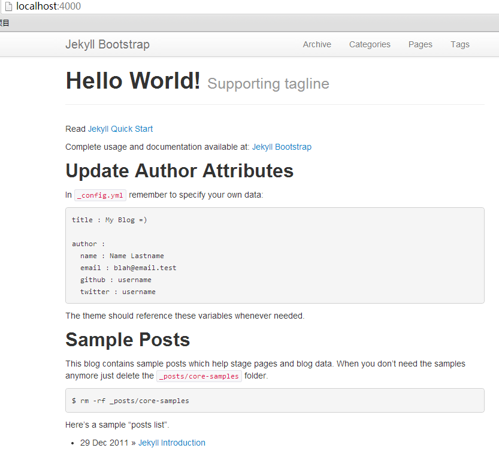
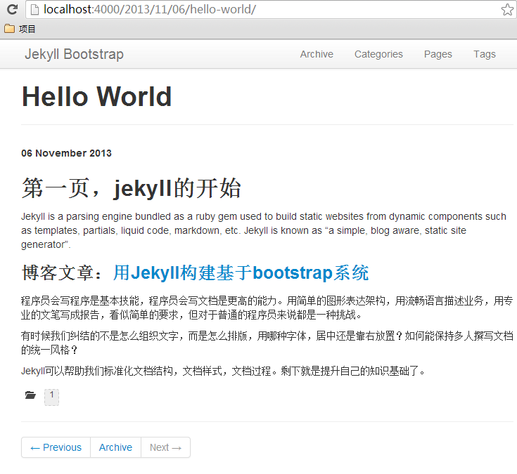

# 用Jekyll书写博客

> Jekyll 是一个简单的免费的 Blog 生成工具，类似 WordPress 。但是和 WordPress 又有很大的不同，它可以免费部署在 Github
  上。相信喜欢 DIY 的你一定会喜欢上它的。

刚开始使用 Jekyll 也走了不少的弯路，查找各种资料，终于将自己的博客搭建起来了。之后就是向博客中添加自己喜欢的功能，包括语法高亮、 LaTex 公式还有各种评论功能，忙的不亦乐乎，也是通过它才学会简单的使用 github 的。最近才发现自己的博客越来越臃肿了，不过也算乐在其中吧。

距离刚使用 Jekyll 有好长时间了，好多东西也记不太清了，所以下面写的也是参考网络上的一些文章回忆的。

## What is Jekyll

Jekyll 是一个静态站点生成器，它会根据网页源码生成静态文件。它提供了模板、变量、插件等功能，可以用来生成整个网站。

Jekyll 生成的站点，可以直接发布到 github 上面，这样我们就有了一个免费的，无限流量的，有人维护的属于我们的自己的 web 网站。Jekyll 是基于 Ruby 的程序，可以通过 gem 来下载安装。

Jekyll官方文档：[http://jekyllrb.com/](http://jekyllrb.com/)

接下来主要介绍 Jkeyll 在 github 上的部署与发布。关于 Jkeyll 在本地的调试环境可以参照我的上一篇博文。

你需要对 github 有一点了解，如果不是很熟的话请参考相关资料。

## 起步：构建 Jekyll 模板

Jekyll 的模板是基于 [bootstrap](http://jekyllbootstrap.com/) 的，下载jekyll-bootstrap的模板项目。

### 从github下载模板

```
Administrator@PC201304202140 /d/workspace/ruby
$ git clone https://github.com/plusjade/jekyll-bootstrap.git jekyll
Cloning into 'jekyll'...
remote: Counting objects: 1898, done.
remote: Compressing objects: 100% (1061/1061), done.
remote: Total 1898 (delta 850), reused 1729 (delta 723)
Receiving objects: 100% (1898/1898), 575.45 KiB | 184 KiB/s, done.
Resolving deltas: 100% (850/850), done.
```

## 进入项目目录

```
Administrator@PC201304202140 /d/workspace/ruby
$ cd jekyll/
```

## 查看目录模板

```
Administrator@PC201304202140 /d/workspace/ruby/jekyll
$ ls
404.html          _config.yml  _plugins      atom.xml         pages.html
History.markdown  _drafts      _posts        categories.html  rss.xml
README.md         _includes    archive.html  changelog.md     sitemap.txt
Rakefile          _layouts     assets        index.md         tags.html
```

### 启动服务

```
Administrator@PC201304202140 /d/workspace/ruby/jekyll
$ jekyll serve
Configuration file: d:/workspace/ruby/jekyll/_config.yml
            Source: d:/workspace/ruby/jekyll
       Destination: d:/workspace/ruby/jekyll/_site
      Generating... done.
    Server address: http://0.0.0.0:4000
  Server running... press ctrl-c to stop.
```

打开浏览器访问网址 http://localhost:4000/ 就可以看到了。



通过几条命令，就可以创建基于 boostrap 风格的网站。当然你也可以根据 jekyll 的语法自己来构建属于自己的模板。

## 旅途：用 Mrakdown 书写文章

我们可以使用命令来创建空白的文章：

```
~ D:\workspace\ruby\jekyll>rake post title="Hello World"
Creating new post: ./_posts/2013-11-06-hello-world.md
```

你也可以仿照一下格式自己新建空白文章。文章需要使用 Markdown 语言书写，具体语法可以参照相关资料。

```markdown
---
layout: post
title: ""
description: ""
category:
tags: []
---

```

文件名就命名为 `年-月-日-文件名.md` 放到 `_post` 目录下面。文章要保存为 `UTF-8 无 BOM 格式编码`，可以使用 Notepad++ 转换一下。然后运行命令启动本地服务器浏览一下。



## 归宿：在 Github 上安家

在开始这一步之前，请确保你有一个 github 的账号。我们需要创建一个新的版本库，库名为你的 github 账户名 + git的域名，假设为USERNAME.github.com 。创建版本库之后将版本库的内容下载下来。

```
$ git clone https://github.com/plusjade/jekyll-bootstrap.git USERNAME.github.com
$ cd USERNAME.github.com
$ git remote set-url origin git@github.com:USERNAME/USERNAME.github.com.git
$ git push origin master
```

接下来过几分钟你就可以在  http://USERNAME.github.io 看到你的博客了。这个应该和你在本地看到的无异。

然后你就可以在这个目录下写文章，本地浏览，觉得不错的之后就可以 push 到 github 上与他人分享啦。这里就可以知道为什么要吧文章保存为 `UTF-8 无 BOM 格式编码` 的了，为防止 github 上生成的文章为乱码。如果文章中含有中文，一定要转换一下编码在 push 上去。 

## 遇到的问题

### 错误一

本地编译运行的时候你可能会遇到以下错误：

```
Administrator@PC201304202140 /d/workspace/ruby/jekyll
$ jekyll serve
Configuration file: d:/workspace/ruby/jekyll/_config.yml
            Source: d:/workspace/ruby/jekyll
       Destination: d:/workspace/ruby/jekyll/_site
      Generating... Error reading file d:/workspace/ruby/jekyll/_posts/2013-11-0
6-hello-world.md: invalid byte sequence in GBK
error: invalid byte sequence in GBK. Use --trace to view backtrace
```

这个是使用 GBK 编码读取 UTF-8 编码的文章造成的错误。找到 jekyll 安装目录，修改 convertible.rb 文件，第38行

```
~vi D:\toolkit\Ruby200\lib\ruby\gems\2.0.0\gems\jekyll-1.3.0\lib\jekyll\convertible.rb
#第38行，替换为下面内容
self.content = File.read_with_options(File.join(base, name), :encoding => "utf-8")
```

还有 tags/include.rb 文件，第129行

```
~vi D:\toolkit\Ruby200\lib\ruby\gems\2.0.0\gems\jekyll-1.3.0\lib\jekyll\convertible.rb
#第129行，替换为下面内容
File.read_with_options(file, :encoding => "utf-8")
```

### 错误二

这种错误也比较常见

```
Administrator@PC201304202140 /d/workspace/ruby/jekyll
$ jekyll serve
Configuration file: d:/workspace/ruby/jekyll/_config.yml
            Source: d:/workspace/ruby/jekyll
       Destination: d:/workspace/ruby/jekyll/_site
      Generating...
 ___________________________________________________________________________
| Maruku tells you:
+---------------------------------------------------------------------------
| Could not find ref_id = "httpblogfensmejekyllbootstarpdoc" for md_link(["http:
//blog.fens.me/jekyll-bootstarp-doc/"],"httpblogfensmejekyllbootstarpdoc")
| Available refs are []
+---------------------------------------------------------------------------
!d:/toolkit/Ruby200/lib/ruby/gems/2.0.0/gems/maruku-0.6.1/lib/maruku/errors_mana
gement.rb:49:in `maruku_error'
!d:/toolkit/Ruby200/lib/ruby/gems/2.0.0/gems/maruku-0.6.1/lib/maruku/output/to_h
tml.rb:715:in `to_html_link'
!d:/toolkit/Ruby200/lib/ruby/gems/2.0.0/gems/maruku-0.6.1/lib/maruku/output/to_h
tml.rb:970:in `block in array_to_html'
!d:/toolkit/Ruby200/lib/ruby/gems/2.0.0/gems/maruku-0.6.1/lib/maruku/output/to_h
tml.rb:961:in `each'
!d:/toolkit/Ruby200/lib/ruby/gems/2.0.0/gems/maruku-0.6.1/lib/maruku/output/to_h
tml.rb:961:in `array_to_html'
\___________________________________________________________________________
Not creating a link for ref_id = "httpblogfensmejekyllbootstarpdoc".done.
    Server address: http://0.0.0.0:4000
  Server running... press ctrl-c to stop.
```

这种错误主要是 Mrakdown 语言的语法有错误。请注意一下方括号与尖括号的问题。修改之后一般就能编译了。

## 参考内容

+ [Jekyll在github上构建免费的Web应用 | 粉丝日志](http://blog.fens.me/jekyll-bootstarp-github/)
+ [利用Jekyll搭建个人博客](http://www.mceiba.com/develop/jekyll-introduction.html)
