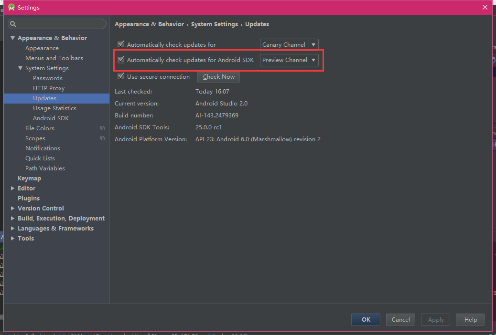
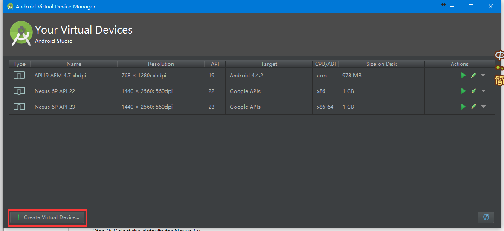
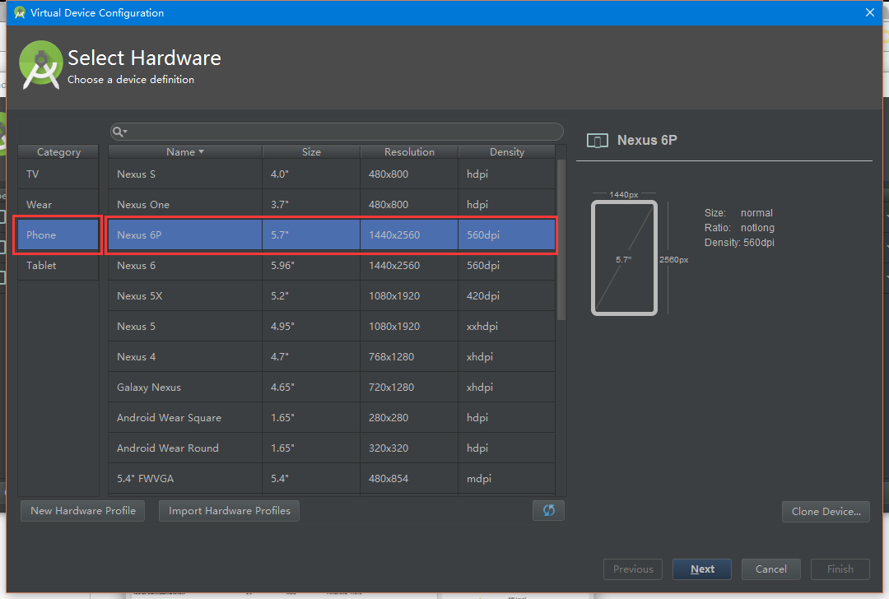
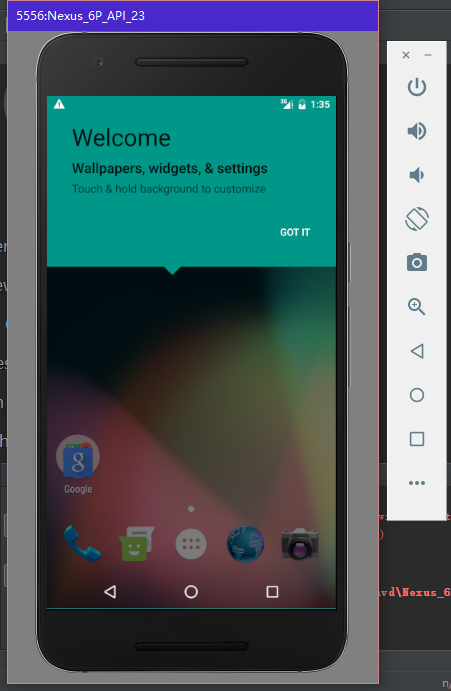
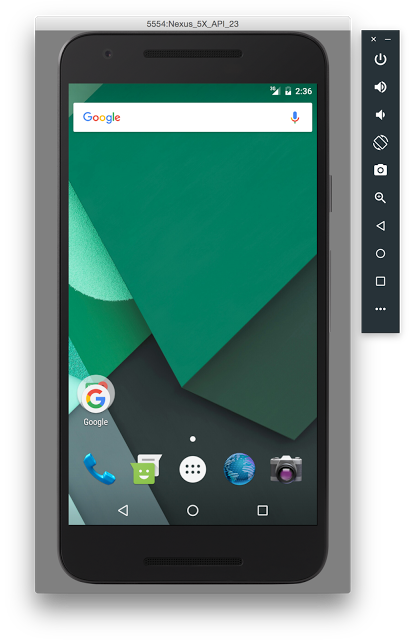
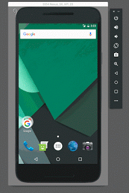
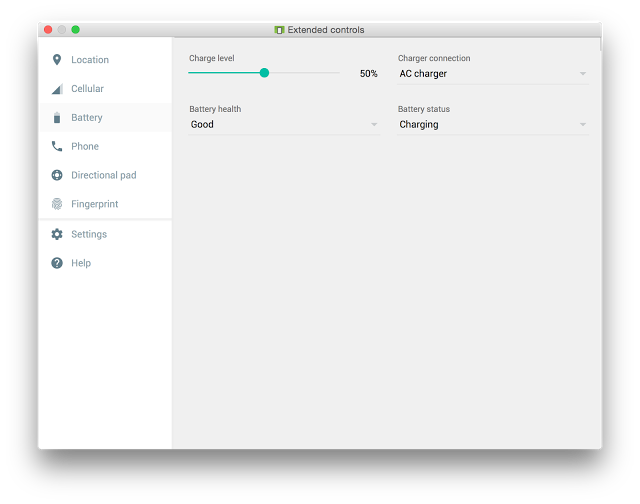
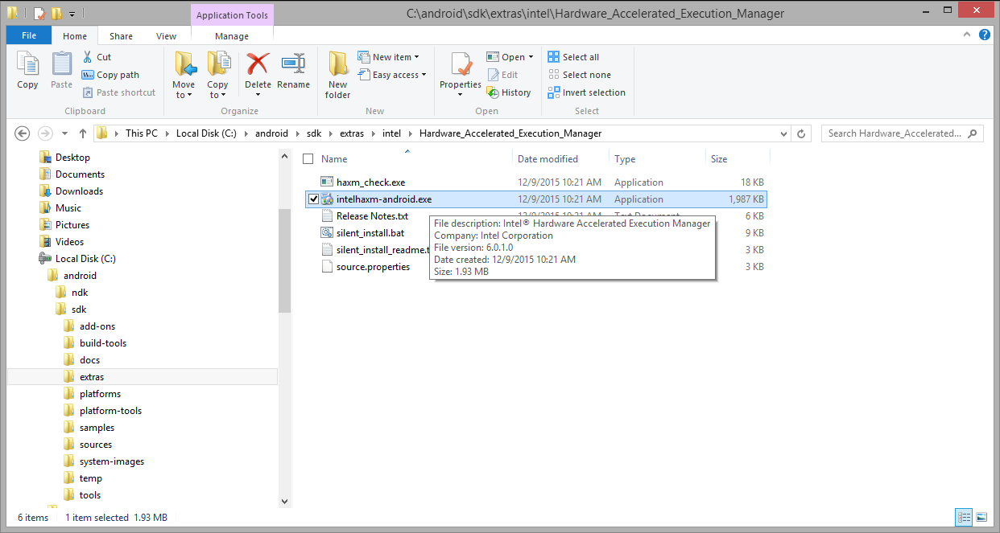

# 尝试Android Emulator Preview模拟器

很早就听说`Android Studio`发布了2.0preview版本，今天又看到连最新的模拟器也可以使用了。
对于之前老的Android官方模拟器一直有一些意见，最大的问题是启动慢和运行卡（机子太烂也不能这样摔锅）。虽然可以使用`HAXM`技术加速，但是效果还是不太明显。曾一度使用`Genymotion`模拟器，最后就直接上真机了。
虽然有这些问题，但新版本发布了还是要来体验一番的。

## 安装更新Android Studio 2.0 & Preview SDK Tools

要想体验最新版Android模拟器，需要在Android Studio下将Android SDK更新到Preview版本。
首先打开Android Studio，选择`File -> Settings`找到`Updates`，修改`Automatically check updates for Android SDK`到`Preview Channel`渠道。



之后选择`Help -> Check for Update...`就可以检查更新。请**自备梯子**。
建议使用额外的SDK Manager进行更新，这里会看到一条Preview下的SDK Tools选项。安装这个，其它的镜像可以随喜好安装。


这样就更新完毕了。

## 创建新的Android虚拟设备(AVD)

为了有更好的体验，还是建议重新创建一个AVD。
在Android Studio中打开**AVD Manager**：


选择**Create Vietual Device...**开始创建新设备：



选择一个分类和设备类型，这里选择**Nexus 6P**：



选择一个系统镜像，这里选择**Lollipop x86 Android 5.1 (with Google APIs)**：


这里可以按照自己的需要修改设置，特别提示一下高级选项**Show Advanced Settings**里可以设置CPU的核心**Multi-Core CPU**：


**Finish**之后点击绿色的箭头就可以启动虚拟机了：


之后可以看到虚拟机的初始化界面，然后虚拟机就启动了。




## 虚拟机特性

[这篇博客](http://android-developers.blogspot.jp/2015/12/android-studio-20-preview-android.html)里提到了虚拟机的一些特性，这里来列举一下：

1. 性能提升，主要体现在CPU（CPU Performance）和ADB（Faster ADB）上。*这个感觉不太直观。*
2. 用户界面优化：
    + 工具栏——提供了虚拟机最常用的操作，电源键、音量键、屏幕放置、截图、屏幕缩放、返回、主菜单、最近任务、设置。
	
    + 窗口放大和缩放——提供便捷的方式缩放屏幕
	
	
    + 拖拽——将APK拖进模拟器窗口就可以安装，这个比较赞。其它类型的文件测试不成功，后续可能会增加
	
    + 拓展UI控制面板——可以在这里设置模拟器的各种环境参数，例如电话、短信、充电电池状态、GPS等
	
	

相比较来说，虚拟机易用性确实提高了不少。

## 虚拟机存在的问题

由于还在预览版阶段，模拟器还存在一些问题，例如未响应、各种参数无法使用等。一般来说还是要等稍微稳定一点才能用。

> + Emulating inbound phone call freezes emulator.
> + Screenshot feature crashes emulator in certain conditions
> + If an AVD has been opened in a previous version of the emulator, it may not boot in the new emulator, therefore create a new AVD.
> + OSX - screen doesn't go black when you sleep the device
> + Linux - segfault on exit in some conditions
> + "-gpu mesa" option not supported
> + "-net*" option not supported
> + "-no-window" option not supported
> + Remote desktop not supported
> + Emulated hardware "recents" key doesn't work in older system images
> + Multiple DNS servers not supported

我在启动模拟器的时候会出现一些问题：

```
Cannot launch AVD in emulator.
Output:
emulator: ERROR: Couldn't find crash service executable D:\Android\sdk\tools\emulator64-crash-service.exe
Hax is enabled
Hax ram_size 0x60000000
HAX is working and emulator runs in fast virt mode.
console on port 5554, ADB on port 5555
adb_server_notify: Failed to establish connection to ADB server
```

但似乎等一段时间模拟器还是能启动起来，初步推断是模拟器有些错误需要报告，结果找不到可以在64位下报告的服务。

## 安装CPU加速器(HAXM)

如果在意的话可以安装一下最新版的CPU加速器，这个在SDK Manager中选中`Intel x86 Emulator Accelerator (HAXM installer)`下载，之后可以在`path\to\sdk\extras\intel\Hardware_Accelerated_Execution_Manager`下找到。


## 参考内容

+ [Getting Started Guide for Android Emulator Preview](http://tools.android.com/tech-docs/emulator)
+ [Android Studio 2.0 Preview: Android Emulator](http://android-developers.blogspot.jp/2015/12/android-studio-20-preview-android.html)
