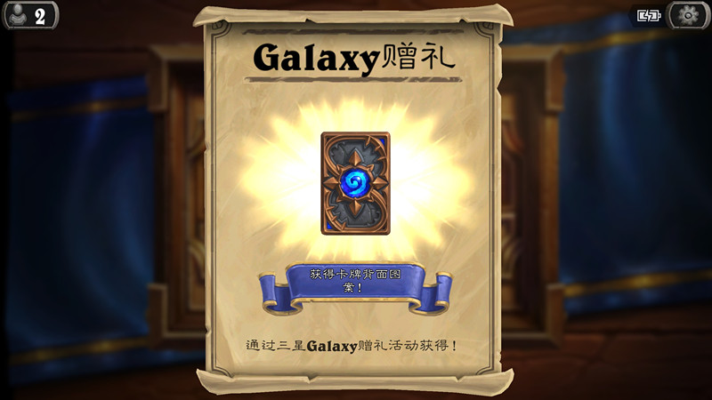

# 用安卓手机获得三星卡背及卡包

圣诞快乐。之前在浏览卡背收藏的时候就看到过三星的卡背，一直很好奇这个是怎么获得的。网上一搜原来是官方与三星合作推出的活动，有三星S6手机登录游戏就可以获得。而且貌似可以伪装手机型号进行欺骗。于是找了一个教程开始了卡包之旅。
卡包卡背我来了！

## 卡包卡背我来了

根据教程的指示，核心思路是修改`build.prop`文件伪装手机型号。
首先将手机root，已经root了，跳过。
然后用re文件管理器打开系统根目录找到`/System`下的`build.prop`文件。挂载成读写模式，**先复制一份备份一下**，修改这个文件，参考以下条目修改：

```
ro.product.brand=samsung
ro.product.name=zerofltezc
ro.product.manufacturer=samsung
ro.build.product=zerofltechn
ro.product.model=SM-G9200
ro.product.device=zerofltechn
```

主要是`ro.product.model=SM-G9200`这一条，主要不要写错了。
保存退出，重启手机。
然后。。。

## 操作失误

原来觉得很简单，结果中间还是有个步骤操作失误了。因为为了修改这个文件修改了文件权限，而没有将其改回来。系统检查文件权限失败，开机就卡在启动画面了。
难道要重刷手机？！！！不过似乎不用，根据经验判断，似乎可以通过recovery解决，谷歌之后果然可以。
首先需要recovery支持adb模式。手机使用的是twrp的recovery，应该是支持的，具体可以重启到recovery里，然后adb试一试。

```sh
D:\Android\sdk\platform-tools>adb devices
List of devices attached
CVH7N15A15003557        recovery
```

检测到设备就是支持的，之后`adb shell`连上去，进入`/System`目录，将文件权限修改成644 `chmod 644 build.prop`，重启。

```sh
D:\Android\sdk\platform-tools>adb shell
~ # cd system
/system # ls -al
drwxr-xr-x   14 root     root          4096 Dec 25 10:37 .
drwxr-xr-x   23 root     root             0 Mar 13  1970 ..
drwxr-xr-x   58 root     root          4096 Dec 16 03:25 app
drwxr-xr-x    3 root     shell         8192 Dec 16 03:26 bin
-rw-r--r--    1 root     root          4657 Dec 25 10:37 build - 复制.prop
-rw-rw-rw-    1 root     root          4672 Dec 25 10:42 build.prop
drwxr-xr-x   15 root     root          4096 Dec 16 03:25 etc
drwxr-xr-x    2 root     root          8192 Jan  1  2009 fonts
drwxr-xr-x    5 root     root          4096 Dec 16 03:26 framework
drwxr-xr-x    6 root     root          8192 Dec 16 03:26 lib
drwxr-xr-x    5 root     root          8192 Dec 16 03:26 lib64
drwx------    2 root     root          4096 Jan  1  1970 lost+found
drwxr-xr-x    3 root     root          4096 Jan  1  2009 media
drwxr-xr-x   55 root     root          4096 Jan  1  2009 priv-app
-rw-r--r--    1 root     root        148432 Jan  1  2009 recovery-from-boot.bak
drwxr-xr-x    9 root     root          4096 Jan  1  2009 usr
lrw-r--r--    1 root     root             7 Jan  1  2009 vendor -> /vendor
drwxr-xr-x    2 root     shell         4096 Dec 16 03:25 xbin
-rw-r--r--    1 root     root            42 Dec 16 03:26 xposed.prop
/system # chmod 644 build.prop
/system # ls -al
drwxr-xr-x   14 root     root          4096 Dec 25 10:37 .
drwxr-xr-x   23 root     root             0 Mar 13  1970 ..
drwxr-xr-x   58 root     root          4096 Dec 16 03:25 app
drwxr-xr-x    3 root     shell         8192 Dec 16 03:26 bin
-rw-r--r--    1 root     root          4657 Dec 25 10:37 build - 复制.prop
-rw-r--r--    1 root     root          4672 Dec 25 10:42 build.prop
drwxr-xr-x   15 root     root          4096 Dec 16 03:25 etc
drwxr-xr-x    2 root     root          8192 Jan  1  2009 fonts
drwxr-xr-x    5 root     root          4096 Dec 16 03:26 framework
drwxr-xr-x    6 root     root          8192 Dec 16 03:26 lib
drwxr-xr-x    5 root     root          8192 Dec 16 03:26 lib64
drwx------    2 root     root          4096 Jan  1  1970 lost+found
drwxr-xr-x    3 root     root          4096 Jan  1  2009 media
drwxr-xr-x   55 root     root          4096 Jan  1  2009 priv-app
-rw-r--r--    1 root     root        148432 Jan  1  2009 recovery-from-boot.bak
drwxr-xr-x    9 root     root          4096 Jan  1  2009 usr
lrw-r--r--    1 root     root             7 Jan  1  2009 vendor -> /vendor
drwxr-xr-x    2 root     shell         4096 Dec 16 03:25 xbin
-rw-r--r--    1 root     root            42 Dec 16 03:26 xposed.prop
/system # exit
```

## 来不容易去也难

系统成功进入，也很顺利取到了卡背，但是怎么修改回去呢？
之前做了一个备份，将备份替换回来就可以了。但是不知为什么文件管理器却获取不到root权限了，只好重启再去recovery里进行操作。

```shell
D:\Android\sdk\platform-tools>adb shell
adb server is out of date.  killing...
* daemon started successfully *
~ # cd /system
/system # ls
app                     framework               recovery-from-boot.bak
bin                     lib                     usr
build - 复制.prop       lib64                   vendor
build.prop              lost+found              xbin
etc                     media                   xposed.prop
fonts                   priv-app
/system # mv build.prop build.prop.bak
```

先将现在的`build.prop`改成`build.prop.bak`。接下来把`build - 复制.prop`改成`build.prop`即可。
**但是**，cmd里的adb shell终端居然无法输入中文，中文输入之后显示`??`。
再三思考之后，可以使用ls出来的文件名结果，然后直接传到mv命令里。
试了很多次，精简的命令如下：

```shell
/system # file=`ls build* | awk '{print $1}' -F '  ' | head -n 1`
/system # echo $file
build - 复制.prop
/system # ls -al "$file"
-rw-r--r--    1 root     root          4657 Dec 25 10:37 build - 复制.prop
/system # mv "$file" build.prop
```

大体思路就是列出所有build开头的文件，然后以两个空格做分割，取第一份保存到file变量里。取到变量之后直接重命名即可。
算是曲线救国的一种方法。

## 卡包卡背

经历了上面那么多，别忘了截图欣赏一下呀。




## 参考内容

+ [炉石传说如何用普通安卓手机领取三星卡背及S6卡包](http://www.72g.com/lushi/96607.html)
+ [build.prop文件权限导致的不能开机问题解决](http://blog.csdn.net/gexueyuan/article/details/8762159)
