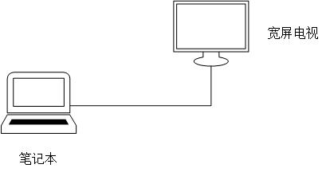

# 假期准备游戏吧！

假期也不知道该干些啥。。。每天睡到很晚起来看看书浑浑噩噩的就到下午了，然后上上网就过去了。。。前几天在翻电视的时候无意中发现电视与电视盒连接居然用的是HDMI线，突然想到能否将电脑和电视连接起来。

于是乎，一个游戏机模型就这样在我脑海中诞生了。

看看手头的装备：

+ 笔记本一台
+ 宽屏电视
+ 小米游戏手柄
+ 各种游戏

不错不错，都满足了。。。今天中午调试了一下，发现了以下问题：

+ 需要将电视作为双显示器的主显示器
+ 小米手柄的兼容性很差，用了`x360ce`适配一下，感觉还凑合吧，就是需要将包括Steam在内的所有游戏都要设置一遍
+ Steam大屏幕模式效果灰常不错，赞
+ 没有网，没有网，没有网，离线游戏吧

OK！万事俱备，只有一个问题急需解决。怎么解释即 **用着电脑** 又 **占着电视** 这个问题？
