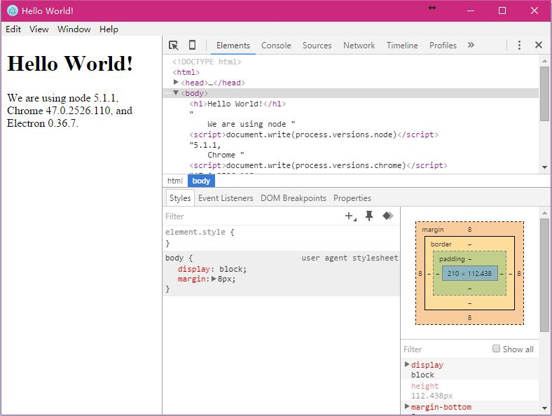

# 体验Electron之起步

很喜欢用[Atom](https://atom.io/)编辑器，于是很好奇Atom是怎样实现的，然后就发现了`Electron`项目。

## Electron

> [Electron框架](http://electron.atom.io/)的前身是 `Atom Shell`，可以让你写使用 JavaScript，HTML 和 CSS 构建跨平台的桌面应用程序。它是基于io.js 和 Chromium 开源项目，并用于在 Atom 编辑器中。Electron 是开源的，由 GitHub 维护，有一个活跃的社区。最重要的是，Electron 应用服务构建和运行在 Mac，Windows 和 Linux。

Electron 托管在 [Github](https://github.com/atom/electron) 上，通过[起步](http://electron.atom.io/#get-started)先感受一下 Electron 的魅力。

## 起步

要体验 Electron，需要安装 NodeJS 和 Git 环境。这里就不再阐述。

运行以下命令就可以看到Electron的简易界面了。

```
# 克隆 Quick Start 仓库
$ git clone https://github.com/atom/electron-quick-start

# 切换到仓库目录
$ cd electron-quick-start

# 安装依赖和运行
$ npm install && npm start
```



可以看到带有菜单栏和开发者工具的界面。从开发者工具也能大体了解显示页面的结构。

## 打包和发布

打包需要使用 `asar` 工具。首先安装asar套件。

```
$ npm install -g asar
```

打包资源文件

```
$ asar pack your-app app.asar
```

这样会得到 app.asar 资源文件，避免将源代码暴漏给用户。要想运行资源文件，还需要框架的支持。从 Electron 的[发布](https://github.com/atom/electron/releases)页面下载对应的Electron版本，这里以 `electron-v0.36.7-darwin-x64.zip` 为例。

将文件解压缩，用打包好的 app.asar 放到 Electron 的资源文件夹下 `electron/resources/` ，这样运行 Electron 会自动读取并执行资源包内的内容。

## 总结

本文从简单的环境搭建上通过官方提供的示例体验了 Electron ，并没有过多的涉及应用编写方面的内容。接下来我会随着自己学习的深入，一步一步的构建一个自己的跨平台应用程序。也希望能一同进步，来感受生活中的一些独特魅力。
