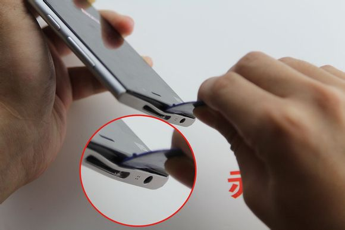
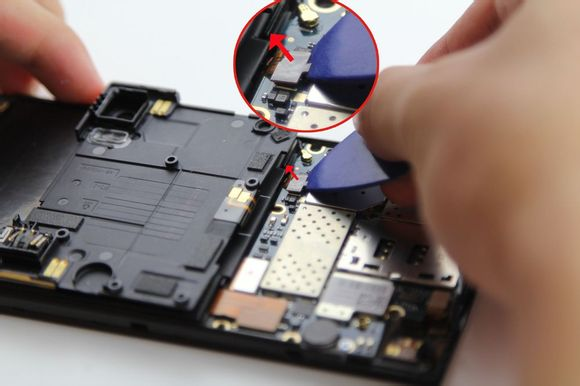
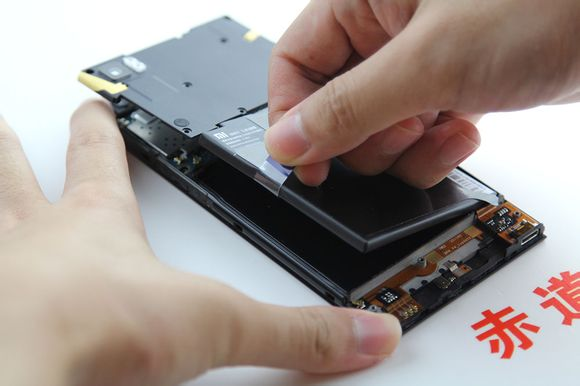
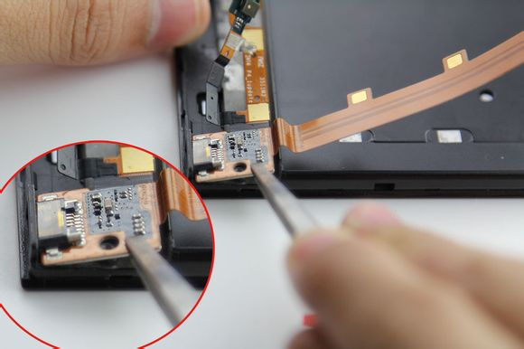

# MI3换屏幕小记

毕业的时候不小心将米3的屏幕压碎了，就这样放在家里放了半年。现在突然心血来潮，给米3换个屏幕吧。后壳也摔得不行了，也需要换一换后壳。

## 准备

X宝上有很多屏幕总成，也不确定哪种好点，于是就随便挑选了价位在130左右的屏幕总成。对于我这样的新手来说，选择屏幕总成省去了很多麻烦。随屏幕赠送拆机工具确实省心的不少，不过还是有自己的工具的。

然后在屏幕送来这几天，稍微研究研究了拆机的方法。还算比较友好吧，各方面模块集成的都比较好。

换屏主要工作是将原手机的部件转移到新手机上，比较麻烦的部分在于排线的转移，大部分排线是粘连在总成上的，需要弄下来。一般都是用镊子进行操作，这里 **注意** 一下，镊子的用法有两种，一种是镊子尖向外挑，另一种是镊子尾向外撬，一般视频上都推荐用第二种，在弄排线的时候特别注意不要让镊子尖扎到排线里，以免弄断排线的电路。

细心、大胆、不烦躁，换屏幕不难。由于换的时候没有拍照，所以就从网上找了一些照片来用。推荐看拆机视频慢慢来弄。

## 后盖拆卸

后盖用卡扣卡住，在卡托里由两颗螺丝固定。

拆掉这两颗螺丝之后，用翘片沿着后壳边缘撬一圈就可以下来。

## 电池外壳拆卸

拆开后盖之后就可以看到里面了。

我们需要将铁盖和电池拆下来，可以看到顶部有8颗螺丝，底部有3颗螺丝。这两种螺丝的长度是不同的，拆下来的时候注意分开存放。

底部的盖很容易就弄下来了，主要还是说一下顶部的盖。顶部的后盖与电池排线连在一起，不能直接拿下来。这里稍微注意一下就额可以了。

撬开顶部后盖之后将电池排线拆下。

电池部分需要拽着“尾巴”拉出来，电池里面使用了双面胶固定，年代久远双面胶可能贴的很死，实在拉不出来可以在顶部找个工具撬一撬。当时废了九牛二虎之力，多弄了几次才下来。

这样就把电池连带上下后壳拆下来了。

## 拆主板

下面轮到主板了，主板上有两颗螺丝固定，记住位置：一颗在摄像头旁边，另一颗这震动器的上面

在将主板拿下来之前，先将外面的排线拿下来：上面是触摸排线，下面是显示排线和尾插排线。还有在右下角有天线，也要拿下来。

拿主板小心注意背面的排线：按键排线。将排线全部拔下主板很容易就拿下来了。

到这里，拆解工作已经完成，下面就是将屏幕旧部件移到新屏幕的过程了，这一部分比较繁琐，建议找个视频反复观看，还是需要注意镊子的用法，不要扎到排线里。

## 换屏幕

这里只说一下我在换屏的过程中遇到的注意点。

1. 镊子的用法，重要的事情
2. 排线背面有双面不干胶，如果没有连同一起撬下来也不必强求，排线一般不会在新屏幕里滑动的
3. 不太懂的地方看懂了再下手，盲目下手会有损害

特别注意尾插排线右下角的部分（USB充电口的里面）。这里的排线下面带有一个铁板，记得将铁板一同撬下，如果从左向右撬排线，到这里很容易忽视掉下面的铁板而弄坏排线。如果镊子伸不进缝隙中，可以使用小刀帮助一下。当时在这里卡了一晚上，最后还是借助小刀解决了。

其它的地方都比较简单，照着视频一步一步换过来就行了。

## 装回

排线搬运完毕后就可以装回主板电池了，记得拆下来的顺序逆着回去就可以了。注意不要用错了螺丝，不然会挤爆屏幕。

换屏就这样结束了，又同时换了个后壳，感觉米3就像新的一样，但是已经回不到过去使用它的时候了。

## 参考内容

+ [『技巧教程』涨知识咯 小米3 完美拆机换屏教程](http://tieba.baidu.com/p/3309054999)
