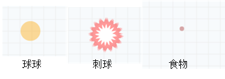
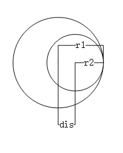
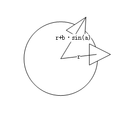

# 背景《球球大作战》实现要点

很早以前有个游戏叫 `agar` ，就是类似大球吃小球的游戏。最近国内在手游上也出现了类似的游戏，比较好的有《球球大作战》和《疯狂贪吃蛇》。对于这两款游戏，不是很感冒，不过还是想把其中的一些内容提取出来，做成一个博客背景动画。

从想法到实现花费了大约一天半的时间，具体实现细节可以参考代码，这里只记录一下一些实现难点。

## 游戏引擎

实现没有用什么游戏引擎，也是自己手写了一个简单的“引擎”，有一个不断通过调用 `window.requestAnimationFrame()` 实现自身死循环的函数，在函数内部依次调用“绘画对象”的 `update` 和 `draw` 方法，来让对象更新自身和绘制自身。

简化代码如下：

```javascript
var that = this;
this.mainLoop = function () {
    if (isRunning) {
        window.requestAnimationFrame(that.mainLoop); // 循环自身
    }
    update(); // 更新
    draw(); // 绘制
    cleanup(); // 清理过期对象
}

this.mainLoop();
```

## 对象管理

需要被管理的对象放置在一个array里（不知道JavaScript对这类数据结构叫什么），每个对象（Object）都有自己的数据和函数，类似于下面的样子：

```javascript
function spritObject() {
    var obj = {};
    return {
        update: function() {}
        draw: function(ctx) {}
        isDead: function() {}
    }
}
```

`obj` 中可以存储对象的私有数值，比如小球的位置（坐标）、小球的大小（半径）、小球的速度、小球的加速度等等。`update` 每一帧会被调用一次，可以更新小球的状态。`draw` 每一帧会被调用一次，之前Canvas画布会被提前清空，这个时候，小球需要重新绘制自己的样式。 `isDead` 用于判断当前对象是否还有用，没用的对象会在下个周期被从Array中清理出去。

附一段清理的代码，其实就是从Array中删除元素的代码，我才发现我上个版本的清理代码中有个函数写错了:sweat:。（我把 `splice` 写成了 `split`，幸亏上个背景的对象不用被清理。:yum:）

```javascript
for (var i = 0; i < this.list.length; i++) {
    if (this.list[i].isDead()) {
        this.list.splice(i, 1);
    }
}
```

## 小球

小球是动画里角色的基本样式，一切行为和绘制都围绕着圆形球来进行。我将小球根据功能划分为三类：球球、食物和刺球。**球球** 通过吃食物和其它小点的球球来增大自身，**食物** 就是被球球吃的，**刺球** 是作为限制球球无限增长的角色存在的。

小球最基本的定义为：

```javascript
var ball = {
    type: ,  // 小球类型（球球、食物、刺球）
    x: ,     // 当前x坐标
    y: ,     // 当前y坐标
    vx: ,    // x方向速度，每帧x方向移动的距离
    vy: ,    // y方向速度
    size: ,  // 小球的面积
    radius: ,// 小球半径
    isDead: ,// 小球是否需要被清理
    age: ,   // 小球当前存活帧数（保护期使用）
    color:   // 小球的颜色
};
```

不同类型的小球只是其中的一些属性不同，比如，食物和刺球不移动，那么它们的vx和vy都为0（实际上，就没执行这两类的update函数）。



小球的绘制其实就是在(x, y)坐标的位置画一个radius半径的圆，并填充颜色。

## 碰撞检测

说到碰撞检测，这里不得不说一下物理上面的知识，小球们的碰撞被分为两种情况：

### (球球 vs 刺球)

这类使用的是“碰”策略，两个物体碰到一起就会触发操作。主要判断的思想是**两个物体圆心的距离 小于等于 两物体半径之和**，这里用公式就是 $dis(o_1, o_2) <= r_1 + r_2$。


```javascript
// 刺球判断
for (var i = 0; i < this._prick.list.length; i++) {
    var prick = this._prick.list[i];
    for (var j = 0; j < this._balls.list.length; j++) {
        var ball = this._balls.list[j];
        if (ball.isDead) continue;
        if (prick.isDead) break;
        if (prick.size > ball.size) continue;
        var dis = Math.sqrt((ball.x - prick.x) * (ball.x - prick.x) + (ball.y - prick.y) * (ball.y - prick.y));
        if (dis <= ball.radius + prick.radius) {
            ball.isDead = true;
            prick.isDead = true;
            //TODO：球球分裂
        }
    }
}
```

首先保证球球和刺球都是存活的，然后计算球球和刺球圆心的距离，如果距离小于两个小球的半径之和，然后就可以清理掉这两个小球了。

### (球球 vs 球球) or (球球 vs 食物)

这类使用的是“包含”策略，当半径大的物体完全包含半径小的物体的时候触发操作。主要判断思想是**两个物体圆心的距离 和 小圆半径之和 小于等于 大圆半径**，使用公式描述一下 $dis(o_1, o_2) + r_2 <= r_1$，其中， $r_1>r_2$。



```javascript
// 球球吃球球
for (var i = 0; i < this._balls.list.length; i++) {
    var balla = this._balls.list[i];
    if (balla.age < this._balls.opts.protectedAge) continue;
    for (var j = i + 1; j < this._balls.list.length; j++) {
        var ballb = this._balls.list[j];
        if (ballb.isDead) continue;
        if (balla.isDead) break;
        if (ballb.age < this._balls.opts.protectedAge) continue;
        var dis = Math.sqrt((balla.x - ballb.x) * (balla.x - ballb.x) + (balla.y - ballb.y) * (balla.y - ballb.y));
        if (balla.radius < ballb.radius && dis + balla.radius <= ballb.radius) {
            ballb.size += balla.size;
            ballb.radius = Math.sqrt(ballb.size / Math.PI);
            balla.isDead = true;
        } else if (ballb.radius < balla.radius && dis + ballb.radius <= balla.radius) {
            balla.size += ballb.size;
            balla.radius = Math.sqrt(balla.size / Math.PI);
            ballb.isDead = true;
        }
    }
}
```

首先判断球球是否在保护期，在保护期的球球直接跳过。判断半径的大小，根据半径大小应用上面的公式。

## 刺球绘制

刺球的绘制单独拿出来说一下，相比球球来说，刺球外面多了一层刺的形状。


说起刺的形状，就像起伏的山峰一样，说到起伏的山峰，就想到了`sin`，恩恩。这里把`sin`的值量化一下，用线连起来就成了山峰的形状了。


之后怎么将这个“变化”应用到曲面上。我们可以通过 $x=r·cos(a)$ 和 $y=r·sin(a)$ 算出当前角度a在圆周上的点的坐标，但是如何将“变化”应用到坐标上。这里直接想象不太好想象，我们可以理解成半径随着`sin`的变化而变化，于是，新的半径为 $r_a=r+b·sin(a)$ ，其中b为一个调整系数常量，绘制坐标公式也为 $x=(r+b·sin(a))·cos(a)$ 和 $y=(r+b·sin(a))·sin(a)$。



```javascript
// 绘制刺球
for (var i = 0; i < this._prick.list.length; i++) {
    var prick = this._prick.list[i];
    ctx.beginPath();
    ctx.arc(prick.x, prick.y, prick.radius, 0, Math.PI * 2);
    ctx.closePath();
    ctx.fillStyle = "#fff";
    ctx.fill();

    ctx.beginPath();
    ctx.strokeStyle = "rgba(255, 0, 0, 0.4)";
    ctx.lineWidth = 2;
    ctx.moveTo(prick.x + prick.radius * Math.cos(0), prick.y + prick.radius * Math.sin(0));
    for (var a = 0; a < 360; a++) {
        ctx.lineTo(prick.x + (prick.radius + 2 * Math.sin(a * 2)) * Math.cos(Math.PI / 180.0 * a),
            prick.y + (prick.radius + 2 * Math.sin(a * 2)) * Math.sin(Math.PI / 180.0 * a))
    }
    ctx.stroke();
}
```

## 绘制网格背景

这个没啥好说的，就是划线，一定间隔划线。话说，如果间隔足够小，那么画的线就变成了面，这就是“线动成面”的原理。

```javascript
// 背景网格
ctx.lineWidth = 1;
ctx.strokeStyle = "#eee";
ctx.beginPath();
for (var i = 0; i <= this.width; i += 20) {
    ctx.moveTo(i, 0);
    ctx.lineTo(i, this.height);
}
for (var i = 0; i <= this.height; i += 20) {
    ctx.moveTo(0, i);
    ctx.lineTo(this.width, i);
}
ctx.stroke();
```

## 其它

除了上面说到的那些，还有其它一些细节。比如，给球球设置了一个保护期，主要避免球球碰到刺球分裂的时候，又被自己吃掉了。:dog:这里定义200帧以内为保护期，保护期内会禁止碰撞检测，只进行位置更新。比如，刺球对比它小的球球没有效果，可以说是弱者的保护伞呐:umbrella:。还比如，保护期内还给球球画了一个贴心的保护罩罩，用的画弧线实现的。哎，字写起来太累，这里就不叙述了。

希望看官们喜欢这次的背景，下次更新还不知道要到啥时候，有空可以移步“秀一秀”看看过去的那些背景。其实最近已经构想了5-6个背景，不过太懒了再加上心情很容易不好，有空的时候会一一实现的，感觉还是蛮有意思的。那么最快下月再见了。

祝你的八月天天快乐。:facepunch:
