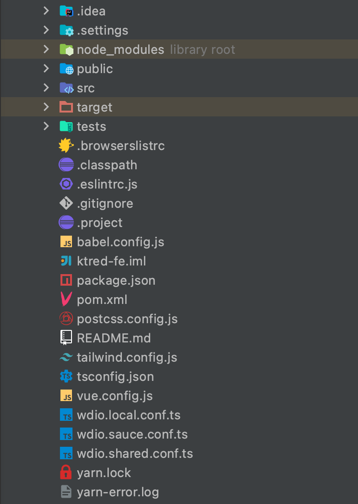

前后端分离已成为现在的主流。一个项目后端使用Java+SpringBoot的模式，提供接口；前端使用Vue提供用户界面。前后端的差异也体现在了部署上，后端需要一套JDK环境，而前端可能只需要一个静态网页服务器。

在这种前后端模式成熟的基础上，为什么还需要将前后端部署在一起（同一容器）呢？可能有以下几个原因：

1. 前端后端都是一个人写的，关联性比较强，可能更适合一起部署
2. 对JSP等模板渲染有情怀，不想让页面和数据分离
3. 合并部署可以节省一个容器，节省部署成本 :thinking:

那如何进行前后端合并部署？下面直接说配置方法：

# 合并部署

首先需要有一个Maven构建的SpringBoot项目，在此基础上，增加前端代码模块。

## 增加前端代码模块

在maven中增加一个模块，将所有前端代码都拷贝到模块目录里，假如你的前端项目使用的也是vue，那么你就会得到一个类似于这样的目录结构。



别忘了在其它模块中引用该模块的成品jar，使其能够正常参与到构建中。

下面分步骤来说明如何配置pom.xml文件。

## 准备node环境

没有node环境，就需要提前做一步操作，将node环境安装到本机中。如果使用jenkins构建，可以增加一步shell操作，用来安装部署node环境。使用的命令如下：

```shell
curl -kv  https://mirrors.huaweicloud.com/nodejs/v10.15.3/node-v10.15.3-linux-x64.tar.gz  -o /usr/local/node-v10.15.3-linux-x64.tar.gz
tar -zxvf /usr/local/node-v10.15.3-linux-x64.tar.gz -C /usr/local/
export NODEJS_HOME="/usr/local/node-v10.15.3-linux-x64"
export PATH="${NODEJS_HOME}/bin:${PATH}"
```

需要注意的是下载node的地址需要根据实际情况进行修改。

## 存在node环境

如果你的构建环境比较给力，恰巧有node，那一切都简单了。只需要一个 **exec-maven-plugin** 插件，依赖执行配置镜像源、安装依赖、构建成品的npm指令即可。

此处配置的镜像源使用的是华为云，实际情况下可以更换成对应的内网npm源。需要执行的命令需要根据前端项目package.json里的指令进行修改。

```xml
...
<plugin>
  <groupId>org.codehaus.mojo</groupId>
  <artifactId>exec-maven-plugin</artifactId>
  <version>3.0.0</version>
  <executions>
      <execution>
          <id>exec-npm-config</id>
          <phase>prepare-package</phase>
          <goals>
              <goal>exec</goal>
          </goals>
          <configuration>
              <executable>npm</executable>
              <arguments>
                  <argument>config</argument>
                  <argument>set</argument>
                  <argument>registry</argument>
                  <argument>https://mirrors.huaweicloud.com/repository/npm/</argument>
              </arguments>
          </configuration>
      </execution>

      <execution>
          <id>exec-npm-config-sass</id>
          <phase>prepare-package</phase>
          <goals>
              <goal>exec</goal>
          </goals>
          <configuration>
              <executable>npm</executable>
              <arguments>
                  <argument>config</argument>
                  <argument>set</argument>
                  <argument>sass_binary_site</argument>
                  <argument>https://mirrors-devcloud.rnd.huawei.com/node-sass</argument>
              </arguments>
          </configuration>
      </execution>

      <execution>
          <id>exec-npm-install</id>
          <phase>prepare-package</phase>
          <goals>
              <goal>exec</goal>
          </goals>
          <configuration>
              <executable>npm</executable>
              <arguments>
                  <argument>install</argument>
              </arguments>
              <workingDirectory>${basedir}</workingDirectory>
          </configuration>
      </execution>

      <execution>
          <id>exec-npm-run-build</id>
          <phase>prepare-package</phase>
          <goals>
              <goal>exec</goal>
          </goals>
          <configuration>
              <executable>npm</executable>
              <arguments>
                  <argument>run</argument>
                  <argument>build</argument>
              </arguments>
              <workingDirectory>${basedir}</workingDirectory>
          </configuration>
      </execution>
  </executions>
</plugin>
...
```

## 拷贝打包生成的文件

前面执行完成npm命令后，会生成一些静态的成品文件，需要将其拷贝到默认的静态资源目录中。

这里将 `/dist` 目录输出的成品文件拷贝到 `/META-INF/resources` 目录下。

```xml
...
  <resources>
      <resource>
          <directory>${project.basedir}/dist/</directory>
          <targetPath>${project.build.outputDirectory}/META-INF/resources</targetPath>
      </resource>
  </resources>
...
```

这样生成的jar包里，就带有了前端的资源文件。

## nginx转发配置

前端路由在使用了 **history** 模式下，刷新会出现404的情况，这时候就需要 nginx 出手解决资源无法找到的问题。

```
    location / {
      rewrite ^(.*)$ index.html break;
      proxy_pass http://127.0.0.1:8080;
    }

    location /api {
      proxy_pass http://127.0.0.1:8080;
    }

    location /statics {
      proxy_pass http://127.0.0.1:8080;
    }
```

这里要做的有三件事：

+ 一是/api开头的接口请求正常通过
+ 二是/statics目录下的静态资源放过请求原地址
+ 三是其余链接全部修改成返回index.html文件

/api 和 /statics 需要跟前端协调好，前端打包构建也要生成创建对应的目录。

## 一个小技巧

本地调试的时候，只需要启动服务端，前台UI有专门调试服务器。但是每次启动服务端的时候都要进行一次页面构建，就比较的不人性。

可以通过 Maven 的 Profiles 功能，为 exec-maven-plugin 插件增加 profile release 配置，在本地调试的时候不启用此配置，而线上打包的时候增加 `-P release` 参数。这样本地调试的时候可以充分利用前后端各自的热加载特性。

# Why

基本原理就是，frontend-maven-plugin 插件调用npm执行安装和构建Vue的命令。然后将构建好的文件当做静态资源供SpringBoot引用。

这里用到的最重要的一个是[webjars](https://www.webjars.org/)。这是将css和js等静态资源打包到jar中，以maven依赖的形式对其进行管理的一种方式。而servlet3.0以上版本，可以直接访问jar包中/META-INF/resources目录中的文件作为静态资源。

所以说本方法只是使用了webjars的资源加载方式来加载生成的静态资源。脚本中还有一些“奇怪”的配置，是为了解决存在内网镜像，但是无法访问外网资源，如何进行构建的该问题。
