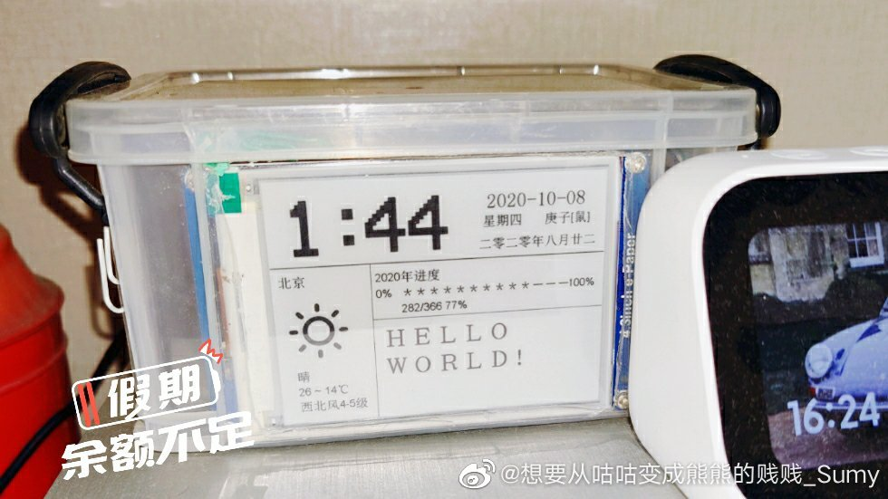

闲暇时候看到一篇文章，介绍可以用树莓派加一块墨水屏制作一个电子日历，然后心血来潮就打算自己也制作一个。前前后后磨蹭了一年的时间，终于克服了懒癌在去年十一假期的时候制作出来了。这段时间看到小米有品也出了一款电子日历，算下来成本和自己制作的差不多。但是怎么说，自己制作的日历可是带了一个树莓派呀，四舍五入就价值一个亿了呀。

先来看一下成品：



整个日历用一个收纳盒包装起来，日历展示了时间、日期、天气和一年进度。这个展示模板只是考虑尽量不联网情况下的内容。不得不说，在不联网的情况下能够展示的资源比较少，基于网络上的其它API进行功能的扩展，可用性就大大增强了。

# 材料准备

主要“材料”是一个树莓派、一块电子墨水屏和两张sd卡。

+ 树莓派使用的是树莓派3b+，某宝上可以搜索一下，很容易找到
+ 电子墨水屏用的是微雪4.3inch e-Paper
+ 两张sd卡和读卡器，一张用来做树莓派的存储安装系统，另一张为墨水屏展示提供图片素材存储，容量不需要太大
+ 建议再准备一套外接的键盘、鼠标、显示器和hdmi线，方便在树莓派上调试和操作

# 树莓派准备

## 安装系统

首先需要安装系统，从官网[https://www.raspberrypi.org/downloads/raspberry-pi-os/](https://www.raspberrypi.org/downloads/raspberry-pi-os/)下载系统镜像，选择 **Raspberry Pi OS with desktop and recommended software**进行下载。

下载完镜像之后，需要一个软件[win32diskimager](https://sourceforge.net/projects/win32diskimager/)将镜像写入到sd卡中，**Image File** 选择刚下载的系统镜像，**Device** 选择sd卡的盘符，注意不要选错了。写入完成后将sd卡插入到树莓派中，然后就可以开机使用树莓派了。

## 硬件连接

我也是嵌入式苦手，在接线这点也卡了好久，主要是确定哪个引脚叫什么比较麻烦，参考了好多个教程才搞定。这里提供树莓派和墨水屏的引脚图进行参考。


墨水屏的引脚说明图在连线的下方，很容易就能找到。


按照以下进行连接，线色仅供参考。再提一句，树莓派3V的引脚在实物图的左侧。

| 屏幕 | 树莓派     | 线色 |
| ---- | ---------- | ---- |
| DIN  | TX(GPIO14) | 绿   |
| DOUT | RX(GPIO15) | 白   |
| GND  | GND        | 黑   |
| VCC  | 3V         | 红   |


## 软件配置

树莓派默认的串口已经有其它用途，所以需要释放串口用于控制墨水屏。

先连接无线网络，常规操作更新一下系统
```
sudo apt-get update
sudo apt-get upgrade
```

编辑 /boot/config.txt 添加一行
```
dtoverlay=pi3-miniuart-bt
```

禁用自带蓝牙
```
sudo systemctl disable hciuart
```

释放串口，编辑 /boot/cmdline.txt
```
删掉 console=ttyAMA0,115200
```

安装墨水屏驱动
```
sudo apt-get install python-requests python-lxml python-serial git build-essential python-dev
git clone https://github.com/adafruit/Adafruit_Python_DHT.git
cd Adafruit_Python_DHT
sudo python ./setup.py install
```

## 电子日历展示程序

这个墨水屏是通过屏幕里的sd加载图片资源和字体资源的，所以需要将sd卡格式化成FAT32格式，分配单元大小选择 4096 字节，然后把展示程序附带的资源拷贝到sd卡中，再插入到屏幕卡槽里使用。

这里可以使用我提供的展示程序 [https://github.com/sumy7/rasepbarry-pi-epaper](https://github.com/sumy7/rasepbarry-pi-epaper)，或者参考附录里提供的展示程序也可以。只要注意屏幕的资源相匹配即可（俩用的应该是相同的资源）。

```
cd /home/pi
git clone https://github.com/sumy7/rasepbarry-pi-epaper
```

在程序目录 /home/pi/rasepbarry-pi-epaper/ 里执行 `python ./main.py` 命令，就可以看到屏幕刷新了。

## 定时程序

屏幕不是自动刷新的，而是每执行一次命令则刷新一次。这样需要配置一个定时任务让屏幕可以自动刷新。

```
sudo crontab -e

# 在其中增加以下代码，注意展示程序放置的目录

*/1 * * * * cd /home/pi/rasepbarry-pi-epaper/ && python ./main.py
```

命令配置的是每个1分钟刷新一次，间隔不用太长，墨水屏的刷新率本身就很低。
