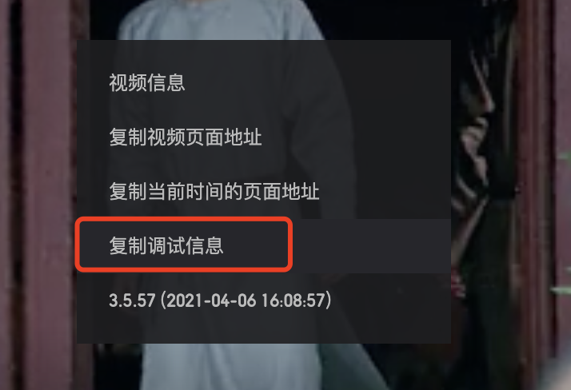
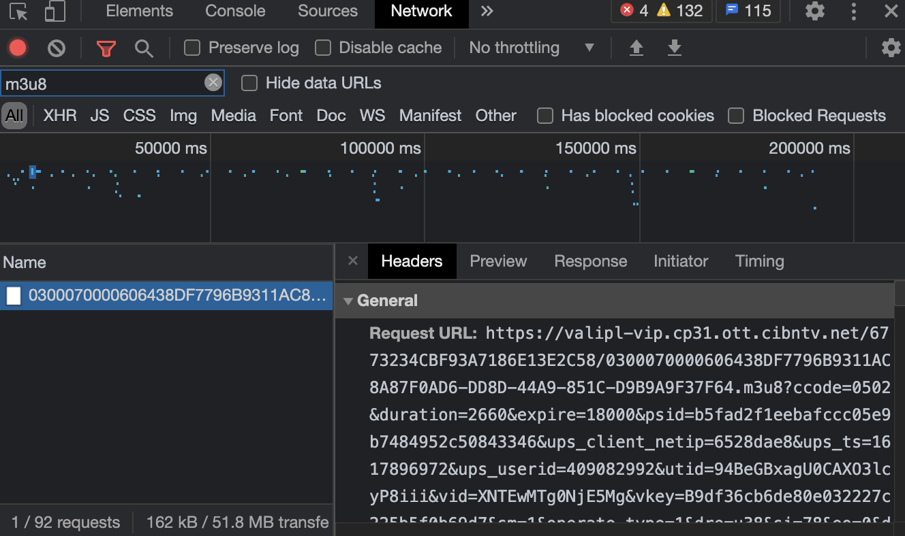
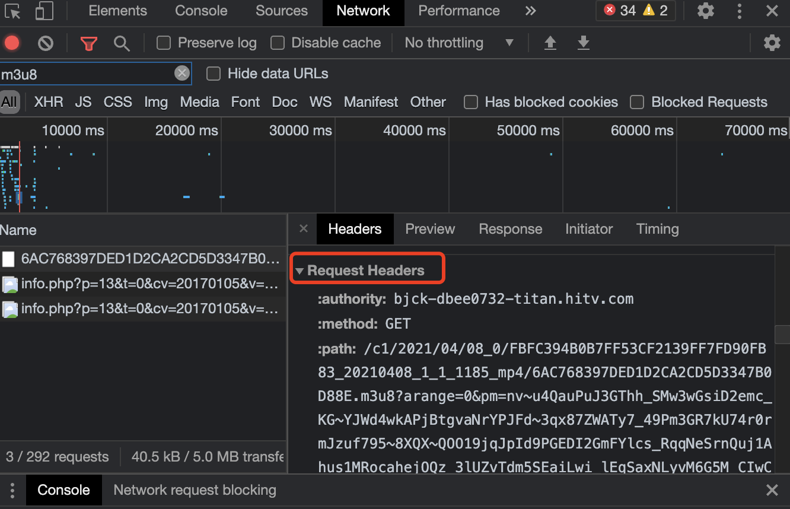

# 从视频网站下载视频的那件事

最近有朋友想从视频网站下载视频，于是稍微研究了一下如何下载。想当年下载视频的时候都有工具能够自动解析，随着时间的发展，这类工具要不不再更新了，要不无法支持某些视频网站的下载。这里使用的工具是m3u8-downloader，主要探讨如何手动获取各个视频网站的m3u8文件。找到m3u8文件后，通过m3u8-downloader工具就可以实现视频片段的下载和自动合并工作。

## 腾讯视频

首先吐槽一下腾讯视频的广告时间好长。广告时间过去后，在播放器右键选择【复制调试信息】，会得到一串JSON格式串。

找一个格式化JSON的网站，可以更方便的看到里面的结构。其中的vurl部分就是被编码的m3u8地址。

再使用一个urlDecode的工具，解码出来地址就可以使用了。

## 优酷视频

优酷视频就比较简单了，打开控制台，切换下对应的清晰度，在Network标签页，搜索m3u8就可以看到对应的地址了，这个地址直接可以下载。需要注意的是VIP和超前点播有加密，虽然能下载但是却无法播放。另外想吐槽的是，优酷的水印居然不是加在视频上的。

## 芒果TV

芒果TV和优酷视频一样，也是打开控制台，然后搜索对应的m3u8文件。但是不同的是直接下载的话会提示下载失败，需要提供【请求头】。这部分信息也可以在控制台里找到，复制【Request Headers】里的内容到下载器里即可。

