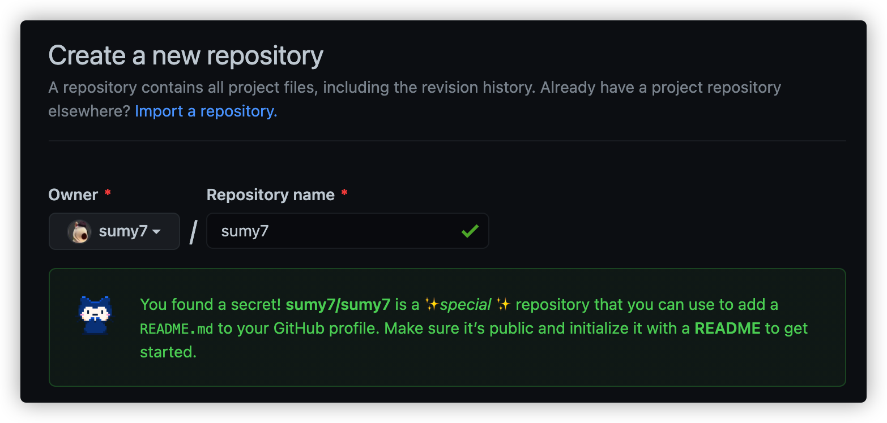

闲逛Github的时候，会发现有的Profile页面出现了一个README的头部，里面可以使用markdown自定义一些信息进行展示。查询了一下发现是Github新出现的一个秘密功能模块。不由分说，赶紧弄起来。

<!-- more -->

# 新建个人仓库

要展示这个特殊的模块，就需要新建一个”特殊“的仓库。这个仓库名称与你的Github用户名相同。如果你以Github用户名新建仓库，就会提示一段话：



> You found a secret! sumy7/sumy7 is a ✨special ✨ repository that you can use to add a README.md to your GitHub profile. Make sure it’s public and initialize it with a README to get started.

记得创建仓库的时候初始化一个README.md文件。

# 编辑README.md文件

打开README.md文件，就会发现Github已经创建好了一段信息，给你补充的灵感。当然，也可以按照自己的想法进行修改。

```markdown
- 🔭 I’m currently working on …
- 🌱 I’m currently learning …
- 👯 I’m looking to collaborate on …
- 🤔 I’m looking for help with …
- 💬 Ask me about …
- 📫 How to reach me: …
- 😄 Pronouns: …
- ⚡ Fun fact: …
```

编辑好文件打开个人首页就可以看到效果了。

# 展示控件

下面介绍几个不错的展示组件和灵感来源。

## 动态GitHub Readme Stats

[anuraghazra/github-readme-stats](https://github.com/anuraghazra/github-readme-stats)提供了一个展示Github动态的方式，支持展示Github基本信息、编码语言分布、仓库信息。最常用的还是Github基本信息和仓库信息。


引用也是非常简单，按照仓库的说明文档，将其中的用户名替换成自己的用户名即可。比如我的就是：

```markdown
[](https://github.com/anuraghazra/github-readme-stats)

[](https://github.com/anuraghazra/github-readme-stats)
```

## Awesome READMEs

如果没有灵感，可以参考一下其他人的Github个人信息页。这里有个仓库收集了一些人的Github信息页，可以翻翻参考一下。

[https://github.com/kautukkundan/Awesome-Profile-README-templates](https://github.com/kautukkundan/Awesome-Profile-README-templates)

## 访问计数

可以添加访问计数的徽章，这类服务不少，也可以自己搭建一个。这里列举一些只需要将其中的用户名替换成自己的用户名。

```markdown
+ 
+ 
```

## 图标徽章

很多仓库都有这类图标徽章 ，[https://shields.io/](https://shields.io/)提供了好多预制的徽章信息可供选择。

除了预制的徽章，shields也能自定义徽章样式。先从[https://simpleicons.org/](https://simpleicons.org/)选择一个图标，shields支持直接使用simpleicons的图标。然后按照对应部分修改或替换到以下地址中，具体参数还是继续查看官网说明吧。

```markdown
 
```

## 模板

各种布局、配件、模板真是挑花了了眼，尤其是其中技能图标，一个一个找好麻烦。幸好这里有一个Github [profilinator](https://profilinator.rishav.dev/)模板生成器，一部分一部分的选择，可以快速生成需要的首页信息。

生成的README.md文件不只是局限于使用他的模板，更重要的是将其中的元素提取出来，复用其中的元素。比如技能图标 等。


# 我的成果

最后我的首页就是这样子了，欢迎前来参观。

[https://github.com/sumy7/](https://github.com/sumy7)
