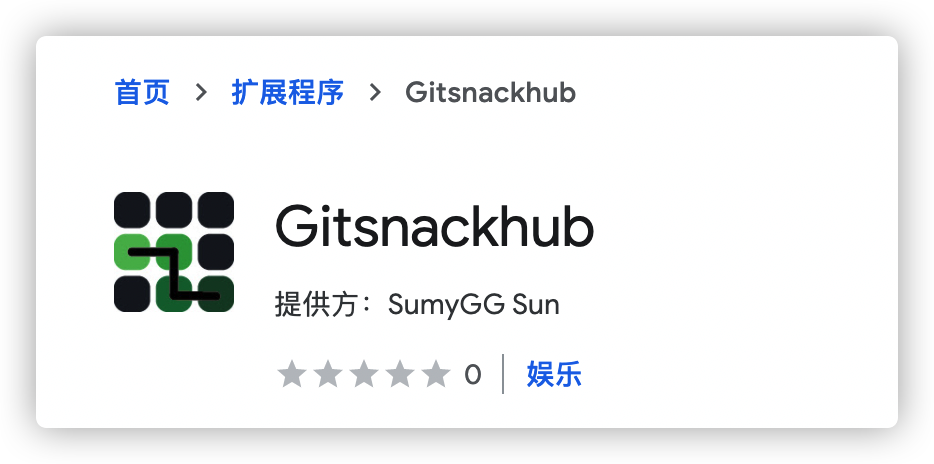
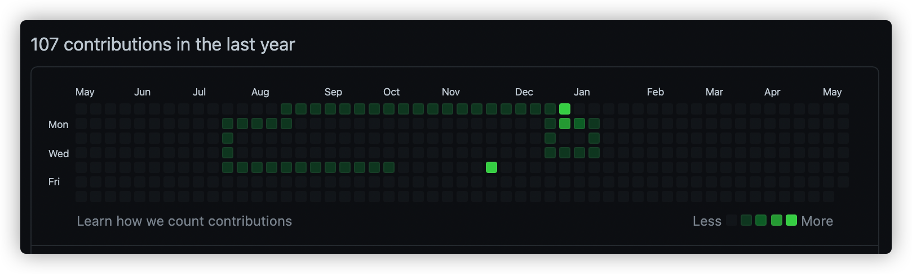

说好不想再挖坑的，结果还是没有控制住自己，结果又开了一个新坑，明明有那么多的坑已经填不完了。。。这次玩点不一样的内容，写一个贪吃蛇游戏吧。但是也不能仅仅是一个贪吃蛇游戏，还想在其中增加些不一样的内容。Kotlin跨平台开发出来好久了，这次就体验一下Kotlin2JS的能力。另一方面，只做一个贪吃蛇游戏没有什么意思，最近经常逛Github，看到贡献墙眼前一亮，为什么不在这里进行游戏呢？将自己的代码逻辑嵌入网站，还是做成一个扩展比较方便。于是就打算按照扩展的模式开发。

本文的重点不在于贪吃蛇游戏逻辑的实现，在于感受Kotlin跨端开发的体验和最后扩展上线的流程。

# 项目概览

贪吃蛇游戏的名称叫 **gitsnackhub**，其实简单来说就是在github的中间插入了snack的英文。

图标也是仿照Github贡献墙的配色，在其中画出贪吃蛇的形状。



最终游戏的呈现方式，代码已开源到[Github](https://github.com/sumy7/gitsnackhub)，欢迎进行指导。



# 创建跨平台项目

使用IntelliJ IDEA可以创建Kotlin/JS类型的项目。

1. 打开Intellij IDEA，新建一个新的项目。
2. 项目类型选择 Kotlin。
3. 输入项目名称后，选择 **Browser Application** 项目，点击下一步
   
4. 保持默认配置，选择完成项目。
   

# 开发过程体验

项目创建完成后，会出现 `build.gradle.kts` 配置文件，其中包含 `kotlin("js")` 的插件和其它依赖。

KotlinJs相对于普通的JavaScript项目而言，其内部也是通过webpack进行的构建，但是各种配置都通过js插件整合到gradle配置中。

## npm依赖与webpack配置

如果想增加npm依赖包，可以在Gradle中通过配置引入：

```kotlin
dependencies {
    // ...
    implementation(npm("is-sorted", "1.0.5"))
}
```

不要忘记Kotlin是一个类型安全语言，要使用引入包中的函数，还要通过`external`的方式将函数声明导出。期望以后能够通过types文件直接导出函数声明。

当然也可以在Gradle中配置一些webpack配置项，例如将输出项从默认的`umd`改为`commonjs2`：

```kotlin
webpackTask {
    outputFileName = "mycustomfilename.js"
    output.libraryTarget = "commonjs2"
}
```

以上配置可以在Kotlin的教程中查看，[https://kotlinlang.org/docs/js-project-setup.html#webpack-bundling](https://kotlinlang.org/docs/js-project-setup.html#webpack-bundling)

KotlinJS的构建过程是，先将kotlin代码转换成JavaScript代码，然后生成webpack配置，基于webpack构建和打包生成最后代码。

## 类型安全

使用Kotlin开发JavaScript最大的感受就是类型安全，虽然类型安全能够在编译阶段发现问题，但是相对于JavaScript这种动态语言来说，就丧失了很多动态性。

例如通过`document.querySelector()`可以获取到指定的元素，这个方法会类型为`Element?`的对象。要想获取对应的属性值，根据查询到的DOM类型，将这个`Element`父类强制转换成我们需要的对象类型。例如查询`<rect>`标签需要将其当做`SVGRectElement`类型进行处理。

在JavaScript中，DOM对象作为一个普通的对象，可以以对象的方式在其中增加修改对象属性。但是在Kotlin中，一个对象中含有的属性是固定的，很难进行增加属性的操作。

## 动态语言支持

为了支持JavaScript的动态语言的特性，Kotlin在语言层面也做了一些改变。

增加`dynamic`类型，表示这个类型是一个**动态**类型。针对动态类型Kotlin编译器有一些特权操作，动态类型可以代表任何值，编译器会跳过类型检查，你可以用任意参数调用动态类型的任意方法（包括不存在的方法）。

还可以在Kotlin中直接书写JavaScript代码，使用`js()`函数可以以字符串方式执行一段JavaScript代码，类似于`eval()`函数。该函数的返回值类型也是`dynamic`类型的。

# 扩展的基本结构

扩展能够使用的表现模式有好多种：

+ 点击图标弹出一个浮窗
+ 右键菜单
+ 嵌入式脚本
+ devtools插件
+ 后台进程

这些类型的具体功能可以查阅相关的资料。扩展需要引用的资源和使用的权限通过一个叫 `manifest.json` 的文件控制。

gitsnackhub通过将脚本注入到github个人信息页的方式，实现操控页面的逻辑。这里就使用了扩展的嵌入式的方式。

```json
{
  "content_scripts": [
    {
      "css": [],
      "js": [
        "gitsnackhub.js"
      ],
      "matches": [
        "https://github.com/*"
      ]
    }
  ]
}
```

`content_scripts` 的作用是会将其指定的css和js文件，在 **matches** 匹配后，插入到页面中。gitsnackhub只用到了js文件，并打算将其插入到github的域名中。

# 上架扩展

为了让用户方便的下载到你的扩展，最好的方式就是上架到Chrome Web Store应用商店里。

第一次上架需要消费5$激活开发者账号。打开[https://chrome.google.com/webstore/devconsole](https://chrome.google.com/webstore/devconsole)，第一次会提示以下内容：


这里的支付可以国内的visa信用卡，注意账单地址需要填写一个地图上真实的账单地址。

注册完成后，新建一个新内容，上传打包好的扩展压缩zip包。第一次上架填写的内容比较多，需要注意以下项目的填写：

+ 扩展说明，需要详细说明扩展的使用方式，不要直接复制manifest.json中的摘要信息，会被驳回
+ 商店图标，注意尺寸
+ 截图，注意尺寸
+ 单一用途，描述扩展的单一用途
+ 请求权限，需要描述所有你扩展声明的权限，并说明必要原因

~~截止目前，我的扩展还没有审核通过。审核频率大概1天1次。第一次因为扩展描述太随便而被驳回。重新修改提交审核即可。~~

终于，扩展审核通过了，[Gitsnackhub - Chrome 网上应用店](https://chrome.google.com/webstore/detail/gitsnackhub/emngeeijijgenmejojhkdigiblicfdbe)。找了位勇士试用了一下，后面再慢慢把一些细节优化一下。
