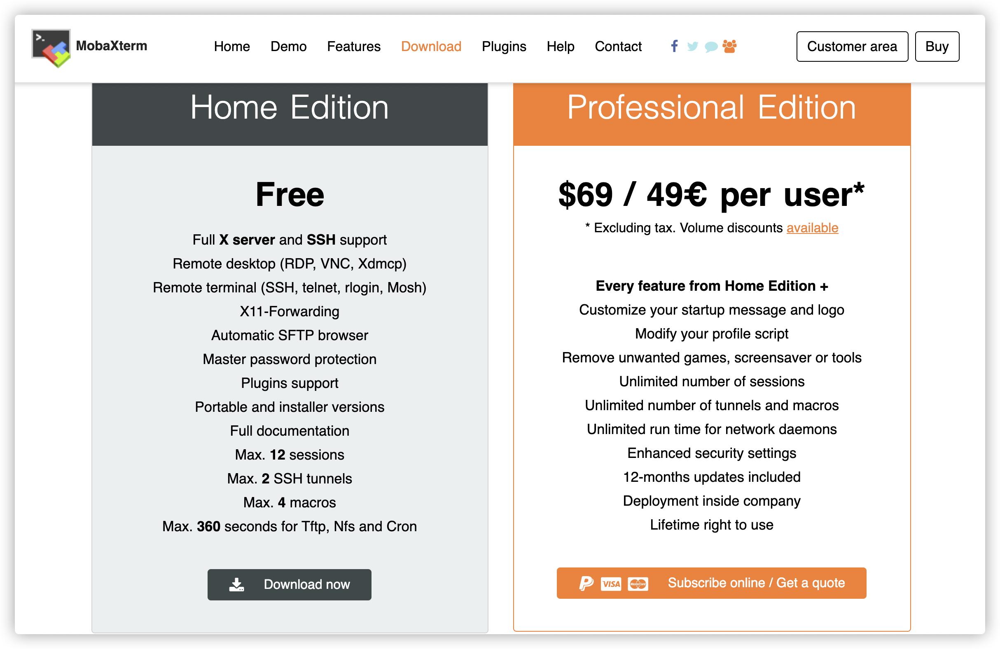
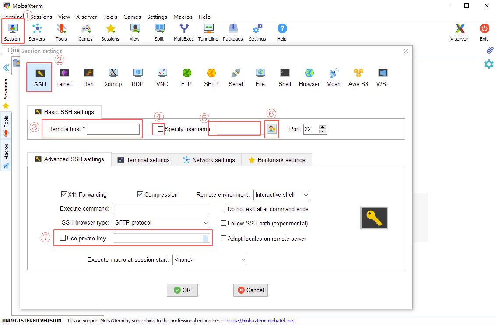
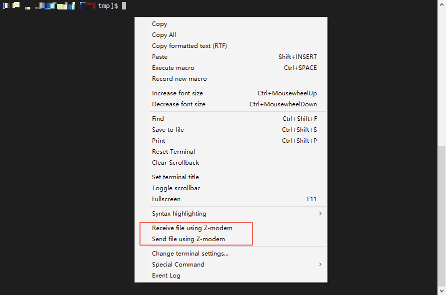

# SSH终端工具MobaXterm介绍

说起终端工具大家一定不陌生，目前比较常见的终端工具有cmd、cmder、git-bash、powershell等。这些工具在执行命令上有各自的优势，
有的还附带了cygwin模拟unix的执行环境。但是在SSH链接上表现都比较薄弱，只提供基础的ssh、scp指令，缺少会话管理的能力。

说起SSH的会话管理，Windows系统下存在不少这类软件。如SecureCRT、XShell、WinSCP等。它们虽然功能强大，
但还有另一个共同点就是——**收费**。

今天的主角MobaXterm集各种优点于一身，虽然也有收费版，但是免费版功能强大。实在是居家开发、~~秃头~~ 运维必备之工具。

下面就以一些工作中的场景，来简单介绍一下MobaXterm的相关功能。

## 下载

https://mobaxterm.mobatek.net/ 是MobaXterm的官方地址。

根据功能分为家庭版和专业版，依据大家的购买能力，这里选择家庭版进行下载。

## 创建SSH会话链接

点击右上角的Session①打开会话管理对话框。

- 点击SSH②打开SSH配置
- 在③输入要连接的远程服务器地址
- ④打勾后，在⑤处输入用于连接的远程用户名
- 如果通过密码进行连接，可以在⑥添加和管理密码
- 如果通过pem私钥认证，可以在⑦指定认证用的私钥文件

## 基本会话窗口

一个基本的SSH会话窗口如下：

- 左侧有一个sftp文件管理器，可以在当前会话中上传下载文件。需要注意的是，
  如果服务器经过了跳板机（多次ssh）登录，那么大概率sftp功能会失效。
- 右侧就是普通的终端窗口，可以在里面使用服务器上的一些终端指令。

## 文件传输功能

MobaXterm一个重要的功能是它对Z-modem协议支持比较好，如果恰好服务器也支持该协议，那么通过该协议可以方便的向当前终端内传输文件，
这在多次ssh跳转环境下体验尤为好。

在终端内打开上下文菜单（一般是右键或Ctrl+右键），选择 `Send file using Z-modem` 会弹出文件选择器，
选择一个文件就能将文件上传到终端当前所在目录内。

另外 `Receive file using Z-modem` 就是从终端下载一个文件，比如下载打包好的日志，可以尝试一下。

## 其它

MobaXterm除了会话管理、SSH连接和文件传输功能外，还有其它功能：

- VNC连接
- 自带文本编辑器
- cmd
- 小游戏
- 等等

在使用过程中可以慢慢尝试。
