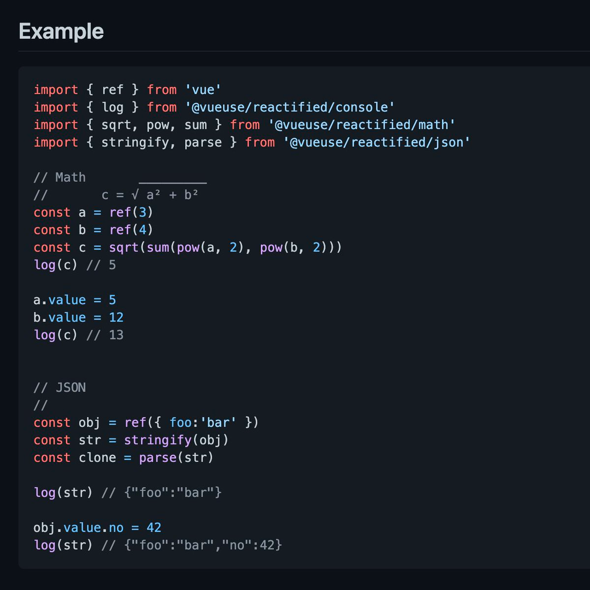
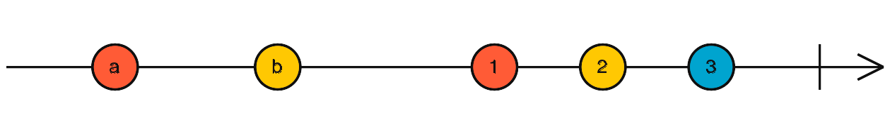
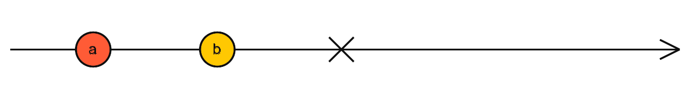
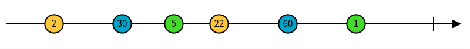
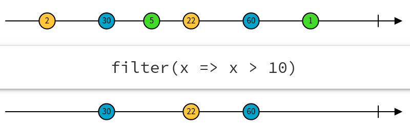

# 响应式编程初探

## 什么是响应式编程

> In computing, reactive programming is an asynchronous programming paradigm concerned with data streams and
> the propagation of change. This means that it becomes possible to express static (e.g. arrays) or dynamic
> (e.g. event emitters) data streams with ease via the employed programming language(s), and that an inferred
> dependency within the associated execution model exists, which facilitates the automatic propagation of the
> change involved with data flow.  
> -- Wikipedia

翻译过来就是：

> 在计算中，响应式编程是一种面向数据流和变化传播的异步编程范式。这意味着可以在编程语言中很方便地表达静态或动态的数据流，
> 而相关的计算模型会自动将变化的值通过数据流进行传播。

概念说了很多，简单来说**响应式编程是使用异步数据流进行编程**。

以上对响应式编程的说明中，有几个概念这里先介绍一下：

### 同步与异步

同步（Synchronous）：代码依次执行，并阻塞等待结果返回。这是一种线性执行方式，执行流程不能跨越。

异步（Asynchronous）：发出调用指令，不必等待结果返回。在这个过程中可以继续执行下面的流程。


响应式编程基于异步调用，这就要求所处的环境为异步环境。

### 流/Stream

作为响应式编程的核心，流的本质是一个按时间顺序排列的进行中事件的序列集合。


流可以发送三种不同的事物：

- 值
- 错误 Error
- 完成信号 Completed

响应式编程针对流，可以对其进行处理、转换和响应。

### 迭代器模式

迭代器（Iterator）模式又叫游标（Sursor）模式，迭代器具有 next 方法，可以顺序访问一个聚合对象中的各个元素，而不需要暴露该对象的内部表现。

在JavaScript中，可以使用`Symbol.iterator`遍历一个数组对象。

```javascript
var iterable = [1, 2];
var iterator = iterable[Symbol.iterator]();
iterator.next(); // => { value: "1", done: false}
iterator.next(); // => { value: "2", done: false}
iterator.next(); // => { value: undefined, done: true}
```

如果把流想象成一个无限大的数组，那么处理它的过程，也是一个遍历的过程。

### 观察者模式

观察者模式（Observer）又叫发布订阅模式（Publish/Subscribe），指多个对象间存在一对多的依赖关系，当一个对象的状态发生改变时，
所有依赖于它的对象都得到通知并被自动更新。

响应式编程的计算模型传播很大程度上依赖观察者模式。

## 【前端】响应式编程

由于响应式编程是一种编程范式，对于各种语言都有自己的实现。下面为了方便讲解，将重点以前端进行说明响应式编程。

### 从Vue3说起响应式

先思考一个问题：  
有一个普通的赋值语句，**C=A+B**。当这个语句执行完成后，即使我们再改变B或C的值，A的值也就不会发生变化了。

```javascript
let A = 1
let B = 1
let C = A + B
console.log(C)
B = 2
console.log(C)
```

但是在Vue3响应式的环境下，这个结果就不同了。

> https://twitter.com/antfu7/status/1346584312079032320



### 响应式编程的要素

为了更好的介绍响应式编程，此处开始，我们以RxJS为例：

> 为了应对高并发服务器端开发场景，在2009 年，微软提出了一个更优雅地实现异步编程的方式——Reactive Programming，
> 我们称之为响应式编程。随后，各语言很快跟进，都拥有了属于自己的响应式编程实现。  
> RxJS 是 Reactive Extensions for JavaScript 的缩写，起源于 Reactive Extensions，是一个基于可观测数据流 Stream
> 结合观察者模式和迭代器模式的一种异步编程的应用库。RxJS 是 Reactive Extensions 在 JavaScript 上的实现。

- **Observable（可观察对象）：** 表示一个概念，这个概念是一个可调用的未来值或事件的集合。
- **Observer（观察者）：** 一个回调函数的集合，它知道如何去监听由 Observable 提供的值。
- **Subscription（订阅）：** 表示 Observable 的执行，主要用于取消 Observable 的执行。
- **Operators（操作符）：** 采用函数式编程风格的纯函数 (pure function)，使用像 `map`、`filter`、`concat`、`flatMap` 等这样的操作符来处理集合。
- **Subject（主体）：** 相当于 EventEmitter，并且是将值或事件多路推送给多个 Observer 的唯一方式。
- **Schedulers（调度器）：** 用来控制并发并且是中央集权的调度员，允许我们在发生计算时进行协调，例如 `setTimeout` 或 `requestAnimationFrame` 或其他。

#### Observable

Observables是在一段时间内发出数据的对象。




使用`new Observable()`创建一个Observable，可以通过传入的subscriber参数来发出数据。

```javascript
const observable = new Observable(subscriber => {
   subscriber.next('first data');
   subscriber.next('second data');
   setTimeout(() => {
       subscriber.next('after 1 second - last data');
       subscriber.complete();
       subscriber.next('data after completion'); // <-- ignored
   }, 1000);
   subscriber.next('third data');
});
```

#### Subscribe

要观测到Observable中的对象数据，需要订阅Observable。使用`.subscribe()`可以订阅。

```javascript
observable.subscribe({
    next: (x) => console.log(x),
    error: (x) => console.log(x),
    complete: () => console.log('completed')
});
```

subscribe中的各种回调与observable相对应。

#### Subjects

Subjects是一种特殊类型Observable，使用`new Subject()`可以创建Subject对象。

```javascript
const subject = new Subject();
// Push data to all observers
subject.next('first data');
// Push error to all observers
subject.error('oops something went wrong');
// Complete
subject.complete('done');
```

与Observable不同的是，Observable是单播的，而Subjects是多播的。

#### Operators

Operators分为创建操作符和管道操作符。

要从其它对象创建一个Observable，可以使用创建操作符。

```javascript
const observable = from([2, 30, 5, 22, 60, 1]);
```



Observable是不可变的，通过使用管道操作符可以将输入的Observable转换成新的Observable。

```javascript
const greaterThanTen = observable.pipe(filter(x => x > 10));
```



各种操作符的概念可以去rxjs的官方文档查看。这里列举几个常用的操作符：

1. mergeMap
2. switchMap
3. exhaustMap
4. map
5. catchError
6. startWith
7. delay
8. debounce
9. throttle
10. interval
11. from
12. of

## 响应式编程是使用异步数据流进行编程

已经说了这么多了，下面以一个具体的示例来进行一次完整的响应式编程。

### 第一次响应式编程？

> 现在有一个div，在双击的时候放大，在三击的时候缩小。

双击事件在PC浏览器上可以通过监听dbclick事件进行触发，但是由于移动端机制的限制是无法触发dbclick事件的。
此处我们考虑监听click事件，通过模拟的方式判断双击和三击行为。

- 双击：300ms内触发了正好两次click事件。
- 三击：300ms内触发了多于两次click事件。

这里可以先思考一下用原有的方式如何实现这个功能。

#### 传统方式

<iframe height="300" style="width: 100%;" scrolling="no" title="dbclick and triclick" src="https://codepen.io/sumy7/embed/YzEjyqe?default-tab=result" frameborder="no" loading="lazy" allowtransparency="true" allowfullscreen="true">
  See the Pen <a href="https://codepen.io/sumy7/pen/YzEjyqe">
  dbclick and triclick</a> by sumy (<a href="https://codepen.io/sumy7">@sumy7</a>)
  on <a href="https://codepen.io">CodePen</a>.
</iframe>

```javascript
let zoom = 1.0;
let clickCount = 0;
let timer = null;
const dbclick = () => {
  if (zoom > 2.5) {
    return;
  }
  zoom = zoom + 0.1;
  document.getElementById("zoom-div").style["transform"] = `scale(${zoom})`;
};

const triclick = () => {
  if (zoom <= 0.5) {
    return;
  }
  zoom = zoom - 0.1;
  document.getElementById("zoom-div").style["transform"] = `scale(${zoom})`;
};

document.getElementById("zoom-div").addEventListener("click", () => {
  clickCount = clickCount + 1;
  if (timer === null) {
    timer = setTimeout(() => {
      if (clickCount === 2) {
        console.log("双击");
        dbclick();
      } else if (clickCount >= 3) {
        console.log("三连");
        triclick();
      }
      clickCount = 0;
      timer = null;
    }, 300);
  }
});
```

在这段代码中你需要同时处理事件、中间变量、还有计算时间间隔。幸运的是js是单线程的，你不需要考虑并发变量更新的问题。

#### 响应式编程方式

如果使用rxjs会怎么做？

<iframe height="300" style="width: 100%;" scrolling="no" title="rxjs-dbclick and triclick" src="https://codepen.io/sumy7/embed/KKyBdqw?default-tab=result" frameborder="no" loading="lazy" allowtransparency="true" allowfullscreen="true">
  See the Pen <a href="https://codepen.io/sumy7/pen/KKyBdqw">
  rxjs-dbclick and triclick</a> by sumy (<a href="https://codepen.io/sumy7">@sumy7</a>)
  on <a href="https://codepen.io">CodePen</a>.
</iframe>

```javascript
let zoom = 1.0
const dbclick = () => {
  if (zoom > 2.5) {
    return
  }
  zoom = zoom + 0.1
  document.getElementById("zoom-div").style["transform"] = `scale(${zoom})`
}

const triclick = () => {
  if (zoom <= 0.5) {
    return
  }
  zoom = zoom - 0.1
  document.getElementById("zoom-div").style["transform"] = `scale(${zoom})`
}

const zoomDiv = document.querySelector('#zoom-div')
const clickStream = Rx.Observable.fromEvent(zoomDiv, 'click')
const multiClickStream = clickStream
  .buffer(() => clickStream.throttle(300))
  .map((list) => list.length)
  .filter((x) => x >= 2)

multiClickStream.subscribe((clickNums) => {
  if (clickNums === 2) {
    dbclick()
    console.log("双击")
  } else {
    triclick()
    console.log("三连")
  }
})
```

除了一些响应事件处理页面元素的代码，真正的核心逻辑只有四行。下面用一个图表示以上的处理流程：


图中的线代表一个Steam流，圆圈是流中的事件，灰色方块是用来转换流的函数。

- 首先我们将div的click事件处理成一个ClickStream流，然后通过throttle()将一段时间内的事件累积到一个列表中，形成一个新的列表事件流。
- 然后通过map()把每个事件（列表）的长度映射成一个新的流。
- 最后，通过filter将整数1过滤掉。

就这样，通过3个操作，就获得了一个包含点击次数的事件流。

最后，通过订阅监听这个流，对对应的点击次数做出对应的反应，触发双击操作还是三击操作。

## 响应式编程的优与劣

听了以上的说明，你是不是也想试一试传说中的响应式编程？但是先别着急，先听一下下面的说明再做决定。

### 优势就在于专注业务，提高线程利用率

响应式编程提高了代码的抽象层级，你可以只关注定义了业务逻辑的那些相互依赖的事件，而非纠缠于大量的实现细节。响应式编程的代码往往会更加简明。

响应式编程在前端和客户端上的优势是明显的，这类平台需要与众多的UI事件进行高度交互。为了提高用户体验，现代应用需要处理大量的实时事件。

响应式编程在后端也有其优点：
- 减少资源占用的情况下（主要是线程）提高cpu利用率。
- 编排异步任务，传统后端异步任务的编排能力非常差，而响应式编程可以通过操作符对任务进行编排，也可以任意组合。
- 拥抱延迟执行，在没有订阅的情况下什么都不会发生（后面会说明为什么），流只是占位不会有任何副作用，只有订阅才回执行。
- 可以非常方便的使用操作是执行异步，而不是显示使用线程池（从命令式并发到声明式并发）。
- 通过操作符可以非常方便的处理异常，重试。而不是使用try catch。

### 响应式编程的劣势

#### 陡峭的学习曲线

响应式编程是一种新的编程模式，免不了需要一些成本去转换思维模式。


#### 难以调试

报错堆栈丢失了关键信息，使得难以定位问题。

## 还有什么？

### push系统与pull系统

pull和push，是在软件中**消费数据**的两种方式，它们描述了**数据生产者（或持有者）**与**数据消费者**之间是如何通讯的。

在pull系统中，数据消费者决定自己何时请求并接收数据；数据持有者只能被动地响应请求。

在push系统中，数据生产者决定何时向消费者推送数据。数据消费者不知道何时会收到数据更新。

|      | 生产者          | 消费者         |
|------|--------------|-------------|
| pull | 被动。收到请求时返回数据 | 主动。决定何时请求数据 |
| push | 主动。决定何时推送数据  | 被动。响应数据的更新  |

在pull系统下，下游没有消费者的时候，整个系统是不工作的。

在push系统下，上游生产数据的能力超过了下游的消费能力，会产生背压。

### 生态与扩展

响应式编程的生态非常丰富，各种语言都有自己的实现，而且都有非常丰富的操作符。

#### rxjs官方库

[ReactiveX/rxjs: A reactive programming library for JavaScript (github.com)](https://github.com/reactivex/rxjs)

#### spring+rxjava=webflux

[Spring WebFlux :: Spring Docs (getdocs.org)](https://spring.getdocs.org/en-US/spring-framework-docs/docs/spring-web-reactive/webflux/webflux.html)

#### rxjs+redux=redux-observable

```javascript
const someEpic = (action$, state$) => { 
    return action$.pipe(
        map(action => {
            return someOtherAction();
        })
    )
}
```

#### 等等

等等

### 破圈

#### 从RxJS到Flink

Flink（Apache Flink）是由 Apache 软件基金会开发的开源流处理框架，用于在无边界和有边界数据流上进行有状态的计算。它的数据流编程模型在有限和无限数据集上提供单次事件（event-at-a-time）处理能力。


Flink通常用于开发以下三种应用：

- 事件驱动型应用  
事件驱动型应用从一个或多个事件流提取数据，并根据到来的事件触发计算、状态更新或其他外部动作。场景包括基于规则的报警，异常检测，反欺诈等等。
- 数据分析应用  
数据分析任务需要从原始数据中提取有价值的信息和指标。例如双十一成交额计算，网络质量监测等等
- 数据管道(ETL)应用  
提取-转换-加载（ETL）是一种在存储系统之间进行数据转换和迁移的常用方法。ETL 作业通常会周期性地触发，将数据从事务型数据库拷贝到分析型数据库或数据仓库。

抛开Flink各种复杂的概念不谈（事件乱序、数据背压、Checkpoint），一个典型的Flink处理过程可以被简化为：  
**源数据流** --转换--> **中间数据流** --订阅--> **消费数据流**  
这个模型无论在响应式编程还是实时数据处理都是通用的。

## 总结

响应式编程不是一个全新的概念，它从现有的概念而来，而体现出来的思想模式又回到其它的思想领域中。
响应式编程不是只在一种语言或一种系统中才能使用的框架，本质上来说，它能在任何事件驱动开发中使用的编程范式。
响应式编程不是生搬硬套，学会Thinking in RP，以响应式编程的角度去思考问题，才能找到最适合它的地方。
