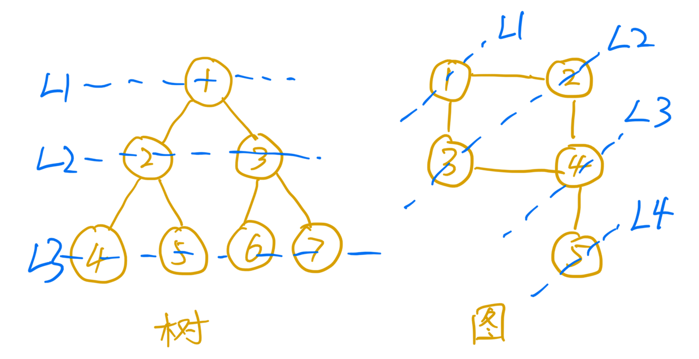
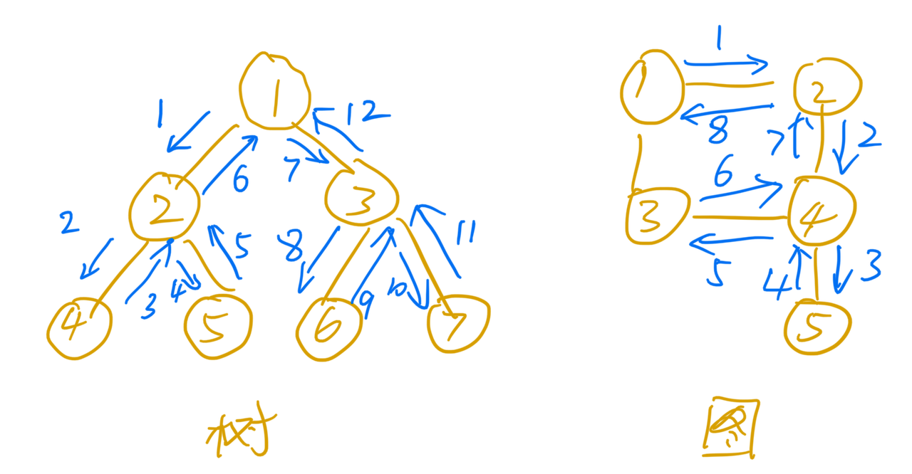

# 深度广度优先搜索

> 所有的问题都能用搜索解决。——某人

不要怂、就是干


## 什么是“搜索”算法

搜索算法是利用计算机的高性能来有目的的穷举一个问题解空间的部分或所有的可能情况，从而求出问题的解的一种方法。

常用的搜索算法有**深度优先搜索**和**广度优先搜索**。**程序=算法+数据结构**。要讨论算法，需要有特定数据结构的辅助。这里我们重点针对树和图这两种数据结构进行讨论。

## 广度优先搜索（BFS）

广度优先搜索（Breadth-First-Search），直观的说就是按照层级一层一层进行搜索。
这里有个简单的示意图，从1号节点开始，按照层级进行遍历，依次经过L1->L2->L3->L4的过程。



由于BFS按照层级进行扩展，与起始节点层级近的会优先遍历到，所以一般用来解决最近、最小之类的问题。

这里有个伪代码模板供大家参考。

```kotlin
fun bfs() {
    visited // 标志节点是否访问过，防止走回头路
    queue // 队列，用于记录将要扩展的节点
    while(queue.isNotEmpty()) {
        cur = queue.remove() // 从队列中获取一个节点
        if(checkCur()) { // 判断当前节点是否满足结束条件，满足时返回结果
            return cur.ans
        }
        // 将当前节点进行扩展
        for(next in cur.next) {
            if(visited[next]) { // 跳过已经访问过的节点
               continue 
            }
            queue.add(next) // 除了记录扩展节点，还需要记录访问到此处的结果
            visited[next] = true
        }
    }
}
```

代码中有几个重要的辅助变量需要注意一下**visited**、**queue**。
- **visited** 用于记录对应的节点是否已经被访问过，防止重复访问。如果节点v被访问过，那么就会有visited[v]=true。
- **queue** 是一个队列，用来记录与已经访问过的节点相连但是还未访问的节点。

### 时间复杂度

最坏情况下，终止顶点t离起始顶点s很远，需要遍历完整个图才能找到。这个时候，每个顶点都要进出一遍队列，每个边也都会被访问一次，所以，广度优先搜索的时间复杂度是O(V+E)，其中，V表示顶点的个数，E表示边的个数。当然，对于一个连通图来说，也就是说一个图中的所有顶点都是连通的，E肯定要大于等于V-1，所以，广度优先搜索的时间复杂度也可以简写为O(E)。

### 题目 [200. 岛屿数量](https://leetcode.cn/problems/number-of-islands/)

染色问题，BFS

### 变体

根据使用场景的不同，可以对代码中的queue或节点扩展方式进行些许变化，产生不同的“变体”。

#### 按层级输出

针对树来说，需要按照层级进行遍历。目前queue里没有层级，可以给节点增加遍历层级的概念。

```
// queue存储数组，里面包含层级和节点信息
queue.add([level, node])
// 扩展
[curLevel, curNode] = queue.remove()
queue.add([curLevel + 1, nextNode])
```

或者参考之前介绍的方法，记录一下当前层级的数量，将当前层的数量遍历结束后再开始下一层。

```kotlin
while(queue.isNotEmpty()) {
    curLevelSize = queue.size()
    for(i in 0 until curLevelSize) {
        curNode = queue.remove()
        // 遍历+扩展
        // ...
    }
}
```

之前分享已经说过了，这里不多展开介绍了。

#### 记录路径

现在BFS只是记录了一个最终的结果值，如果需要记录抵达最终结果的**一条**路径，需要怎么做？

这里可以使用一个前向指针，记录是从哪个节点扩展过来的（即父节点的下标）。用一棵树可以形象的表示这种关系。从终点一直回溯回起始节点就是要寻找的路径了。


```kotlin
// 新增prev变量记录父节点，初始值为-1
prev = [ -1 ] * n

// 扩展时
curIndex // 当前index
prev[nextIndex] = curIndex

// 回溯寻找路径
path = []
cur = tIndex
while(cur != -1) {
    path.add(cur)
    cur = prev[cur]
}
path.reverse()
```

## 深度优先搜索（DFS）

深度优先搜索（Depth-First-Search），就是“走迷宫”，不撞南墙不回头的那种。



深度优先搜索使用的是回溯思想。为了能够在遍历过程中“快速”快速回到上一个状态，深度优先搜索一般会使用递归来实现。

```kotlin
fun dfs(cur,     // 当前遍历到的节点
    visited,     // 遍历到此处的经过的节点
    ...otherArgs // 搜索过程中的其它参数
) {
    if(checkCur()) { // 判断当前节点是否满足结束条件
        ans = Math.max/min(ans, cur) // 更新结果
        return
    }
    // 扩展节点
    for(next in cur.next) {
        if(visited[next]) {
            continue
        }
        visited.add(next)
        dfs(next, visited, ...otherArgs)
        // 还原现场
        visited.remove(next)
    }
}
```

深度优先搜索和广度优先搜索一样，也使用了变量记录遍历的一些状态，不同的是，有些变量可以写在函数参数上，方便快速回溯现场。
- **cur** 一般用来表示当前遍历到的节点
- **visited** 记录该路径上遍历过的节点，防止重复遍历已经经过的节点

### 时间复杂度

深度优先遍历从图中可以看出，每条边最多会被访问两次，一次是遍历，一次是回退。所以，图上的深度优先搜索算法的时间复杂度是O(E)，E表示边的个数。
但是深度优先搜索的时间复杂度就不同了，主要看遍历经过的节点顺序不同是否算是不同结果。例如生成三位数字的深搜，1-2-3和1-3-2就算是不同的结果。那么它的时间复杂度会是指数级的O(C^N)，C是每一层可能的情况，N是需要搜索的层数。

### 题目 [129. 求根节点到叶节点数字之和](https://leetcode.cn/problems/sum-root-to-leaf-numbers/)

树，深搜

### 变体

#### 记录路径

DFS与BFS不同的是，DFS不需要prev进行父节点，因为DFS连续的从起点遍历到终点，所以它到达终点时途中经过的节点，就是最终的路径了。

[797. 所有可能的路径](https://leetcode.cn/problems/all-paths-from-source-to-target/)

#### 剪枝

在深搜的过程中，如果发现在当前条件下，即使按照最优策略去寻找，也无法获取到比已得到的结果更优的结果时，就没必要继续向下搜索了。这时候可以直接退出当前搜索路径，转而从其它路径继续寻找其它可能的情况。这种勇于（合理）舍弃部分搜索情况，但是对最终正确结果不会造成影响的方式叫做**剪枝**。

例如一个二叉树，所有的节点的值都大于0。现在寻找从根节点到叶子节点和的最小值。


如果在遍历的过程中，已经发现当前的和超过了之前找到的一个结果，那么即使后面节点的值都为1，最终找到的结果一定大于当前的结果，于是就没比较继续向下搜索了。

[111. 二叉树的最小深度](https://leetcode.cn/problems/minimum-depth-of-binary-tree/)

## 总结

广度优先搜索和深度优先搜索是最常用、最基本的搜索算法，相比其它搜索算法（A*、IDA*等）没有进行什么优化，所以这两种算法只能针对数据量不大的题目。

> 广度优先搜索，通俗的理解就是，地毯式层层推进，从起始顶点开始，依次往外遍历。广度优先搜索需要借助队列来实现，遍历得到的路径就是，起始顶点到终止顶点的最短路径。深度优先搜索用的是回溯思想，非常适合用递归实现。换种说法，深度优先搜索是借助栈来实现的。在执行效率方面，深度优先和广度优先搜索的时间复杂度都是O(E)，空间复杂度是O(V)。

回到开头那句话。因为广度优先搜索和深度优先搜索会将所有可能的情况进行搜索，所以理论上所有的问题都能通过搜索解决。像是破解密码这种就特别适合用搜索解决，而且一定能破解出来，别管什么数据规模了，剩下的就交给时间吧。（做题之前一定要看好数据范围！）

## 综合练习

- [827. 最大人工岛](https://leetcode.cn/problems/making-a-large-island/)
- [126. 单词接龙 II](https://leetcode.cn/problems/word-ladder-ii/)
