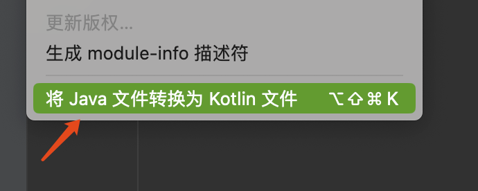

# 小米2023年度编程挑战赛分享

> 小米编程大赛是每年1024的固定活动，依托于力扣的周赛和双周赛，进行内部排名。  
> 今年跟去年相比，因档期限制只有一场周赛可以参加。第二是存在些许冷门，这也是编程比赛的一个看点。
> 本次将题目、解题思路和一些感悟分享给大家。

## 题目

### [2908. 元素和最小的山形三元组 I](https://leetcode.cn/problems/minimum-sum-of-mountain-triplets-i/)

给你一个下标从 **0** 开始的整数数组 `nums` 。

如果下标三元组 `(i, j, k)` 满足下述全部条件，则认为它是一个 **山形三元组** ：

- `i < j < k`
- `nums[i] < nums[j]` 且 `nums[k] < nums[j]`

请你找出 `nums` 中 **元素和最小** 的山形三元组，并返回其 **元素和** 。如果不存在满足条件的三元组，返回 `-1` 。

**示例 1：**

> **输入：** nums = [8,6,1,5,3]  
> **输出：** 9  
> **解释：** 三元组 (2, 3, 4) 是一个元素和等于 9 的山形三元组，因为： 
> - 2 < 3 < 4
> - nums[2] < nums[3] 且 nums[4] < nums[3]
> 
> 这个三元组的元素和等于 nums[2] + nums[3] + nums[4] = 9 。可以证明不存在元素和小于 9 的山形三元组。

**示例 2：**

> **输入：** nums = [5,4,8,7,10,2]  
> **输出：** 13  
> **解释：** 三元组 (1, 3, 5) 是一个元素和等于 13 的山形三元组，因为：  
> - 1 < 3 < 5 
> - nums[1] < nums[3] 且 nums[5] < nums[3]
>  
> 这个三元组的元素和等于 nums[1] + nums[3] + nums[5] = 13 。可以证明不存在元素和小于 13 的山形三元组。

**示例 3：**

> **输入：** nums = [6,5,4,3,4,5]  
> **输出：** -1  
> **解释：** 可以证明 nums 中不存在山形三元组。

**提示：**

- `3 <= nums.length <= 50`
- `1 <= nums[i] <= 50`

#### 思考

签到题

数据范围不大三重循环才 50^3 ，直接开搞判断满足条件的更新 ans

#### 比赛代码

```kotlin
class Solution {
    fun minimumSum(nums: IntArray): Int {
        val n = nums.size
        var ans = 1000000000
        for (i in 0 until n) {
            for (j in i + 1 until n) {
                if (nums[i] >= nums[j]) {
                    continue
                }
                for (k in j + 1 until n) {
                    if (nums[k] >= nums[j]) {
                        continue
                    }
                    ans = Math.min(ans, nums[i] + nums[j] + nums[k])
                }
            }
        }
        if (ans > 1000000) {
            return -1
        }
        return ans
    }
}
```

### [2909\. 元素和最小的山形三元组 II](https://leetcode.cn/problems/minimum-sum-of-mountain-triplets-ii/)

给你一个下标从 **0** 开始的整数数组 `nums` 。

如果下标三元组 `(i, j, k)` 满足下述全部条件，则认为它是一个 **山形三元组** ：

- `i < j < k`
- `nums[i] < nums[j]` 且 `nums[k] < nums[j]`

请你找出 `nums` 中 **元素和最小** 的山形三元组，并返回其 **元素和** 。如果不存在满足条件的三元组，返回 `-1` 。

**示例 1：**

> **输入：** nums = [8,6,1,5,3]  
> **输出：** 9  
> **解释：** 三元组 (2, 3, 4) 是一个元素和等于 9 的山形三元组，因为：
> - 2 < 3 < 4
> - nums[2] < nums[3] 且 nums[4] < nums[3]
> 
> 这个三元组的元素和等于 nums[2] + nums[3] + nums[4] = 9 。可以证明不存在元素和小于 9 的山形三元组。

**示例 2：**

> **输入：** nums = [5,4,8,7,10,2]  
> **输出：** 13  
> **解释：** 三元组 (1, 3, 5) 是一个元素和等于 13 的山形三元组，因为：
> - 1 < 3 < 5
> - nums[1] < nums[3] 且 nums[5] < nums[3]
> 
> 这个三元组的元素和等于 nums[1] + nums[3] + nums[5] = 13 。可以证明不存在元素和小于 13 的山形三元组。

**示例 3：**

> **输入：** nums = [6,5,4,3,4,5]  
> **输出：** -1  
> **解释：** 可以证明 nums 中不存在山形三元组。

**提示：**

-   `3 <= nums.length <= 10^5`
-   `1 <= nums[i] <= 10^8`

#### 思考

上一题的数据量加强版，三重循环 (10^5)^3 > 10^7，考虑用其他方法

题目要求找最小的，那么可以贪心找满足条件三个数最小的（同时找三个数不太好找）

再退一步。对于某个数 nums[i]，先预处理找左边最小的数与当前的和 leftToRightSum[i]，再找右边最小的数与当前数的和 rightToLeftSum[i]，
最后遍历一遍计算 leftToRightSum[i] + rightToLeftSum[i] - nums[i] 更新ans

（写的不是很优雅，相同代码直接拷贝了两遍，这样容易出错。而且其实预处理里也不用计算当前数字的）

写完之后把代码提交回第一题验证了一下

#### 比赛代码

```kotlin
class Solution {
    fun minimumSum(nums: IntArray): Int {
        val n = nums.size
        // 以 i 为顶点的所能构成的最小和
        val leftToRightSum = LongArray(n)
        val rightToLeftSum = LongArray(n)

        var minNum = -1
        for (i in 0 until n) {
            if (minNum == -1) {
                leftToRightSum[i] = -1L
                minNum = nums[i]
            } else {
                if (nums[i] > minNum) {
                    leftToRightSum[i] = minNum.toLong() + nums[i]
                } else {
                    leftToRightSum[i] = -1L
                }
                minNum = Math.min(minNum, nums[i])
            }
        }
        minNum = -1
        for (i in n - 1 downTo 0) {
            if (minNum == -1) {
                rightToLeftSum[i] = -1L
                minNum = nums[i]
            } else {
                if (nums[i] > minNum) {
                    rightToLeftSum[i] = minNum.toLong() + nums[i]
                } else {
                    rightToLeftSum[i] = -1L
                }
                minNum = Math.min(minNum, nums[i])
            }
        }
        var ans = -1L
        for (i in 0 until n) {
            if (rightToLeftSum[i] != -1L && leftToRightSum[i] != -1L) {
                if (ans < 0) {
                    ans = leftToRightSum[i] + rightToLeftSum[i] - nums[i]
                }
                ans = Math.min(ans, leftToRightSum[i] + rightToLeftSum[i] - nums[i])
            }
        }

        return ans.toInt()
    }
}
```

### [2910. 合法分组的最少组数](https://leetcode.cn/problems/minimum-number-of-groups-to-create-a-valid-assignment/)

给你一个长度为 `n` 下标从 **0** 开始的整数数组 `nums` 。

我们想将下标进行分组，使得 `[0, n - 1]` 内所有下标 `i` 都 **恰好** 被分到其中一组。

如果以下条件成立，我们说这个分组方案是合法的：

-   对于每个组 `g` ，同一组内所有下标在 `nums` 中对应的数值都相等。
-   对于任意两个组 `g(1)` 和 `g(2)` ，两个组中 **下标数量** 的 **差值不超过** `1` 。

请你返回一个整数，表示得到一个合法分组方案的 **最少** 组数。

**示例 1：**

> **输入：** nums = [3,2,3,2,3]  
> **输出：** 2  
> **解释：** 一个得到 2 个分组的方案如下，中括号内的数字都是下标：  
> 组 1 -> [0,2,4]  
> 组 2 -> [1,3]  
> 所有下标都只属于一个组。  
> 组 1 中，nums[0] == nums[2] == nums[4] ，所有下标对应的数值都相等。  
> 组 2 中，nums[1] == nums[3] ，所有下标对应的数值都相等。  
> 组 1 中下标数目为 3 ，组 2 中下标数目为 2 。  
> 两者之差不超过 1 。  
> 无法得到一个小于 2 组的答案，因为如果只有 1 组，组内所有下标对应的数值都要相等。  
> 所以答案为 2 。

**示例 2：**

> **输入：** nums = [10,10,10,3,1,1]  
> **输出：** 4  
> **解释：** 一个得到 2 个分组的方案如下，中括号内的数字都是下标：  
> 组 1 -> [0]  
> 组 2 -> [1,2]  
> 组 3 -> [3]  
> 组 4 -> [4,5]  
> 分组方案满足题目要求的两个条件。  
> 无法得到一个小于 4 组的答案。  
> 所以答案为 4 。

**提示：**

- `1 <= nums.length <= 10^5`
- `1 <= nums[i] <= 10^9`

#### 思考

先统计每个数字出现次数，然后数字就可以扔掉了，后面只跟次数有关系。

（看数据量，又是最值问题，计划写成二分，二分枚举每组的数量）

先写 check 函数。数量差1，(s-1, s) 还有 (s, s+1) 都满足条件，但是如何混合判断，会出现 (s-1, s+1) 这种不满足条件的情况。
所以，为了方便进行处理，这里限制每组数量为 s 或 s+1 ，在这种情况下能分成多少组。如果不能分出来，就返回 -1。

分法：先将每组数量定为 s+1，分完之后最后一组会出现一个余数（不为0的时候），然后从每组拿一个出来分给最后一组，看能否将最后一组补齐到 s。


（写完check发现，貌似无法二分，因为结果不一定连续）

本着不浪费代码的原则，改为了暴力枚举，将分组从次数最多倒序枚举到1个，然后就AC了。。。

（这个题目在处理分组上浪费了好多时间，过了之后没再思考赶紧继续看第四题。。。）

（后来稍微思考了一下数据量，枚举量与两个因素有关，数字出现最多的次数 numMaxCnt 和 去重后数字的个数 distinctCnt。distinctCnt 越多，
那么 numMaxCnt 就越少，这两个基本上是互斥的关系）

#### 比赛代码

```kotlin
class Solution {
    fun minGroupsForValidAssignment(nums: IntArray): Int {
        val numCntMap = HashMap<Int, Int>()
        for (num in nums) {
            numCntMap[num] = numCntMap.getOrDefault(num, 0) + 1
        }
        val cntList = numCntMap.values.toList()

        fun check(s: Int): Int {
            var total = 0
            for (cnt in cntList) {
                if (cnt % (s + 1) == 0) {
                    total += cnt / (s + 1)
                } else {
                    val group = cnt / (s + 1)
                    val remind = cnt % (s + 1)
                    // 能否补齐最后一组
                    if (group + remind < s) {
                        return -1
                    }
                    total += (group + 1)
                }

            }
            return total
        }

        var ans = nums.size
        var left = 1
        var right = cntList.max()!!
        for (i in right downTo left) {
            val checkSize = check(i)
            if (checkSize == -1) {
                continue
            } else {
                ans = Math.min(ans, checkSize)
            }
        }

        return ans
    }
}
```

### [2911. 得到 K 个半回文串的最少修改次数](https://leetcode.cn/problems/minimum-changes-to-make-k-semi-palindromes/)

给你一个字符串 `s` 和一个整数 `k` ，请你将 `s` 分成 `k` 个 **子字符串** ，使得每个 **子字符串** 变成 **半回文串** 需要修改的字符数目最少。

请你返回一个整数，表示需要修改的 **最少** 字符数目。

**注意：**

-   如果一个字符串从左往右和从右往左读是一样的，那么它是一个 **回文串** 。
-   如果长度为 `len` 的字符串存在一个满足 `1 <= d < len` 的正整数 `d` ，`len % d == 0` 成立且所有对 `d` 做除法余数相同的下标对应的字符连起来得到的字符串都是 **回文串** ，那么我们说这个字符串是 **半回文串** 。比方说 `"aa"` ，`"aba"` ，`"adbgad"` 和 `"abab"` 都是 **半回文串** ，而 `"a"` ，`"ab"` 和 `"abca"` 不是。
-   **子字符串** 指的是一个字符串中一段连续的字符序列。

**示例 1：**

> **输入：** s = "abcac", k = 2  
> **输出：** 1  
> **解释：** 我们可以将 s 分成子字符串 "ab" 和 "cac" 。子字符串 "cac" 已经是半回文串。如果我们将 "ab" 变成 "aa" ，它也会变成一个 d = 1 的半回文串。  
> 该方案是将 s 分成 2 个子字符串的前提下，得到 2 个半回文子字符串需要的最少修改次数。所以答案为 1 。

**示例 2:**

> **输入：** s = "abcdef", k = 2  
> **输出：** 2  
> **解释：** 我们可以将 s 分成子字符串 "abc" 和 "def" 。子字符串 "abc" 和 "def" 都需要修改一个字符得到半回文串，所以我们总共需要 2 次字符修改使所有子字符串变成半回文串。  
> 该方案是将 s 分成 2 个子字符串的前提下，得到 2 个半回文子字符串需要的最少修改次数。所以答案为 2 。

**示例 3：**

> **输入：** s = "aabbaa", k = 3  
> **输出：** 0  
> **解释：** 我们可以将 s 分成子字符串 "aa" ，"bb" 和 "aa" 。  
> 字符串 "aa" 和 "bb" 都已经是半回文串了。所以答案为 0 。

**提示：**

-   `2 <= s.length <= 200`
-   `1 <= k <= s.length / 2`
-   `s` 只包含小写英文字母。

#### 思考

之前碰到过一个类似的题目《得到K个回文串的最小修改次数》，先套用那题的转移方程

dp[i][j]表示前i个字符，分隔成j个字符串，得到(半)回文的最小修改次数  
转移方程 dp[i][j] = Math.min(dp[k][j-1] + getCost(k, i - 1))  
getCost(l, r)是把字符串 [l, r] 变成(半)回文串的修改次数

然后就是处理这个看着很啰嗦，其实也要读好久的半回文串的定义  
以 `adbgad` 为例，len=6，因子d有 1,2,3,6 四个，首先排除自身 6，只剩下 1,2,3  
d=1 分成 adbgad  
d=2 分成 adbgad -> aba dgd  
d=3 分成 adbgad -> ag da bd  
可以发现在 d=2 时，分隔出来的 d 个字符串都是回文字符串，所以 adbgad 是一个半回文字符串

搞懂了半回文字符串的定义，按照题目描述计算最小花费  
getCostPart 用于计算在 d=step 的情况下形成半回文字符串的花费。外层循环表示第 j 个字符串组，
内部双指针计算将该组变成回文字符串所需要的花费。d 的花费就是所有字符串组的花费之和  
getCost 枚举 len 的因子，交给 getCostPart 计算花费，最后统计一个最小的花费

（全部搞完就剩最后 6 分钟了，赶紧提交了一下，发现 WA 了）  
（很紧张的检查代码，发现 getCostPart 的 right 初始值设置的不对，修改后赶在最后一分钟提交成功😭）  
（下次可以让 力扣 官方出个实时大屏，让场外同学感受一下这种紧张的气氛）


#### 比赛代码

```kotlin
class Solution {
    fun minimumChanges(s: String, k: Int): Int {
        val n = s.length
        val MAX_VAL = 100000000
        // 前 i 个字符，分隔成 j 个子字符串，最小的修改次数
        val dp = Array<IntArray>(n + 1) {
            IntArray(k + 1) {
                MAX_VAL
            }
        }
        dp[0][0] = 0

        fun getCostPart(l: Int, r: Int, step: Int): Int {
                        // println("${l}-${r}-${step}")
            var cost = 0
            for (j in 0 until step) {
                var left = l + j
                var right = r - (step - j - 1)
                while (left < right) {
                    if (s[left] != s[right]) {
                        cost++
                    }
                    left += step
                    right -= step
                }
            }
            // println("${l}-${r}-${step}-${cost}")
            return cost
        }

        // 字符串从[l, r]组成半回文的最小花费
        fun getCost(l: Int, r: Int): Int {
            val len = r - l + 1
            var cost = MAX_VAL
            for (step in 1 until len) {
                if (len % step == 0) {
                    cost = Math.min(cost, getCostPart(l, r, step))
                }
            }
            return cost
        }

        for (i in 1..n) {
            for (j in 1..Math.min(k, i)) {
                if (j == 1) {
                    dp[i][j] = getCost(0, i - 1)
                } else {
                    for (k1 in j - 1 until i) {
                        dp[i][j] = Math.min(dp[i][j], dp[k1][j - 1] + getCost(k1, i - 1))
                    }
                }
            }
        }
        return dp[n][k]
    }
}
```

## 刷题经验

接下来我就简单说一下个人在 LeetCode 上的一些感想。

### Why Kotlin

大家可能看到我的语言常年使用的是 Kotlin。最初接触到这门语言还是在 Jetbrains 北京站大会上，之前也是被 Java 模板代码苦恼的一员。

当时布道师的一句话：我们提供了 Convert Java to Kotlin 的功能，为什么没有提供 Kotlin to Java 呢？因为你只要用过 Kotlin 就不想换回去了。



在我使用下来，Kotlin 相比 Java 在刷题上的优势：

1. 函数可以定义在方法内部，这样一个函数就能把题目需要的所有逻辑包含进来。

```kotlin
fun xxx(args: Any): Any {

    fun yyy(xxx: Any): Any {
        return ""
    }

    return yyy(args)
}
```

2. 提供了不少的工具方法，简化代码。举几个🌰

```kotlin
// 创建array、list、set etc
fun createALSE() {
    val aList = listOf()
    val aArray = intArrayOf()
    val aSet = setOf()
}

// 排序
fun sort() {
    arrayOf("a" to "b", "c" to "d").sortWith(compareBy<Pair<String, String>> { it.first }.thenByDescending { it.second })
    val queue = PriorityQueue<Pair<String, String>>(compareBy<Pair<String, String>> { it.first }.thenByDescending { it.second })
}

// 链式处理
fun mostCommonWord(paragraph: String, banned: Array<String>): String {
    return paragraph.split('!', '?', '\'', ',', ';', '.', ' ')
        .asSequence()
        .filter { it != "" }
        .map { it.toLowerCase() }
        .groupBy { it }
        .map { it.key to it.value.size }
        .filter { it.first !in banned }
        .maxBy { it.second }!!
        .first
}

// 循环
fun iter() {
    val n = 10
    for(i in 0 until n) {
    }
    for(j in n - 1 downTo 0) {
    }
}
// 类型转换
fun toFun() {
    listOf<Int>(1, 2, 3).toIntArray()
    "123".toInt()
    1L.toInt()
}

// 等等
```

每门语言都有自己独特的魅力，不管你刷题的目的是什么，首先要做的是找到一门适合自己的语言。

### 找到适合的刷题节奏

想要提升，疯狂嗑 hard，结果物极必反。  
想要成就感，刷 easy 固然很爽（我有的时候一天能刷10道easy），但是对提升不大。  
如何在这两者之间找到平衡，我给自己的定位是“刷题混子”。。。  
每天上午开工前拿出 30 分钟，完成日常的每日两题（美服一题，国服一题）。碰到搞不定的就留到晚上来解决。有时候晚上比较忙，就加 TODO && CV大法。  
竞赛有奖品就参加（所以才是混子），没有奖品就无视了。。。这里不得不提两位常年打星的大佬，真的每场周赛都参加。  
所以找到自己的刷题节奏，保持成就感，不要有太大压力。这是一个长期提升的过程，不要一开始就把精力全用光。

### 数据范围也会提供重要信息

读完题目之后，一定记得看一眼数据范围。一些题目算法上比较麻烦，但是因为数据范围较小，可以用暴力搜索低分飘过。

不同的数据范围处理起来也不一样，而且数据范围会提示一些算法方向。

- 基本时限内的复杂度在 10^6 ~ 10^7
- 10^5 需要考虑 O(nlogn) 以内的算法，比如 二分、各种优先队列、剪枝 等
- 10^3 以内O(n^2) 就可以随便做了（大概）
- 10^2 以内深搜暴力

因此读完题目之后，**一定记得看一眼数据范围**。

### 夯实基础，才能不惧怕 hard

可以打开题目列表看一下前三行的tag，是否都有了解。这个可以说是力扣的重点考试范围了。


有的人一看到 hard 下意识就想 CV 了。但是 hard 其实也有可以攻破的点。


hard 使用的知识点都有对应的 medium 题目，在碰到 hard 的时候不妨尝试一下，了解自己欠缺的知识点。对症学习。缺啥补啥。

## 刷题价值

要说刷 LeetCode 是否有价值，答案是肯定的。我认为有以下几点：

### 提升编码熟练度

通过不断的刷题，可以让你更熟练地使用编程语言，提高编码效率。你会更熟悉语法，更了解如何有效地使用数据结构和算法，
以及如何编写出更优雅、更高效的代码。

### 了解语言特性

算法是所有语言共通的，但是每种编程语言都有其独特的特性和优势。说到 Python 就很容易想起它的大数处理、内置缓存，
说到 Java 就有很多数据结构可供选择，说到 JavaScript 好像没啥可以说的。。。

通过刷题， 你就能更好的更深入的了解这些语言特性。当你熟练掌握这些特性之后，不仅可以使你更好的了解这门语言，
也能简化代码提高刷题效率。这是一个相互的，不断改进的过程。

### 强化算法思维

碰到一个问题如何进行拆解，如何对代码结构进行规划使其能够满足易扩展的要求。通过刷题可以不断强化这部分能力，例如如何解决深搜广搜的问题等。

将你学到的各种算法和数据结构，应用到实际问题中，这不仅可以提高解决问题的能力，更能助力你理解和设计复杂的系统。

### 增强抗压能力

不知道大家都有没有碰到过，线上出了一个问题，然后一群人在盯着你解决。


这种情况下，如何顶住鸭梨完成代码修复、发版、上线的任务。

力扣的竞赛都有时间限制，就需要在有限的时间内完成问题理解、算法设计、代码编写。然后提交！！！如果WA了，还需要在时限内调试代码，找到问题所在。

多参加竞赛，在编码时保持冷静和坚持，对于个人成长和职业发展都会有帮助。

## 总结

1. 感谢【xxxxxxxxxxxx】和各位大佬给予的这次机会
2. 这次比赛成绩有一定的运气成分
3. 刷题是个持之以恒的过程，只要坚持下去就一定能有收获
